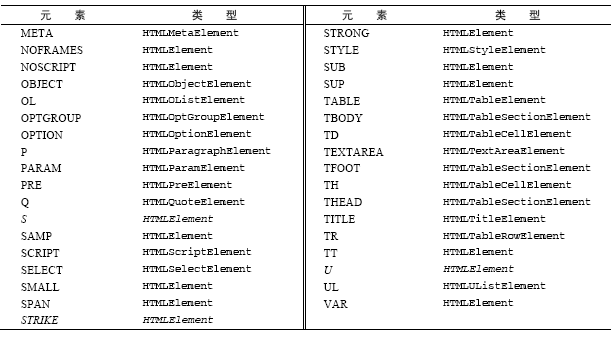

#JavaScript 高级程序设计

## DOM

>DOM(文档对象模型)是针对HTML和XML文档的一个API。DOM描绘了一个层次化的节点树，允许开发人员添加、移除和修改页面的某一部分。DOM脱胎于Netscape及微软创始的DHTML，但是现在它已经成为表现和操作页面标记的跨平台、语言中立的方式。

*IE中的所有DOM对象都是以COM对象的形式实现的*

###特殊集合对象

*在DOM中经常会接触到的集合对象，因此在这里做一个汇总*

**NodeList**

NodeList是一种类数组对象，用于保存一组有序的节点。它的独特指出在于，它实际上是`基于DOM结构动态执行查询的结果`，因此DOM结构的变化能够自动反映在NodeList对象中。

*下列这段代码能够加深对NodeList的认识，运行在浏览器可能会导致死机*

```javascript
    var alldivs=document.getElementsByTagName("div");
    for(var i=0;i<alldivs.length;i++){ //死循环，alldivs.length不断增加
        console.log(alldivs.length);
        document.body.appendChild(document.createElement("div"));
    }
```

通常出于性能和操作方面的考虑，会将NodeList转化为数组

```javascript
/*
    由于IE8及更早版本将NodeList实现为一个COM对象，因此只能手动枚举所有成员。
    其他的版本或其他浏览器，则使用Array.prototype.slice进行转换就可以
*/
function convertToArray(nodes){
    var array = null;
    try{
        array = [].prototype.slice.call(nodes,0);
    } catch (ex){
        array = [];
        for (var i = 0,len = nodes.length;i++){
            array.push(nodes[i]);
        }
    }

    return array;
}
```

**HTMLCollection**

与NodeList类似，是一个"动态"的集合，原型属性有

* length ： 对象数量

* item(index) : nodeList[index]

* nameItem(name) : 根据name获取对象

**NamedNodeMap**

与NodeList类似，是一个"动态"的集合，`nodeName`是属性的名称，`nodeValue`是属性的值，原型属性有

* getNamedItem(name) : 返回nodeName属性等于name的节点

* removeNamedItem(name) : 移除nodeName属性等于name的节点

* setNamedItem(node) : 添加节点，以节点的nodeName属性为索引

* item(pos) : 返回pos位置处的节点


### 节点层次

>DOM可以将任何HTML或XML文档描绘成一个由多层节点构成的结构。节点分为几种不同的类
型，每种类型分别表示文档中不同的信息及（或）标记。每个节点都拥有各自的特点、数据和方法，另外也与其他节点存在某种关系。

简单的HTML文档

```html
<!DOCTYPE html>
<html>
<head>
    <title>sample page</title>
</head>
<body>
    <p>hello world!</p>
</body>
</html>
```

可以展开为层次结构


#### Node类型

>DOM1 级定义了一个Node接口，该接口将由DOM 中的所有节点类型实现。这个Node 接口在JavaScript中是作为Node类型实现的；`除了IE之外`，在其他所有浏览器中都可以访问到这个类型。JavaScript 中的所有节点类型都继承自Node类型，因此所有节点类型都共享着相同的基本属性和方法。

**nodeType**

每个节点都有一个`nodeType`属性，用于表明节点类。节点类型由在Node类型中定义的12个数值常量来表示

1. Node.ELEMENT_NODE(1)；

2. Node.ATTRIBUTE_NODE(2)；

3. Node.TEXT_NODE(3)；

4. Node.CDATA_SECTION_NODE(4)；

5. Node.ENTITY_REFERENCE_NODE(5)；

6. Node.ENTITY_NODE(6)；

7. Node.PROCESSING_INSTRUCTION_NODE(7)；

8. Node.COMMENT_NODE(8)；

9. Node.DOCUMENT_NODE(9)；

10. Node.DOCUMENT_TYPE_NODE(10)；

11. Node.DOCUMENT_FRAGMENT_NODE(11)；

12. Node.NOTATION_NODE(12)。

*由于IE没有公开Node类型的构造函数，因此，最好还是将nodeType属性与数字值进行比较*

```javascript
if(someNode.nodeType == 1){ //适用于所有浏览器
    console.log('Node is an element');
}
```

**nodeName & nodeValue**

可以了解节点的具体信息，这两个属性的值完全取决于节点的类型

```javascript
//先检测一下节点的类型
if(someNode.nodeType == 1){
    value = someNode.nodeName; //nodeName的值是元素的标签名
}
```

**节点关系**

文档中所有的节点之间都存在这样或那样的关系。节点间的各种关系可以用传统的家族关系来描述，相当于把文档树比喻成家谱。


节点的关系属性

1. childNodes [返回NodeList/null]
    1. firstChild
    2. lastChild
2. parentNode 
3. previousSibling [返回NodeList/null]
4. nextSibling [返回NodeList/null]
5. ownerDocument [document]


**操作节点**

以下四个方法，在`不支持子节点`的节点上调用，将会导致错误发生

1. appendChild(childNode)
    
    用于向childNodes列表的末尾添加一个节点，添加节点后，childNodes的新增节点、父节点及从以前的最后一个子节点的关系指针都会相应地得到更新

    ```javascript
    var returnedNode = someNode.appendChild(newNode);
    returnedNode == newNode //true
    someNode.lastChild == newNode //true
    ```

    *可以将DOM树看成由一系列指针连接起来的，但任何DOM节点也不能同时出现在文档的多个位置上*

    ```javascript
    var returnedNode = someNode.appendChild(someNode.firstChild);
    returnedNode == someNode.firstChild; //false
    returnedNode == someNode.lastChild; //true
    ```

2. insertBefore(childNode,ref-node/null)
    
    可以将节点放在childNodes列表中的某个特定的位置上，如果参照节点为null，则与appendChild执行相同的操作。

    ```javascript
    //插入后成为第一个子节点
    var returnedNode = someNode.insertBefore(newNode,someNode.firstChild);
    returnedNode == newNode; //true
    returnedNode == someNode.firstChild; //true

    //插入后成为最后一个子节点
    var returnedNode = someNode.insertBefore(newNode,null);
    returnedNode == newNode; //true
    returnedNode == someNode.lastChild; //true
    ```

3. replaceChild(newNode,oldNode)

    要替换的节点将由这个方法返回并从文档树中移除，同时由要插入的节点占据其位置

    *插入一个节点时，该节点的所有关系指针都会从被它替换的节点复制过来*

    ```javascript
    //替换第一个子节点
    var returnedNode = someNode.replaceChild(newNode,someNode.firstChild);
    ```

    *从技术上讲，被替换的节点仍然还在文档中，但是它在文档中已经没有了自己的位置*

4. removeChild(childNode)

    移除节点

    ```javascript
    //移除第一个子节点
    var formerFirstChild = someNode.removeChild(someNode.firstChild);
    ```

**其他方法**

所有类型都具有的

1. cloneNode(boolean)

    创建调用这个方法的节点的一个完全相同的副本，参数表示是否执行深复制。当为`true`时，执行深复制，即复制节点及其整个子节点树，为`false`时，只复制节点本身。复制返回的节点副本属于文档所有。

    ```html
    <ul>
        <li>item 1</li>
        <li>item 2</li>
        <li>item 3</li>
    </ul>
    <script>
        var deepList = myList.cloneNode(true);
        deepList.childNodes.length; //3

        var shallowList = myList.cloneNode(false);
        shallowList.childNodes.length; //0
    </script>
    ```

    *正常情况下，此方法不会复制添加到DOM节点中的Javascript属性，例如事件处理程序。但是IE存在一个bug，即它会复制事件处理程序，所以在复制之前最好先移除事件处理程序*

2. normalize()

    处理文档树中的文本节点。由于解析器的实现或DOM操作等原因，可能会出现文本节点不包含文本，或者接连出现两个文本节点的情况。当某个节点上调用这个方法时，就会在该节点的后代节点中查找上述两种情况：`如果找到空文本节点，则删除它；如果找到相邻的文本节点，则将它们合并为一个文本节点`。

#### Document类型

>JavaScript通过Document类型表示文档。在浏览器中，document对象是HTMLDocument（继承自Document类型）的一个实例，表示整个页面。而且，document对象是window对象的一个属性，因此可以将其作为全局对象来访问。

**Document节点特征**

* nodeType为9

* nodeName为"#document"

* nodeValue为null

* parentNode为null

* parentNode为null

* ownerDocument为null

* 其子节点可能是一个DocumentType(最多一个)、Element(最多一个)、ProcessingInstruction或Comment

Document类型最常见的应用就是作为HTMLDocument实例的document对象，通过这个文档对象，不仅可以取得与页面有关的信息，而且还能操作页面的外观及其底层结构

*在Firefox、Safari、Chrome 和Opera 中，可以通过脚本访问Document 类型的构造函数和原型。但在所有浏览器中都可以访问HTMLDocument类型的构造函数和原型，包括IE8 及后续版本。*

1. 文档的子节点
    
    1. document.documentElement
    
        该属性始终指向HTML页面中的html元素

        ```html
        <html>
            <body>
            
            </body>
        </html>
        <script>
        var html = document.documentElement; //取得对<html>的引用
        html === document.childNodes[0];     //true
        html === document.firstChild;       //true
        </script>
        ```
   
    2. document.body
        
        直接指向<body>元素

2. 文档信息

    1. title

        可以获取修改title的值

        ```javascript
        //取得文档标题
        var originalTitle = document.title;
        //设置文档标题
        document.title = 'New Page Title';
        ```

    2. url

        包含页面完整的URL，即地址栏中显示的URL，不可以修改

        ```javascript
        //取得完整的URL
        var url = document.URL;
        ```

    3. domain

        只包含页面的域名，可以设置，但是由于安全方面的限制，不能将这个属性设置为URL不包含的域

        ```javascript
        //假设页面来自p2p.wrox.com域

        document.domain = 'wrox.com'; //成功

        document.domain = 'nsnsns.net'; //出错
        ```

        *当页面中包含来自其他子域的框架或内嵌框架时，能够设置document.domain 就非常方便了。由于跨域安全限制， 来自不同子域的页面无法通过JavaScript 通信。而通过将每个页面的document.domain设置为相同的值，这些页面就可以互相访问对方包含的JavaScript 对象了*

        此外，浏览器对domain属性还有一个限制，如果域名一开始是`松散的(loose)`，那么不能将它再设置为`紧绷的(tight)`

        ```javascript
         //假设页面来自p2p.wrox.com域

        document.domain = 'wrox.com'; //松散的，成功

        document.domain = 'p2p.wrox.com'; //紧绷的 出错
        ```
   
    4. referrer

        取得来源页面的URL

        ```javascript
        var referrer = document.referrer;
        ```

3. 查找元素

    1. document.getElementById()
        
        id必须与页面中元素的id特性严格匹配，包括大小写。如果页面中多个元素的ID值相同，只返回文档中第一次出现的元素。

        在IE7及较低版本还为此方法添加了一个有意思的"怪癖"：name特性与给定ID匹配的表单元素也会被该方法返回。因此，最好是`不让表单字段的name属性与其他元素的ID相同`

        ```html
        <input type="text" name="myElement" >
        <div id="myElement">a div</div>
        <script>
        var e = document.getElementById('myElement');
        e //在IE7返回 <input>
        </script>
        ```

    2. document.getElementsByTagName()
    
        返回HTMLCollection对象

        ```html
        
        <script>
        var images = document.getElementsByTagName('img');
        //相关操作
        images.length; //输出图像的数量
        images[0].src; //第一个图像元素的src元素
        images.item(0).src; //第一个图像元素的src元素

        //取得文档中的所有元素，非IE
        var allelements = document.getElementsByTagName('*');
        </script>
        ```

    3. getElementsByName()

        返回带有给定name属性的所有元素

4. 特殊集合
    
    * document.anchors : 文档中所有带name属性的<a\>元素

    * document.forms : 包含文档中所有的<form\>元素

    * document.images : 包含文档中所有的元素

    * document.links : 包含文档中所有带href属性的<a\>元素 

5. DOM一致性检测
    
    由于DOM分为多个级别，也包含多个部分，因此检测浏览器实现了DOM的哪些部分就十分必要了。`document.implementation`属性就是为此提供相应信息和功能的对象，与浏览器对DOM的实现直接对应。

    

    ```javascript
    var hasXmlDom = document.implementation.hasFeature('XML','1.0');
    ```

    *有时候返回true也不意味着实现与规范一致，因此最好除了检测hasFeature之外，还要同时使用能力检测*

6. 文档写入
    
    将输出流写入网页中，如果在页面完全加载之后执行，会重写整个页面

    1. write(string)
        原样写入
    2. writeIn(string)
        会在字符串末尾加一个换行符(\n)

    ```html
    <!DOCTYPE html>
    <html>
        <head>
            <title>document.write()</title>
        </head>
        <body>
        <script type="text/javascript">
            document.write('<scirpt src=\"file.js\" >' + '<\/script>');
        </script>
        </body>
    </html>
    ```

    这组方法分别用于打开和关闭网页的输出流

    3. open()
    4. close()

#### Element类型

>Element类型用于表现XML或HTML元素，提供了对元素标签名、子节点及属性的访问

**Element节点特征**

* nodeType 为 1

* nodeName/tagName 为 元素标签名

* nodeValue 为 null

* parentNode 可能是 Document或Element

* 子节点 可能是 Element、Text、Comment、ProcessingInstruction、CDATASection或
EntityReference

**tagName**

```javascript
//适用于任何文档的标签名判断，需要转换大小写
if (element.tagName.toLowerCase() === 'div'){
    //执行某些操作
}
```

1. HTML元素

    所有HTML元素都由`HTMLElement`类型表示，不是直接通过这个类型，也是通过它的子类型来表示。有以下这些属性

    * id，元素在文档中的唯一标识符
    
    * className，与元素的class属性对应
    
    * title
    * lang
    * dir

    ```html
    <div id="myDiv" class="bd" title="body text" lang="en" dir="ltr"></div>
    <script type="text/javascript">
         var div = document.getElementById('myDiv');
         div.id; //myDiv
         div.className;//bd
    </script> 
    ```

    元素和对应的类型表：

    

    

2. 取得属性

    **getAttribute()**

    ```html
    <div id="myDiv" class="bd" data-my-attribute="hello"></div>
    <script type="text/javascript">
        var div = document.getElementById('myDiv');
        div.getAttribute('id');//myDiv
        div.getAttribute('class');//bd
        div.getAttribute('data-my-attribute');//hello
    </script>
    ```

    根据HTML5规范，自定义特性应该加上data-前缀以便验证，此外，只有非自定义的属性才会以属性的形式添加到DOM对象中

    ```javascript
    div.data-my-attribute; //undefine(IE除外)
    ```

    有两类特殊的属性，虽然有对应属性名，但是属性的值与通过getAttribute()返回的值并不相同。

    1. `style`:通过属性来访问返回一个对象，而通过getAttribute()返回CSS文本。

    2. `onXXX`:例如onclick这样的事件处理程序，通过属性访问一个JavaScript函数，而通过getAttribute()返回相应的代码

    *一般来说，只有在取得自定义特性值的情况下，才会使用getAttribute()*

3. 设置属性

    **setAttribute()**

    既可以操作HTML属性，也可以操作自定义属性

    ```javascript
    div.setAttribute('id','myDiv');
    div.setAttribute('data-my-attribute','hello');
    ```

    也可以直接给属性赋值设置属性的值，但是如果为DOM添加的是自定义的属性，该属性不会自动成为元素的特性

    ```javascript
    //添加非自定义属性【成功】
    div.id = 'myDiv';

    //添加自定义属性，【不可行】
    div.mycolor = 'red';
    div.getAttribute(mycolor); //null(IE除外)
    ```
    
4. 移除属性

    **removeAttribute()**

    不常用，但在序列化DOM元素时，可以通过它来确切地指定要包含哪些属性？

5. attributes属性

    Element类型是使用attributes属性唯一一个DOM节点类型。attributes属性中包含一个`NamedNodeMap`。元素的每一个属性都由一个Attr节点表示，每个节点都保存在NamedNodeMap对象中

    ```javascript
    //取得元素的id属性值
    var id1 = element.attributes.getNamedItem('id').nodeValue;
    var id2 = element.attributes['id'].nodeValue;

    //设置元素的属性的值
    element.attributes['id'].nodeValue = 'myDiv';

    //删除属性
    var oldAttr = element.attributes.removeNamedItem('id');
    ```

    *一般来说，由于attributes的方法不够方便，还是会较多使用前面getAttribute(),setAttribute(),removeAttribute()*

    在需要将`DOM结构序列化为XML或HTML字符串时`，就可以用到attributes属性

    在这里需要注意两个问题

    1. 针对attributes 对象中的特性，不同浏览器返回的顺序不同。这些特性在XML或HTML代码中出现的先后顺序，不一定与它们出现在attributes 对象中的顺序一致。
    
    2. IE7 及更早的版本会返回HTML元素中所有可能的特性，包括没有指定的特性。换句话说，返回100 多个特性的情况会很常见。
    
    ```javascript
    function outputAttribtues(element){
        var pairs = [],
            attrName,
            attrValue,
            i,
            len;

        for(i = 0,len = element.attributes.length;i < len;i++){
            attrName = element.attributes[i].nodeName;
            attrValue = element.attributes[i].nodeValue;
            /*
                针对IE7及更早版本中存在的问题，可以利用每个属性节点的specified
                属性，如果这个属性的值为true，说明要么是在HTML中指定了相应属性
                ，要么是通过了setAttribute()方法设置了该属性。在IE中，所有未设
                置过的属性的该属性值为false。当然其他浏览器不会有问题2的存在，
                所以无需考虑(在其他浏览器，任何属性节点的specified值始终是(
                true)    
            */
            if(element.attributes[i].specified){
                pairs.push(attrName + '=\"' + attrValue + '\"');
            }
        }

        return pairs.join(' ');
    }
    ```

6. 创建元素

    **document.createElement(tagName)**

    在创建新元素的同时，也为新元素设置了owerDocument属性，由于创建的新元素尚未添加到文档树中，为新元素设置的属性还不会影响浏览器的显示。可以通过`appendChild(),insertBefore(),replaceChild()`方法，将新元素添加到文档树。

    ```javascript
    //创建新元素
    var div = document.createElement('div');
    div.id = 'myDiv';
    div.className = 'box';

    //添加到文档树
    document.body.appendChild(div);
    ```

    在IE7及更早版本中，可以使用这个方法来避开动态创建元素的某些问题：

    * 不能设置动态创建的<iframe\>元素的name 特性。
    
    * 不能通过表单的reset()方法重设动态创建的<input\>元素
    
    * 动态创建的type 特性值为"reset"的<buttou\>元素重设不了表单。
   
    * 动态创建的一批name 相同的单选按钮彼此毫无关系。name值相同的一组单选按钮本来应该用于表示同一选项的不同值，但动态创建的一批这种单选按钮之间却没有这种关系。
    
    ```javascript
    //上述问题都可以通过createElement()中指定完整的HTML标签来解决
    if(client.browser.ie && client.browser.ie <= 7){//其余的浏览器不支持

        //创建一个带name特性的iframe元素
        var iframe = document.createElement('<iframe name=\"myframe\"></iframe>');

        //创建input元素
        var input = document.createElement('<input type=\"checkbox\">');

        //创建button 元素
       var button = document.createElement('<button type=\"reset\"></button>');
       
       //创建单选按钮
       var radio1 = document.createElement('<input type=\"radio\" name=\"choice
       \" '＋'value=\"1\">');

       var radio2 = document.createElement('<input type=\"radio\" name=\"choice
       \" '＋'value=\"2\">');
    }
    ```

    在IE6789，使用这个方法，可以`使得浏览器支持HTML5的新标签`，不会当成普通的字符串

    ```html
    <!DOCTYPE html>
    <html>
    <head>
        <title>test</title>
        <script>
            document.createElement('aside');
        </script>
    </head>
    <body>
        <aside>
            section
        </aside>
    </body>
    </html>
    ```

7. 元素的子节点

    元素可以有任意数目的子节点和后代节点。但是，`不同浏览器看待这些节点方面存在显著的不同`

    例如：

    ```html
    <ul id="list">
        <li>item 1</li>
        <li>item 2</li>
        <li>item 3</li>
    </ul>
    ```

    在IE中，ul有3个子节点，分别是3个li元素；其他浏览器，ul有7个子节点，包括3个li元素和4个文本节点（表示li元素之间的空白符）。如果把空白符删除，那么所有浏览器都会返回相同数目的子节点

    ```html
    <ul id="list"><li>Item 1</li><li>Item 2</li><li>Item 3</li></ul>
    ```

    如果需要通过childNodes属性来遍历子节点，由于浏览器之间的差别，意味着在执行某项操作之前，通常要先检查一下`nodeType`属性

    ```javascript
    for(var i = 0, len = element.childNodes.length;i < len;i++){
        if(element.childNodes[i].nodeType === 1){//表示是Element类型
            //执行某些操作
        }
    }
    ```
   
    如果想通过特定的标签名来取得子节点，可以使用`getElementsByTagName()`

    ```javascript
    var ul = document.getElementById('list');
    var items = ul.getElementsByTagName('li');
    ```

#### Text类型

文本节点由Text类型表示，包含的是可以照字面解释的纯文本内容。有一下特征

* nodeType 为 3

* nodeName 为 "#text"

* nodeValue 为 节点所包含的文本

* parentNode 为 一个Element

* 不支持（没有）子节点

操作节点中文本的方法

* appendData(text) : 将text添加到节点的末尾

* deleteData(offset,count) : 从offset指定的位置开始删除count个字符

* insertData(offset,text) : 从offset位置插入text

* replaceData(offset,count,text) : 用text替换从offset位置到offset+count的字符串

* splitText(offset) : 从offset位置将当前文本节点分为两个文本节点

* substringData(offset,count) : 提取从offset位置到offset+count为止的字符串

默认情况，每个可以包含内容的元素最多只能有一个文本节点，而且必须确实有内容存在

```html
<!--没有内容，也就没有文本节点-->
<div></div>

<!--有空格，因而有一个文本节点-->
<div> </div>

<!--有内容，因而有一个文本节点-->
<div>hello!</div>
```

如果这个文本节点当前存在于文档树中，那么修改文本节点的结果就会立即得到反映。还需注意的是，赋值的字符串`会经过HTML编码`

```javascript
//输出的结果是"Some &lt;strong&gt;other&lt;/strong&gt; message"
div.firstChild.nodeText = 'Some <strong>other</strong> message';
```

1. 创建文本节点

    **document.createTextNode(text)**

    在创建新文本节点的同时，也会为其设置ownerDocument属性。

    ```javascript
    var element = document.createElement('div');
    element.className = 'message';

    //创建文本节点
    var textNode = document.createTextNode('Hello world!');
    element.appendChild(textNode);

    //添加到文档树
    document.body.appendChild(element);    
    ```

2. 规范化文本节点
    
    **normalize()**

    DOM文档中存在相邻的同胞文本节点很容易导致混乱，因为分不清哪个文本节点表示哪个字符串。另外，DOM文档中出现相邻文本节点的情况也不在少数，于是就催生了一个能将相邻文本节点合并的方法。在一个包含两个或者多个文本节点的父元素上调用`normalize()`方法，则会将所有文本节点合并成一个节点。

    ```javascript
    var element = document.createElement('div');
    element.className = 'message';

    //创建文本节点
    var textNode = document.createTextNode('Hello world!');
    element.appendChild(textNode);

    //创建另外一个文本节点
    var anotherTextNode = document.createTextNode('Yippee!');
    element.appendChild(anotherTextNode);

    document.body.appendChild(element);

    element.childNodes.length; //2

    //规范化
    element.normalize();
    element.childNodes.length; //2
    element.firstChild.nodeValue; //'Hello wordl!Yippee!'
    ```

    *浏览器在解析文档时永远不会创建相邻的文本节点，这种情况只会作为执行DOM操作的结果出现*

3. 分割文本节点

    **splitText(offset)**

    作为从文本节点中提取数据的一种常用的DOM解析技术

    ```javascript
    var element = document.createElement('div');
    element.className = 'message';

    //创建文本节点
    var textNode = document.createTextNode('Hello world!');
    element.appendChild(textNode);

    document.body.append(element);

    //分割
    var newNode = element.firstChild.splitText(5);
    element.childNodes.length;//2
    element.firstChild.nodeValue;//Hello
    newNode.nodeValue; //world
    ```

#### Comment类型

注释在DOM中是通过Comment类型来表示的，Comment类型和Text类型继承自相同基类，有除splitText()之外的所有字符串操作方法。有以下特征：

* nodeType 为 8

* nodeName 为 "#comment"

* nodeValue 为 注释的内容

* parentNode 为 Document或Element

* 不支持（没有）子节点

```html
<div id="myDiv"><!--A comment--></div>
<script>
    var div = document.getElementById('myDiv');
    var comment = div.firstChild;
    comment.data; //A comment
</script>
```

#### CDATASection类型

CDATASection类型只针对基于XML的文档，表示的是CDATA区域。CDATASection类型继承自Text类型，因此拥有除splitText()之外的所有字符串操作方法。具有以下特征：

* nodeType 为 4

* nodeName 为 "#cdata-section"

* nodeValue 为 CDATA区域中的内容

* parentValue 可能是 Document或Element

* 不支持（没有）子节点

#### DocumentType类型

不常有，仅有Firefox、Safari、Opera支持。具有以下特征：

* nodeType 为 10

* nodeName 为 doctype的名称

* nodeValue 为 null

* parentNode 为 Document

* 不支持（没有）子节点

#### DocumentFragment类型

在所有节点类型中，只有DocumentFragment在文档中没有对应的标记。`DOM规定文档片段(document fragment)是一种"轻量级"的文档，可以包含和控制节点，但不会像完整的文档那样占用额外的资源`。具有以下特征：

* nodeType 为 11

* nodeName 为 "#document-fragment"

* nodeValue 为 null

* parentNode 为 null

* 子节点可以是Element、ProcessingInstruction、Comment、Text、CDATASection 或EntityReference。

**合理利用document fragment，可以提高DOM操作的效率**

1. 可以将文档片段作为"仓库"来使用，即可以在里面保存将来可能添加到文档中的节点。

2. 文档片段继承了Node的所有方法，通常用于执行那些针对文档的DOM操作

例如：想为一个ul元素添加3个li，如果逐个添加，将会导致浏览器反复渲染。可以利用文档片段来避免这个问题，减少浏览器重绘的次数

```javascript
//假设 <ul id="list"></ul>

//创建文档片段
var fragment = document.createDocumentFragment();
var ul = document.getElementById('list');
var li = null;

for(var i = 0;i < 3;i++){
    li = document.createElement('li');
    li.appendChild(document.createTextNode('item'+[i]));
    fragment.appendChild(li); //由于还不在文档树中，不会触发浏览器重绘
}

//DOM处理完成之后，再一次性添加到文档树中
ul.appendChild(fragment);
```

#### Attr类型

元素的属性在DOM中以Attr类型来表示。属性就是存在于元素的attributes中的节点，具有以下特征：

* nodeType 为 2

* nodeName 为 属性的名称

* nodeValue 为 属性的值

* parentNode 为 null

* 在HTML中不支持（没有）子节点

* 在XML中子节点可以Text或EntityReference

*特别少用，不详述*

### DOM操作技术

#### 动态脚本

1. 插入外部文件
    
    动态加载的外部JavaScript文件能够立即运行

    ```javascript
    function loadScript(url){
        var script = document.createElement('script');
        script.type = 'text/javascript';
        script.src = url;
        doucment.body.appendChild(script);
    }
    ```

    加载之后的问题是：`怎么知道脚本加载完成`，需要借助一些事件来探知。

2. 插入JavaScript代码

    IE将&lt;script&gt;视为一个特殊的元素，不允许DOM访问其子节点，不过可以使用&lt;script&gt;元素的text属性来指定JavaScript代码。

    ```javascript
    function loadScriptString(code){
        var script = document.createElement('script');
        script.type = 'text/javascript';
        try{
            script.appendChild(document.createTextNode(code));
        } catch(ex){
            script.text = code;
        }

        document.body.appendChild(script);
    }
    ```

    *以这种方式加载的代码会在全局作用域中执行，而且当脚本执行后立即可用*

#### 动态样式

1. <link\>引入外部文件
    
    必须将<link\>元素添加到<head\>而不是<body\>元素，才能保证在所有浏览器中的行为一致。

    ```javascript
    function loadCss(url){
        var link = do
    }
    ```

2. &lt;style&gt;内嵌css

    同样，IE将&lt;style&gt;视为一个特殊的节点，不允许访问其子节点。

    ```javascript
    function loadStyleString(css){
        var style = document.createElement('style');
        style.type = 'text/css';

        try{
            style.appendChild(document.createTextNode(css));
        } catch (ex){
            style.styleSheet.cssText = css;
        }

        //添加到head中
        var head = document.getElementsByTagName('head')[0];
        head.appendChidl(style);
    }
    ```

#### 操作表格

HTMLDOM为<table\>、<tbody\>、<tr\>添加了一些属性和方法来方便构建表格

**&lt;table&gt;**

* caption ： 保存着对<caption\>的指针

* tBodies : 一个<tbody\>元素的HTMLCollection

* tFoot : 保存这<tfoot\>元素的指针

* tHead : 保存着对<thead\>元素（如果有）的指针。

* rows : 是一个表格中所有行的HTMLCollection。

* createTHead()：创建<thead\>元素，将其放到表格中，返回引用。

* createTFoot()：创建<tfoot\>元素，将其放到表格中，返回引用。

* createCaption()：创建<caption\>元素，将其放到表格中，返回引用。

* deleteTHead()：删除<thead\>元素。

* deleteTFoot()：删除<tfoot\>元素。

* deleteCaption()：删除<caption\>元素。

* deleteRow(pos)：删除指定位置的行。

* insertRow(pos)：向rows 集合中的指定位置插入一行。

**&lt;tbody&gt;**

* rows：保存着<tbody\>元素中行的HTMLCollection。

* deleteRow(pos)：删除指定位置的行。

* insertRow(pos)：向rows 集合中的指定位置插入一行，返回对新插入行的引用。

**&lt;tr&gt;**

* cells：保存着<tr\>元素中单元格的HTMLCollection。

* deleteCell(pos)：删除指定位置的单元格。

* insertCell(pos)：向cells 集合中的指定位置插入一个单元格，返回对新插入单元格的引用。

例：创建如下表格

```html
<table border="1" width="100%">
    <tbody>
        <tr>
            <td>Cell 1.1</td>
            <td>Cell 2.1</td>
        </tr>
        <tr>
            <td>Cell 1.2</td>
            <td>Cell 2.2</td>
        </tr>
    </tbody>
</table>
```

使用上述元素的属性进行构建

```javascript
//创建table
var table = document.createElement('table');
table.width = '100%';
table.border = 1;

//创建tbody
var tbody = document.createElement('tbody');
table.appendChild(tbody);

//创建第一行
table.insertRow(0);
table.rows[0].insertCell(0);
table.rows[0].cell[0].appendChild(document.createTextNode('Cell 1.1'));
table.rows[0].insertCell(1);
table.rows[0].cell[1].appendChild(document.createTextNode('Cell 2.1'));

//创建第二行
table.insertRow(1);
table.rows[1].insertCell(0);
table.rows[1].cell[0].appendChild(document.createTextNode('Cell 1.2'));
table.rows[1].insertCell(1);
table.rows[1].cell[1].appendChild(document.createTextNode('Cell 2.2'));

//添加到文档树
document.body.appendChild(table);
```

