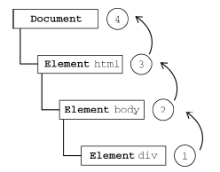
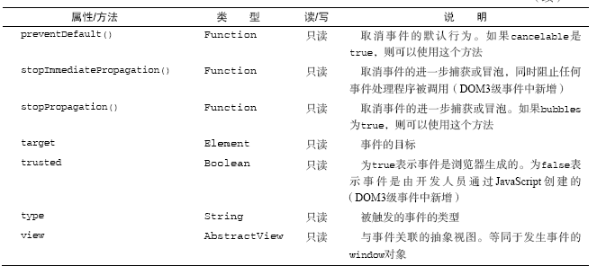

#JavaScript 高级程序设计

## 事 件

>JavaScript与HTML之间的交互是通过事件实现的。事件，就是文档或浏览器窗口中发生的一些特定的交互瞬间。可以使用侦听器（或处理程序）来预订事件，以便事件发生时执行相应的代码。这种在传统软件工程中被称为观察员模式的模型，支持页面的行为（JavaScript代码）与页面的外观（HTML和CSS代码）之间的松散耦合。

### 事件流

事件流描述的是从页面中接收事件的顺序。IE的事件流是`事件冒泡流`，而Netscape Communicator的事件流是`事件捕获流`

#### 事件冒泡

>event bubbling:事件开始时由最具体的元素(文档中嵌套层次最深的那个节点)接收，然后逐级向上传播到较为不具体的节点(文档).

例如：

```html
<!DOCTYPE html>
<html>
<head>
    <title>Event Bubbling Example</title>
</head>
<body>
    <div id="myDiv">Click Me</div>
</body>
</html>
```

如果单击了页面中的<div\>元素，那么这个`click`事件会按照如下顺序传播



*IE9、Firefox、Chrome 和Safari 则将事件一直冒泡到window 对象。*

#### 事件捕获

>event capturing:不太具体的节点应该更早接收到事件，而最具体的节点应该最后接收到事件。它的用意在于在事件到达目标之前捕获它。

仍以之前的例子，事件捕获的过程为：


*IE9、Safari、Chrome、Opera和Firefox 目前也都支持这种事件流模型。尽管“DOM2 级事件”规范要求事件应该从document 对象开始传播，但这些浏览器都是从window 对象开始捕获事件的。*

#### DOM 事件流

DOM2级事件规定的事件流包括三个阶段：`事件捕获阶段`、`处于目标阶段`和`事件冒泡阶段`。

首先发生的是事件捕获，为截获事件提供了机会，然后是实际的目标接收到事件，最后一个阶段是冒泡阶段，可以在这个阶段对事件做出响应。

仍以之前的例子，DOM事件流为：


IE9、Opera、Firefox、Chrome 和Safari 都支持DOM 事件流；IE8 及更早版本不支持DOM 事件流。

### 事件处理程序

事件就是用户或浏览器自身执行的某种动作，而响应某个事件的函数就叫做事件处理程序。

#### HTML事件处理程序

某个元素支持的每种事件，都可以使用一个与相应事件处理程序的同名的HTML特性来指定。这个特性的值应该是能够执行的JavaScript代码，或者也可以调用页面其他地方的定义的脚本。

```html
<!--直接包含JavaScript代码-->
<input type="button" value="click me" onlclick="alert(&quot;clicked&quot;)">

<!--调用页面其他地方的脚本，同时捕捉脚本错误-->
<input type="button" value="click me" onlclick="try{showMessage();}catch(ex){}">

<script>
    function showMessage(){
        alert('clicked');
    } 
</script>
```

缺点：

1. 存在一个时差问题，用户可能会在HTML元素一出现在页面上就触发相应的事件，但是由于当时事件处理程序还未加载，而导致脚本错误。

2. HTML与JavaScript代码紧密耦合。要更换事件处理程序，要改动两个地方：HTML代码和JavaScript代码

#### DOM0级事件处理程序

通过JavaScript指定事件处理程序的传统方式，就是`将一个函数赋值给一个事件处理程序属性`。

这种事件处理程序的方式至今仍然为所有现代的浏览器所支持，原因：

1. 简单
2. 具有跨浏览器优势

```javascript
var btn = document.getElementById('myBtn');

//设置事件处理程序
btn.onclick = function(event){
    alert(this.id);
};

//删除事件处理程序
btn.onclick = null;
```

不足：当需要添加多个事件处理程序时，比较麻烦

```javascript
var btn = document.getElementById('myBtn');

//设置事件处理程序1
btn.onclick = function(event){
    //事件处理程序1
};

//如果不这么做，之前的事件处理程序会被覆盖掉
var oldClickHandler = btn.onclick;

//添加事件处理程序2
btn.onclick = function(event){
    oldClickHandler();
    //事件处理程序2
}
```

#### DOM2级事件处理程序

"DOM2级事件"定义了两个方法，用于处理指定和删除事件处理程序操作。主要的好处就是`可以添加多个事件处理程序`

1. addEventListener(type,handler,caputering)

2. removeEventListener(type,handler,caputering)

这两个方法都接收3个参数

* type：事件类型

* handler：事件处理程序

* caputering：布尔值，true表示在捕获阶段调用handler，false表示在冒泡阶段调用

IE9、Firefox、Safari、Chrome 和Opera 支持DOM2 级事件处理程序。

添加多个事件处理程序

```javascript
var btn = document.getElementById('myBtn');

//添加事件处理程序1
btn.addEventListener('click',function(){},false);

//添加事件处理程序2
btn.addEventListener('click',function(){},false);
```

通过addEventListener添加的事件处理程序只能使用removeEventListener来移除。移除时传入的参数与添加程序时使用的参数相同。这意味着`通过addEventListener添加的匿名函数将无法移除`

```javascript
var btn = document.getElementById('myBtn');

//添加事件处理程序
btn.addEventListener('click',function(){
    alert(this.id);
    },false);

//无效的删除
btn.removeEventListener('click',function(){
    alert(this.id);
    },false);
```

*大多数情况下，都是将事件处理程序添加到事件流的冒泡阶段，这样可以最大限度地兼容各种浏览器。*

#### IE事件处理程序

IE实现了与DOM中类似的两个方法。

1. attchEvent(type,handler)

2. detachEvent(type,handler)

由于IE8及更早版本只支持事件冒泡，所以通过attchEvent添加的事件处理程序都会被添加到冒泡阶段

```javascript
var btn = document.getElementById('myBtn');

btn.attachEvent('onclick',function(){
    alert('clicked');
});
```

使用这两个方法要注意两点：

1. 第一个参数要加上"on"

2. 事件处理程序的作用域。在使用attachEvent的情况下，事件处理程序会全局作用域中运行。

```javascript
var btn = document.getElementById('myBtn');

btn.attachEvent('onclick',function(){
    alert(this === window); //true
});
```

#### 跨浏览器的事件处理程序

```javascript
var EventUtil = {
    addHandler : function(element,type,handler){
        if(element.addEventListener){
            element.addEventLisener(type,handler,false);
        } else if (element.attachEvent){
            element.attachEvent('on' + type,handler);
        } else {
            element['on' + type] = handler;
        }
    },
    removeHandler : function(element,type,handler){
        if(element.removeEventListener){
            element.removeEventListener(type,handler,false);
        } else if (element.detachEvent){
            element.detachEvent('on' + type,handler);
        } else {
            element['on' + type] = null;
        }
    }
}
```

### 事件对象

>在触发DOM上的某个事件时，会产生一个事件对象event，这个对象中包含着所有与事件有关的信息。包括导致事件的元素、事件的类型以及其他与特定事件相关的信息。例如，鼠标操作导致的事件对象中，会包含鼠标位置的信息，而键盘操作导致的事件对象中，会包含与按下的键有关的信息。所有浏览器都支持event 对象，但支持方式不同。

#### DOM中的事件对象

兼容DOM的浏览器会将一个event对象传入到事件处理程序中。

**event对象的属性和方法**




1. currentTarget target

    在事件处理程序内部，`对象的this始终等于currentTarget`的值，而target则`只包含事件的实际目标`。

2. preventDefault()

    只有cancelable属性设置为true的事件，才可以使用preventDefault()来取消其默认行为。

3. stopPropagation() 

    立即停止事件在DOM层次的传播，即取消进一步的事件捕获或冒泡

4. eventPhase

    确定事件当前位于事件流的哪个阶段

    * 捕获阶段：eventPhase为1
    
    * 处于目标对象上：eventPhase为2
    
    * 冒泡阶段：eventPhase为3
    
    ```javascript
    
    ```