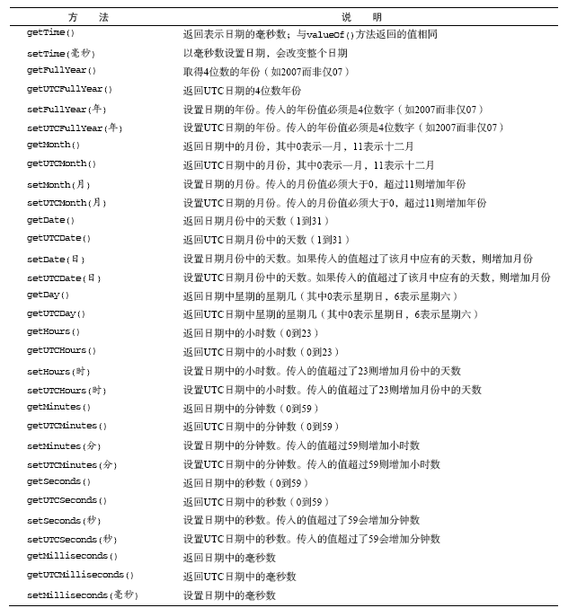

#JavaScript 高级程序设计

## 引用类型

>	引用类型的值（对象）是引用类型的一个实例。在ECMAScript中，引用类型是一种数据结构，用于将数据和功能组织在一起，也被常称为“类”。引用类型有时候也被成为对象定义，因为它们描述的是一类对象所具有的属性和方法


### Object类型

生成实例

	1. new Object() 

	2. {}（对象字面量法）

属性访问：点表示法 和 方括号

```javascript
	person.name 
	person['name']
```


### Array类型

特点：

	1. 数组每一项可以保存任何类型的数据

	2. 大小可以动态调整

创建实例：
	
	1. new Array() 

	2. [] 对象字面量

#### length
	
不是只读的，通过设置这个属性，可以从数组的末尾移除项或向数组中添加新项

```javascript
	var a = [1,2,3];
	a[2]; //3
	a.length = 2;
	a[2]; //undefined
```

利用length属性可以方便地在数组末尾添加新项

```javascript
	var a = [];
	a[a.length] = 1;
	a[a.length] = 2;
	a; //[1,2]
```

当把一个值放在超出当前数组大小的位置上时，数组会重新计算其长度值，即长度值等于
最后一项的索引加1

```javascript
	var a = [1,2,3];

	a[99] = 100;

	a.length; //100,位置3到98都是不存在的，访问都返回undefined
```

#### 检测数组【经典问题】

>对于一个全局作用域而言，可以使用 instanceof 进行检测，但是如果一个页面包含多
个frame（父子跨域），也就是说存在两个以上不同的全局执行环境时，就会存在两个不
同版本的Array构造函数，因此instanceof就会失效。

	解决方法：鸭式辨型（duck typing），kangax方法

#### 转换方法 

toLocaleString()

	创建一个数组值的以逗号分隔的字符串，不同的是，
	调用的是每一项的toLocaleString()方法

toString()

	返回由数组中每个值的字符串形式拼接而成的一个以逗号分隔
	的字符串，alert调用的是这个toString方法

valueOf()

	返回的是数组

join()

	可以使用不同的分隔符来构建这个字符串，只接收一个参数，
	即用分隔符的字符串，然后返回包含所有数组项的字符串

```javascript
	var a = [1,2,3];
	a.join('|'); //1|2|3
```

#### 栈方法 

ECMAScript数组提供了一种让数组的行为类似于栈（LIFO,Last-In-First-Out）数据结构的方法。

push()
	
	将参数逐个添加到数组末尾，返回修改后数组的长度

pop()
	
	从数组末尾移除最后一项，减少数组的length值

				
```javascript
	var a = [];
	var count = a.push(1,2,3);
	a;//1,2,3
	count;//3
	var item = a.pop();
	item;//3
	a.length;//2
```

#### 队列方法

ECMAScript数组提供了一种让数组的行为类似于队列（FIFO，First-In-First-Out）数据结构的方法。

shift()

	移除数组中的第一项，并返回该项，同时length减1

push()
	
	将参数逐个添加到数组末尾，返回修改后数组的长度

unshift()
	
	能在数组前端添加任意项，返回数组的长度

pop()
	
	从数组末尾移除最后一项，减少数组的length值

```javascript
	var a = [];
	var count = a.push(1,2,3);
	a;//1,2,3
	count;//3
	var item = a.shift();
	item;//1
	a.length;//2
	/*
		利用后两个方法可以实现反向的队列
	*/
	var r = [];
	var len = r.unshift(1,2,3);
	r;//3,2,1
	len; //3
	item = r.pop();
	item; //1
	r.length;//2
```

#### 重排序方法

reverse()
	
	反转数组项的顺序

```javascript
	var a = [1,2,3,4,5];
	a.reverse();
	a;//5,4,3,2,1
```

sort()

	默认情况下，sort()按照升序排列数组项，为了实现排序，sort()方法会调用每个数
	组项的toString()方法，然后比较得到的字符串，以确定排序，即使数组中的每一项
	都是数值，sort()方法比较也是字符串。

```javascript
	var a = [0,1,5,10,15];
	a.sort();
	a; //0,1,10,15,5
```

	显然这种排序方式在很多情况下都不是最佳方案，因此sort()方法可以接收一个比较
	函数作为参数，以便我们知道哪个值位于哪个值的前面。

```javascript
	//升序
	function asc(v1,v2){
		if(v1 > v2){
			return 1;
		} else if (v1 < v2){
			return -1;
		} else {
			return 0;
		}
	}
	//降序
	function desc(v1,v2){
		return -asc(v1,v2);
	}

	var a = [0,1,5,15,10];
	a.sort(asc);
	a;//0,1,5,10,15
```

#### 操作方法

concat()
	
	基于当前数组中的所有项创建一个新数组，具体来说，这个方法会先创建当前数组的
	一个副本，然后将接收到的参数添加到这个副本的末尾，最后返回新构建的数组，在
	没有参数的情况下，只是复制当前数组并返回副本

```javascript
	var a = [1,2,3]
	var b = a.concat(4,[5,6]);
	a;//1,2,3 原来的数组不变
	b; //1,2,3,4,5,6
```

slice()
	
	基于当前数组中的1或多个项创建一个新的数组

```javascript
	slice(start?,end?) //index = start ,..., (end-1)
	//if(start > end) return [];
	var a = [1,2,3,4]
	var a1 = a.slice(1);
	a1;//2,3,4
	var a2 = a.slice(1,2);
	a2;//2,
```

splice()

	主要用途是向数组的中部插入项
	1. 删除
		2个参数：要删除的第一项的位置 要删除的项数
	2. 插入
		3个参数：起始位置 0 要插入的项
	3. 替换
		3个参数：起始位置 要删除的项数 要插入的项

```javascript
	var a = [1,2,3];

	//删除
	var removed = a.splice(0,1); //删除第一项
	removed; //1
	a;//2,3

	//插入
	removed = a.splice(1,0,6,5,4);//从位置1开始插入两项
	removed; // []
	a; //2,6,5,4,3

	//替换
	removed = a.splice(1,2,11,22);
	removed;//6,5
	a;//2,11,22,4,3
```

#### 位置方法【ECMAScript5】

indexOf()
	
	从数组的开头开始向后查找

lastIndexOf()
	
	从数组的末尾开始向前查找

*都返回要查找的项在数组中的位置，或者没找到时返回-1，查找的项必须严格相等(===)*

```javascript
	var a = [1,2,3,4,5,5,6];
	a.indexOf(5);//4
	a.lastIndexOf(5);//5
```

#### 迭代方法【ECMAScript5】

every()
	
	对数组中的每一项运行给定函数，如果该函数对每一项都返回true，则返回true

filter()
	
	对于数组中的每一项运行给定函数，返回该函数会返回true的项组成的数组

forEach()
	
	对数组中的每一项运行给定函数，这个方法没有返回值

map()
	
	对数组中的每一项运行给定函数，返回每次函数调用结果组成的数组

some()
	
	对数组中的每一项运行给定函数，如果该函数对任意一项返回true，则返回true

```javascript
	var a = [1,2,3,4,5,4,3,2,1];
	var everyResult = a.every(function(item,index,array){
			return (item>2);
		}),
		someResult = a.some(function(item,index,array){
			return (item>2);
		}),
		filterResult = a.filter(function(item,index,array){
			return (item>2);
		}),
		mapResult = a.map(function(item,index,array){
			return item * 2;
		});
		a.forEach(function(item,index,array){
			//执行某些操作
			});

	everyResult; //false

	someReuslt; //true

	filterResult; //[3,4,5,4,3]

	mapResult; //[2,4,6,8,10,8,6,4,2]

```

#### 归并方法【ECMAScript5】

1. 迭代数组的所有项，然后构建一个最终返回的值
2. 参数：前一个结果值(pre) 当前值(cur) 索引(index) 数组对象(array)
3. 第一次迭代发生在数组的第二项上。

reduce()
	
	从数组的第一项开始，逐个遍历到最后

reduceRight()
	
	从数组的最后一项开始，向前遍历到第一项

```javascript
	var a = [1,2,3,4,5];
	/*
		执行过程
		#1 1+2
		#2 1+2 3
		#3 1+2+3 4
		#4 1+2+3+4 5 -> 15
	*/
	var sum = a.reduce(function(pre,cur,index,array){
			return pre+cur;
		});
	sum; //15,
```


### Date类型

>ECMAScript中的Date类型是在早期Java中的java.util.Date类基础上构建的，为此，
Date类型使用自UTC（国际协调时间）

#### 属性

Date.parse()
	
	参数：月/日/年（6/13/2013）

Date.UTC()
	
	返回表示日期的毫秒数

Date.now()【ECMAScript5】
	
	返回表示调用这个方法时的日期和时间的毫秒数

```javascript
	//开始
	var start = Date.now();

	//调用函数
	doSomething();

	//结束
	var stop = Date.now(),
	result = stop - start;
```

#### 继承的方法
1. toString()
2. toLocaleString()
3. valueOf()
	`返回日期的毫秒表示，可以用比较操作符来比较日期值`
			
```javascript
	var d1 = new Date(2016,0,1);
	var d2 = new Date(2016,1,1);
	d1 > d2 ; //false
```

#### 日期格式化方法

toDateString()
	
	星期几、月、日、年

toTimeString()
	
	时、分、秒、时区

toLocaleDateString()
	
	特定地区的格式 星期几、月、日、年

toLocaleTimeString()
	
	特定地区的格式 时、分、秒、时区

toUTCString()

	完整的UTC日期

#### 日期/时间组件方法



### RegExp类型

ECMAScript通过RegExp类型来支持正则表达式

```javascript
var expression = / pattern / flags ; 
```

#### flags

	·g:（global）表示全局模式，即模式将应用于所有字符串
	·i：（case-insensitive）表示不区分大小写模式
	·m：（multiline），表示多行模式，即在到达一行文本末尾时继续查找下一行

```javascript
	/*
	* 匹配字符串中所有"at"的实例
	*/
	var pattern1 = /at/g;
	/*
	* 匹配第一个"bat"或"cat"，不区分大小写
	*/
	var pattern2 = /[bc]at/i;
	/*
	* 匹配所有以"at"结尾的3 个字符的组合，不区分大小写
	*/
	var pattern3 = /.at/gi;
```

>使用正则表达式字面量和使用RegExp构造函数创建的正则表达式不一样,在ECMAScript3中，正则表达式字面量始终会共享一个RegExp实例。在ECMAScrpt5明确规定,使用正则表达式字面量必须像直接调用RegExp构造函数一样，每次都创建新的RegExp实例


#### RegExp实例属性

global
	
	布尔值，是否设置g标志

ignoreCase
	
	布尔值，是否设置i标志

multiline
	
	布尔值，是否设置m标志

lastIndex
	
	整数，表示开始搜索下一个匹配的字符位置，从0算起

source
	
	正则表达式的字符串表示

```javascript
	var pattern = /\[bc\]at/i;
	pattern.global;       //false
	pattern.ignoreCase;   //true
	pattern.multtline;    //false
	pattern.lastIndex;	  //0
	pattern.source;       //'\[bc\]at'
```

#### RegExp实例方法

exec()
	
	专门为捕获组而设计的，只接收要应用模式的字符串，然后返回包含第一个匹配项信
	息的数组，返回的数组是Array的实例，同时包含两个额外的属性：
		1. index（匹配项在字符串中的位置）
		2. input（应用正则表达式的字符串）
	第一项是与整个模式匹配的字符串，其他项是与模式中的捕获组匹配的字符串；
	如果没有匹配项则返回null。

```javascript
	var text = 'mom and dad and baby';
	var pattern = /mom( and dad( and baby)?)?/gi;
	var matches = pattern.exec(text);
	matches.index; //0
	matches.input; //'mom and dad and baby'
	matches[0];//'mom and dad and baby'
	matches[1];//' and dad and baby'
	matches[2];//' and baby'
```

test()
	
	接收一个字符串参数，在该模式有参数匹配的情况下返回true，否则返回false

```javascript
	var text = '000-00-0000';
	var pattern = /\d{3}-\d{2}-\d{4}/;
	if(pattern.test(text)){
		console.log('matched');
	}
```

#### RegExp构造函数属性

>RegExp构造函数包含一些属性，这些属性适用于作用域中的所有正则表达式，并且基于所执行的最近一次正则表达式操作而变化。


```javascript
	var text = 'this has been a short summer';
	var pattern = /(.)hort/g;

	/*
	 *注意：Opera不支持input、lastMatch、lastParen和Multiline属性
	 *IE不支持multiline属性
	 */
	 if(pattern.test(text)){
	 	console.log(RegExp.input); //this has been a short summer
	 	console.log(RegExp.lastParen);//s
	 	console.log(RegExp['$1']);//s
	 	console.log(RegExp.lastMatch);//short
	 	console.log(RegExp['$&']); //short
	 }
```

#### 模式的局限性

不支持的特性
	
	1. 匹配字符串开始和结尾的\A 和\Z 锚
	2. 向后查找（lookbehind）
	3. 并集和交集类
	4. 原子组（atomic grouping）
	5. Unicode 支持（单个字符除外，如\uFFFF）
	6. 命名的捕获组
	7. s（single，单行）和x（free-spacing，无间隔）匹配模式
	8. 条件匹配
	9. 正则表达式注释


### Function类型

>ECMAScript中相当特别的东西，函数实际上是对象，每个函数都是Function类型的实例,而且都与其他引用类型一样具有属性和方法，由于函数是对象，因此函数名实际上也是一个指向函数对象的指针，不会与某个函数绑定。

```javascript
	function foo(){return 1;}
	var bar = foo;
	foo = null;
	bar();//1
```

#### 函数的定义（3种）

函数声明

```javascript
	function sum(n1,n2){
		return n1 + n2;
	}
```

函数表达式定义

```javascript
	var sum = function(n1,n2){
		return n1 + n2;
	};
```

通过Function构造函数
*不建议，一是会导致解析两次代码，二是表达上不灵活*
			
```javascript
	var sum = new Function('n1','n2','return n1+n2');
```

#### 没有重载（深入理解）

将函数名想象为指针，有助于理解为什么ECMAScript中没有函数重载的概念

#### 函数声明与函数表达式

>两者的区别：解析器在向执行环境中加载数据时，会率先读取函数声明，并使其在执行任何代码之前可以访问，至于函数表达式，则必须等到解析器执行到它所在的代码行，才会真正被解释执行

```javascript
	/*
		函数声明，不需要注意位置
	*/
	sum(10,10);//20
	function sum(n1,n2){return n1 + n2 ;}
	/*
		函数表达式，需要在注意先后顺序
	*/
	sum(10,10);//error,unexpected identifier
	var sum = function(n1,n2){return n1 + n2;}
```

#### 作为值的函数

>因为ECMAScript中的函数名本身就是变量，所以函数也可以被作为值来使用，不仅可以作为参数进行传递，也可以作为结果返回。

```javascript
	function callSomeFunction(someFucntion,someArgument){
		return someFunction(someArgument);
	}
```

#### 函数内部属性

arguments

	主要用途是保存函数参数，此外还有一个callee的属性，指向拥有这个arguments对
	象的函数

```javascript
	//阶乘函数
	function factorial(n){
		if(n <= 1){
			return 1;
		} else {
			return n * arguments.callee(n - 1);
		}
	}
```

this

	this引用的是函数据以执行的环境对象，如当在网页的全局作用域中调用函数时，
	this对象引用的就是window

caller
	
	保存着调用当前函数的引用，如果在全局作用域中调用当前函数，它的值为null

```javascript
	function outer(){
		inner();
	}
	function inner(){
		console.log(inner.caller);
		console.log(arguments.callee.caller);
	}
	outer();
```

#### 函数的属性和方法

ECMAScript中的函数是对象，因此函数也有属性和方法

length
	
	表示函数希望接收的命名参数的个数

prototype

	对于ECMAScript中的引用类型而言，prototype是保存它们所有实例方法的真正所在

***
call() & apply()
	
	用途是在特定的作用域中调用函数，实际上等于设置函数体内的this对象的值，使用
	这两种方法来扩展作用域的最大好处就是对象不需要与方法有任何耦合关系。

bind()【ECMAScript5】
	
	创建一个函数的实例，其this值会被绑定到传给bind()函数的值

```javascript
	window.color = 'red';
	var o = {color:'blue'};
	function sayColor(){
		console.log(this.color);
	}
	var objectSayColor = sayColor.bind(o);
	objectSayColor();//blue
```

### 基本包装类型

>为了方便操作基本类型值，ECMAScript提供了3个特殊的引用类型：Boolean Number 和 String，实际上，每当读取一个基本类型值的时候，后台就会创建一个对应的基本包装类型的对象，从而能让我们能够调用一些方法来操作这些数据。

```javascript
	var s1 = 'some text';
	var s2 = s1.substring(2);
	/*
		1）创建一个String类型的实例
		2）在实例上调用指定的方法
		3）销毁这个实例
	*/
```

自动创建的基本包装类型的对象，只存在于一行代码的执行瞬间，然后立即被销毁，这意
味这我们不能在运行时为基本类型值添加属性和方法

```javascript
	var s1 = 'some text';
	s1.color = 'red';
	console.log(s1.color);//undefined;
```

*可以显式地创建基本包装类型的对象，但是不建议。*

#### Boolean类型

***永远不要使用***
			
```javascript
	var falseObject = new Boolean(false);
	var result = falseObject && true;
	result; //true
	/*
		布尔表达式中所有对象会被转为true，即使是布尔对象取
		false值
	*/
```

#### Number类型

与数字值对应的引用类型

toString()

	可以传递一个表示基数的参数，返回几进制数值的字符串形式

toFixed()
	
	按照指定的小数位返回字符串表示,会进行自动舍入

```javascript
	var num = 10;
	num.toFixed(2); //10.00
```

toExponential()
	
	返回以指数表示法(e表示法)
				
```javascript
	var n = 10;
	n.toExponential(1);//1.0e+1
```

toPrecision()
	
	可以通过参数来获取最合适的格式。

```javascript
	var n = 99;
	n.toPrecision(1);//1e+2
	n.toPrecision(2);//99
	n.toPrecision(3);//99.0
```

#### String类型

字符串的对象包装类型

**length**
	
	表示字符串中包含的字符的个数

**字符方法**
	
	参数：基于0的字符位置

charAt()

	以单字符字符串的形式返回给定位置的那个字符

charCodeAt()

	返回字符编码

```javascript
	var s = 'hello world';
	s.charAt(1); //e
	s.charCodeAt(1);//101
```

**字符串操作方法**

concat(string)
	
	用于将一或多个字符串拼接起来

```javascript
	var s = 'hello';
	var s1 = s.concat('world');
	s1; //hello world
	s;//hello
```

>在实践中，更多的还是使用'+'操作符

基于子字符串创建新字符串的方法：
	当参数都是正数时，得到的结果都是一样的；
	当参数是负数时：

slice(start,end?)
	
	将传入的负值与字符串的长度相加

substr(start,end?)
	
	将负的第一参数加上字符串的长度，负的第二个参数转换为0

substring(start,end?)
	
	将所有负值参数都转换为0


```javascript
	var s = 'hello world';
	s.slice(-3);//rld
	s.substr(-3);//rld
	s.substring(-3);//hello world
	s.slice(3,-4);//lo w
	s.substr(3,-4);//''
	s.substring(3,-4)/;//helo
```

**字符串位置方法**

从一个字符串中搜索给定的子字符串，返回子字符串的位置

indexOf()
	
	从头向后搜索

lastIndexOf()
	
	从后向前搜索

```javascript
	/*
		循环搜索，匹配所有的字字符串
	*/
	var s = 'Lorem ipsum dolor sit amet, consectetur'
			+' adipisicing elit',
		positions = [],
		pos = s.indexOf('e');
	while(pos > -1){
		positions.push(pos);
		pos = s.indexOf('e',pos + 1);
	}
	positions;//3,24,32,35,52
```

**trim()【ECMAScript5】**

创建一个字符串的副本，删除前置及后缀的所有空格，然后返回结果

```javascript
	var s = '    hello world     ';
	var trims = s.trim();
	trims;//hello world
```

**字符串大小写转换方法**

借鉴java.lang.String的同名方法

toLowerCase()
toUpperCase()
toLocaleLowerCase()
toLocaleUpperCase()

**字符串的模式匹配方法**

match(RegExp对象/正则表达式)
	
	本质上与调用RegExp的exec()方法相同

```javascript
	var text = 'cat,bat,sat,fat';
	var pattern = /.at/;
	var matches = text.match(pattern);
	matches.index; //0
	matches[0];//cat
	pattern.lastIndex; //0
```

search()
	
	返回字符串中第一个匹配项的索引，如果没有，则返回-1

```javascript
	var text = 'cat,bat';
	var pos = text.search(/at/);
	pos;//1
```

replace(RegExp/字符串,字符串/函数)

	替换子字符串的操作，如果第一个参数是字符串，那么只替换第一个字符串，要替换
	所有的子字符串，需要是正则表达式，且指定'g'标志

```javascript
	var text = 'cat,bat,sat,fat';
	var result = text.replace('at','ond');
	result;//'cond,bat,sat,fat'
	result = text.replace(/at/g,'ond');
	result;//'cond,bond,sond,fond'
```
	
	如果第二个参数是字符串，还可以使用一些特殊的字符序列，将正则表达式操作得到
	的值插入到结果字符中
		1. $$ $
		2. $& 匹配整个模式的子字符串。与RegExp.lastMatch的值相同
		3. $' 匹配的子字符串之前的子字符串。与RegExp.leftContext的值相同
		4. $` 匹配的子字符串之后的子字符串。与RegExp.rightContext的值相同
		5. $n 匹配第n个捕获组的子字符串，其中n等于0～9
		6. $nn 匹配第nn个捕获组的子字符串，其中nn等于01～99

```javascript
	var text = 'cat,bat,sat,fat';
	var result = text.replace(/(.at)/g,'word($1)');
	result;//word(cat),word(bat),word(sat),word(fat)
```

	如果第二个参数是一个函数，在只有一个匹配项，会向这个函数传递3个参数：
				 (模式匹配项 模式匹配项index 原始字符串)
	在正则表达式中定义了多个捕获组的情况下，传递的参数会是:
			(模式匹配项,第一个捕获组,第二个捕获组...,index,原始字符串)

```javascript
		function htmlEscape(text){
			return text.replace(/[<>"&]/g,function(match,pos,originalText){
				switch(match){
					case '<':
						return '&lt';
					case '>':
						return '&gt';
					case '&':
						return '&amp';
					case '\"':
						return '&quot';
				}
			});
		}
```

split(字符串或RegExp,数组大小)
	
	基于指定的分隔符将一个字符串分割成多个子字符串，将结果放在一个数组中

```javascript
	var color = 'red,blue,green,yellow',
		color1 = color.split(','),
		color2 = color.split(',',2),
		color3 = color.split(/[^\,]+/);

	color1;//['red','blue','green','yellow']
	color2;//['red','blue']
	color3;//["", ",", ",", ",", ""]
```

**localeCompare()**

比较两个字符串，并返回下列值中的一个

1. 如果字符串在字母表中应该排在字符串参数之前，则返回一个负数(大多数情况下是-1)
2. 如果字符串等于字符串参数，则返回0；
3. 如果字符串在字母表中应该排在字符串参数之后，则返回一个正数(大多数是1)

**fromCharCode()**

接收一或者多个字符编码，将它们转换成一个字符串

```javascript
	String.fromCharCode(104,101,108,108,111);//'hello'
```

**HTML方法**

专门用于简化常见的HTML格式化任务的方法，不过尽量别使用

### 单体内置对象

>由ECMAScript实现提供的，不依赖于宿主环境的对象，这些对象在ECMAScript程序执行之前就已经存在了，即内置对象已经被实例化了

####Global对象

所有在全局作用域定义的属性和函数，都是Global对象的属性，

**isNaN()**

**isFinite()**

**parseInt()**

**parseFloat()**

**URI编码方法**
	
	有效的URI中不能包含某些字符，而这两个URI编码方法就可以对URI进行编码，它们
	用特殊的UTF-8编码替换所有无效的字符，从而让浏览器能够接受和理解

encodeURI() & decodeURI()
	
	对整个URI进行编码\解码，但不会对属于URI的特殊字符进行编码，如冒号，正斜杠
	，问号，井号

encodeURIComponent() & decodeURIComponent()
	
	主要用于对URI的某一段，会对它发现的任何非标准字符进行编码\解码

```javascript
	var uri = 'http://www.wrox.com/illegal value.html#start';
	//http://www.wrox.com/illegal%20value.html#start
	encodeURI(uri);
	//http%3A%2F%2Fwww.wrox.com%2Fillegal%20value.html%23start"
	encodeURIComponent(uri);
```

>一般来说，使用encodeURIComponent方法要多一些，因为在实践中更常见的是对查询字符串参数而不是对基础URI进行编码


**eval()**

*现在使用基本就只限制在解析json，其余的不建议使用*
作用是像一个完整的ECMAScript解析器，只接受一个参数，即要执行的ECMAScript字符串

**Global对象的属性**


window对象

>ECMAScript虽然没有指出如何直接访问Global对象，但是Web浏览器都是将这个全局对象作为window对象的一部分加以实现，因此全局作用域中声明的所有变量和函数，都成为了window对象的属性

```javascript
	//取得Global对象的方法
	var global = function(){
		return this;
	}();
```

#### Math对象

>ECMAScript还为保存数学公式和信息提供了一个公共位置，即Math对象，与我们在JavaScript直接编写的计算功能相比，Math对象提供的计算功能执行起来要快得多

**Math对象的属性**


**min() & max()**
	
	确定一组数值中的最小值和最大值

```javascript
	var a = [1,2,3,4,5,6];
	var max = Math.max.apply(Math,a);
```

**舍入方法**

Math.ceil()
	
	将数值向上舍入为最接近的整数
Math.floor()
	
	将数值向下舍入为最接近的整数
Math.round()

	标准四舍五入

```javascript
	Math.ceil(25.1);//26
	Math.floor(25.9); //25
```

**random()**

	返回[0,1)的一个随机数,从某个整数范围内随机选择一个值:
	值 = Math.floor(Math.random * 可能值的总数 + 第一个可能的值)

```javascript
	//从1-10之间的数值
	var n = Math.floor(Math.random() * 10 + 1);
```

**其他方法**


