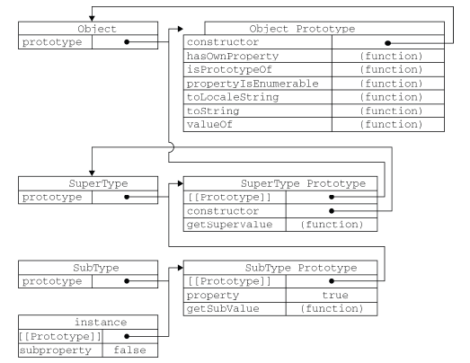

#JavaScript 高级程序设计

##面向对象的程序设计

	ECMA-262把对象定义为：无序属性的集合，其属性可以包含基本值、对象或
	者函数。

	###理解对象

		1.属性类型

			[ECMAScript5]

			*数据属性[Object.defineProperty()]
				·[[Configurable]]
				·[[Enumerable]]:for-in
				·[[Writable]]
				·[[Value]]:默认是undefined
				`
					var person = {};
					Object.defineProperty(person,'name',{
							writable:false,
							value:'zhang'
						});
					person.name;//zhang
					perosn.name = 'foo';
					person.name; //zhang
				`

			*访问器属性[setter getter]
				它们包含一对getter和setter函数，在读取访问器属性的时候
				，会调用getter函数，返回有效的值，在写入访问器属性时，
				会调用setter函数，并传入新值
				`
					var book = {
						_year : 2004,
						edition : 1
					};
					Object.defineProperty(book,'year',{
							get : function(){
								return this._year;
							},
							set : function(newValue){
								if(newValue > 2004){
									this._year = newValue;
									this.edition += newValue - 2004;
								}
							}
						});
					book.year = 2005;
					book.edition; //2
				`

			*定义多个属性[Object.defineProperties]
				`
					var book = {};
					Object.defineProperties(book,{
							_year : {
								value : 2004
							},
							edition : {
								value : 1
							},
							year : {
								get : function(){
									return this._year;
								},
								set : function(newValue){
									if(newValue > 2004){
										this._year = newValue;
										this.edition += newValue - 2004;
									}
								}
							}
						});
				`

			*读取属性的特性[Object.getOwnPropertyDescriptor()]
				`
					var descriptor = Object.getOwnPropertyDescriptor(book,'_year');
					descriptor.value;
					descriptor.configurable;
				`

		2.创建对象

			*工厂模式
				用函数来封装以特定接口创建对象的细节
				`
					function createPerson(name,age,job){
						var o = new Object();
						o.name = name;
						o.age = age;
						o.job = job;
						o.sayName = function(){
							console.log(this.name);
						};
						return o;
					}
					var person = createPerson('zhang',25,'programmer');
				`
				【不足】无法解决对象识别问题（类型），而且方法应该是共
				用的，但是这次方法实际上每次都会创建一个新的方法。

			*构造函数模式
				ECMAScript中的构造函数可用来创建特定的对象
				`
					function Person(name,age,job){
						this.name = name;
						this.age = age;
						this.job = job;
						this.sayName = function(){};
					}
					var person = new Person('zhang',25,'programmer');
				`
				其中，Person()与createPerson()的区别：
					·没有显示地创建对象
					·直接将属性和方法赋予this对象
					·没有return语句
				之所有首字母大写是借鉴其他的OO语言，主要是为了区别与
				ECMAScript其他的函数，因为构造函数本身也是函数
				要创建Person的实例，必须使用new操作符，以这种方式调用
				构造函数实际上会经历4个步骤：
					1）创建一个新对象
					2）把构造函数的作用域赋予给新对象(this的指向)
					3）执行构造函数的代码(为新对象添加属性)
					4）返回新对象
				用这种方式创建的实例对象，它们的constructor属性都会指向
				Person，这也是胜过工程模式的地方
				`
					person.constructor == Person //true
					person instanceof Object // true
					person instanceof Person //true
				`
				此外，还有两点需要注意的：
				1）将构造函数当作函数
					构造函数与其他函数唯一的区别就是调用的方式不同，任
					何函数，只要通过new操作符来调用，那它就可以作为构
					造函数
					`
						//当作构造函数调用
						var person = new Person('zhang',25,'programmer');
						//作为普通函数调用
						Person('zhang',25,'programmer');
						window.sayName();//this指向window
						//在另一个对象的作用域调用
						var o = {};
						Person.call(o,'zhang',25,'programmer');
						o.sayName();//zhang
					`
				2）构造函数的问题
					缺点就是每个方法都要在每个实例上重新创建一遍，以这
					种方式创建函数，会导致不同的作用域链和标识符解析，
					因此，不同实例上的同名函数是不相等的。
					`
						p1.sayName == p2.sayName //false
					`

			*原型模式
				我们创建的每个函数都有一个prototype属性，这个属性是一
				个指针，指向一个对象，而这个对象的用途是包含可以有特定
				类型的所有实例共享的属性和方法。使用原型对象的好处是可
				以让所有对象实例共享它所包含的属性和方法。
				`
					function Person(){}
					Person.prototype.name = 'zhang';
					Person.prototype.sayName = function(){
						console.log(this.name);
					};
					var p1 = new Person();
					p1.sayName(); //zhang
					var p2 = new Person();
					p2.sayName();//zhang
				`
				1）理解原型对象
					无论什么时候，只要创建一个新函数，就会根据一组特定
					的规则为该函数创建一个prototype属性，这个属性指向
					函数的原型对象。默认情况下，所有原型对象都会自动获
					得一个constructor属性，有
						Person.prototype.constructor == Person
					当调用构造函数创建一个新实例后，该实例的内部包含一
					个指针，指向构造函数的原型对象，ECMA-262管这个指针
					叫[[Prototype]]，在Firefox,Safari和Chrome在每个对象
					上支持一个属性__proto__，在其他的实现上，则是不可见
					需要注意的是：这个连接存在于实例与构造函数的原型对
					象之间，而不是存在与实例与构造函数之间。 
						
					可以通过isPrototypeOf()来确定对象之间是否存在这种关
					系
						`
							Person.prototype.isPrototypeOf(p1) //true
						`
					每当代码读取某个对象的某个属性时，都会执行一次搜索
					，目标是具有给定名字的属性，搜索首先从对象实例本身
					开始。如果在实例中找到了具有给定名字的属性，则返回
					属性的值，如果没有找到，则继续搜索指针指向的原型对
					象，在原型对象中查找具有给定名字的属性。
					虽然可以通过通过对象实例访问原型中的值，但是不能通
					过对象实例重写原型中的值，当为对象实例添加一个属性
					时，这个属性就会屏蔽原型对象中保存的同名属性。
						`
							function Person(){}
							Person.prototype.name = 'zhang';
							Person.prototype.sayName = function(){
								console.log(this.name);
							};
							var person = new Person();
							person.sayName(); //zhang
							person.name = 'foo';
							person.sayName();//foo
							delete person.name;
							person.sayName(); //zhang
						`
						
					使用hasOwnProperty()可以知道属性是对象实例上的，或
					者是原型对象上的。
				2）原型与in操作符
					·for-in
						返回所有能够通过对象访问的，可枚举的属性，包括
						实例中的属性和原型中的属性。
						要取得对象上所有可枚举的实例属性，可以使用
						Object.keys()
					·in
						通过对象能够访问给定属性（实例或原型）时返回
						true，同时使用hasOwnProperty()和in，就可以确定
						该属性存在与对象中，还是存在与原型中
						`
							function hasPrototypeProperty(o,name){
								return !Object.hasOwnProperty(name) && (name in o);
							}
						`
				3）更简单的原型语法
					常见的做法是用一个包含所有属性和方法的对象字面量重
					写整个原型对象
					`
						function Person(){}
						Person.prototype = {
							name : 'zhang',
							age : 25,
							job : 'programmer',
							sayName : function(){}
						};
					`
					但是，使用这种方法，本质上完全重写了默认的prototype
					对象，因此constructor属性不再指向Person函数，但是
					instanceof操作符还能返回正确的结果
					`
						var p = new Person();
						p instanceof Person; //true,instanceof是__proto__的指向，来判断
						p.constructor == Person; //false
					`
					如果要添加constructor属性，还必须保证constructor属
					性的[[Enumable]]特性被设置为false
				4）原型的动态性
					可以随时为原型添加属性和方法，并且修改能够立即在所
					有对象实例中反映出来，如果是重写整个原型对象，则重
					写原型对象切断了现有原型与任何之前存在的对象实例之
					间的联系，它们引用的仍然是最初的原型。
					`
						function Person(){}
						var friend = new Person();
						Person.prototype = {
							name : 'zhang',
							age : 25,
							job : 'programmer',
							sayName : function(){}
						};
						friend.sayName(); //error
					`
					
				5）原生对象的原型
					原生的引用类型，都是采用这种模式创建的，所有原生引
					用类型都在其构造函数的原型上定义了方法。
				6）原型对象的问题
					原型中所有属性是被很多实例共享的，这种共享对于函数
					非常合适，但是一般来说，实例都是要有属于自己的全部
					的属性的，这个问题正是我们很少看到有人单独使用原型
					模式的原因所在。

			*组合使用构造函数模式和原型模式【常用】
				构造函数模式用于定义实例属性，原型模式用于定义方法和共
				享的属性，使得每个实例都会有自己的一份实例属性的副本，
				同时又共享着方法的引用，最大限度地节省内存
				`
					function Person(name,age,job){
						this.name = name;
						this.age = age;
						this.job = job;
					}
					Person.prototype = {
						constructor : Person,
						sayName : function(){
							console.log(this.name);
						}
					}
				`
				这种混合模式，是目前ECMAScript中使用最广泛、认同度最高
				的一种创建自定义类型的方法。

			*动态原型模式
				`
					function Person(name,age,job){
						this.name = name;
						this.age = age;
						this.job = job;
						//只会在初次调用构造函数时才会执行
						if(typeof this.sayName != 'function'){
							Person.prototype.sayName = function(){};
						}
					}
				`

			*寄生构造模式
				基本思想是创建一个函数，该函数的作用仅仅是封装创建对象
				的代码，然后返回新创建的对象
				`	
					/*
						创建一个具有额外方法的特殊数组，由于不能直接修
						改Array构造函数，因此可以使用这个模式
					*/
					function SpecialArray(){
						//创建数组
						var values = new Array();
						//添加值
						values.push.apply(values,arguments);
						//添加方法
						values.toPipedString = function(){
							return this.join('|');
						};
						console.log(this);
						//返回数组
						return values;
					}
					var colors = new SpecialArray('red','blue','grey');
					colors.toPipedString();//red|blue|grey
				`
				注：这段“奇怪的代码”的原理：构造函数在不返回值的情况下
				，默认会返回新对象实例，通过在构造函数的末尾添加一个
				return语句，可以重写调用构造函数时返回的值。构造函数返
				回的对象与在构造函数外部创建对象没有什么不同，为此
				`
					colors instanceof SpecialArray //false
				`

			*稳妥构造函数模式
				Douglas Crockford发明了JavaScript中的稳妥对象(durable 
				objects)这个概念，所谓稳妥对象，指的是没有公共属性，而
				且其方法也不引用this的对象。稳妥对象最适合在一些安全的
				环境中，或者在防止数据被其他应用程序(Mashup 程序)改动
				时使用。
				特点：
					1）新创建对象的实例方法不引用this
					2）不使用new操作符调用构造函数
				`
					function Person(name,age,job){
						var o = new Object();
						o.sayName = function(){
							console.log(name.last);
						}
						return o;
					}
					var p = Person({last:'zhang'},25,'programmer');
					p.sayName();
				`
				除了调用sayName()方法外，没有别的方式可以访问其数据成
				员，即使有其他代码会给这个对象添加方法或数据成员，但也
				不可能有别的方法访问到传入构造函数中的原始数据。

		3.继承

			*原型链
				ECMAScript中描述了原型链的概念，并将原型链作为实现继承
				的主要方法，其基本思想是利用原型让一个引用类型继承另一
				个引用类型的属性和方法。
				`
					/*
						实现原型链的基本模式
					*/
					function SuperType(){
						this.property = true;
					}
					SuperType.prototype.getSuperValue = function(){
						return this.property;
					};
					function SubType(){
						this.subproperty = false;
					}
					//继承了SuperType
					SubType.prototype = new SuperType();
					SubType.prototype.getSubValue = function(){
						return this.subproperty;
					};
					var instance = new SubType();
					instance.getSupperValue(); //true
				`
				
				需要注意的几点
				1）确定原型和实例的关系
					`
						instance instanceof Object //true
						instance instanceof SuperType //true
						instance instanceof SubType //true
					`
					`
						Object.prototype.isPrototypeOf(instance) //true
						SuperType.prototype.isPrototypeOf(instance) //true
						SubType.prototype.isPrototypeOf(instance) //true
					`
				2）子类型给原型添加方法的代码一定要放在替换原型的语句
				   之后
				3）原型链的问题
					最主要的问题来自于包含引用类型值的原型，在通过原型
					来实现继承时，原型实际上变成了另一个类型的实例，于
					是原先的实例属性也就顺理成章地变成了现在的原型属性
					了
					`
						function SuperType(){
							this.colors = ['red','blue'];
						}
						function SubType(){}
						//继承了SuperType
						SubType.prototype = new SuperType();
						var instance = new SubType();
						insance.colors;//
					`
					第二个问题是：在创建子类型实例时，不能向超类型的构
					造函数中传递参数。综合两点，在实践中很少单独使用原
					型链

			*借用构造函数
				constructor stealing（借用构造函数），基本思想：在子类
				型构造函数的内部调用超类型构造函数。
				`
					function SuperType(){
						this.colors = ['red','blue','green'];
					}
					function SubType(){
						SuperType.call(this);
					}
					var instance1 = new SubType();
					var instance2 = new SubType();
					instance1.colors.push('black');
					instance1.colors;//red blue green black
					instance2.colors; //red blue green
				`
				1）优势：传递参数
					即可以在子类型构造函数中向超类型构造函数传递参数
					`
						function SuperType(name){
							this.name = name;
						}
						function SubType(){
							SuperType.call(this,'zhang');
							this.age = 25;
						}
					`
				2）问题
					很明显，方法都在构造函数中定义，因此函数复用就无从
					谈起，而且在超类型的原型中定义的方法，对子类型而言
					是不可见的

			*组合继承【常用】
				combination inheritance，伪经典继承，指的是将原型链和
				借用构造函数技术组合到一块，思路是使用原型链实现对原型
				属性和方法的继承，借助构造函数来实现对实例属性的继承
				`
					function SuperType(name){
						this.name = name;
						this.colors = ['red','blue','grey'];
					}
					SuperType.prototype.sayName = function(){
						console.log(this.name);
					};
					function SubType(name,age){
						//继承属性
						SuperType.call(this,name);//第二次调用
						this.age = age;
					}
					SubType.prototype = new SuperType();//第一次调用
					SubType.prototype.constructor = SubType;//默认的被重写了，重新赋值
					SubType.prototype.sayAge = function(){
						console.log(this.age);
					};
					var instance1 = new SubType('zhang',26);
					instance1.colors.push('black');
					instance1.colors;//red blue grey black
					instance1.sayName(); //zhang
					instance1.sayAge(); //26
					var instance2 = new SubType('z',29);
					instance2.colors;//red blue grey 
					instance2.sayName(); //z
					instance2.sayAge(); //29
				`
				问题：
				无论在什么情况下，都会调用两次超类型构造函数，而且不得
				不调用子类型构造函数时重写属性，屏蔽原型中的两个同名属
				性。

			*原型式继承
				2006年，道格拉斯·克罗克德福介绍了一种实现继承的方法，
				想法是借助原型可以基于已有的对象创建新的对象
				`
					function object(o){
						function F(){};
						F.prototype = o;
						return new F();
					}
				`
				从本质上讲，object()对传入其中的对象执行了一次浅复制。
				对其对象的属性进行共享。
				`
					var person = {
						name : 'zhang',
						friends : ['li','wang']
					};
					var anotherPerson = object(person);
					//创建自己name属性
					anotherPerson.name = 'lao';
					//为原型链上的friends数组添加项
					anotherPerson.friends.push('foo');
					anotherPerson.friends;//li wang foo
				`
				在ECMAScript5中，有Object.create()实现相同的功能
				`
					var person = {
						name : 'zhang',
						friends : ['li','wang']
					};
					var anotherPerson = Object.create(person,{
						name : {
							value : 'lao';
						}
					});	
				`
				如果只想让一个对象与另一个对象保持类似的情况下，原型式
				继承是完全可以胜任的

			*寄生式继承
				思路：创建一个仅用于封装继承过程的函数，该函数在内部以
				某种方式来增强对象，然后再像真地是它做了所有工作一样返
				回对象。
				`
					function createAnother(original){
						//通过调用函数创建一个新对象
						var clone = object(original);
						//以某种方式来增强这个对象
						clone.sayHi = function(){
							console.log('hi');
						};
						return clone;
					}
					var person = {
						name : 'zhang',
						friends : ['li','wang']
					};
					var anotherPerson = createAnother(person);
				`

			*寄生式组合继承【最理想】
				即通过借助构造函数来继承属性，通过原型链的混成形式来继
				承方法，其背后的思路是：不必为了指定子类型的原型而调用
				超类型的构造函数，我们所需要的无非就是超类型的原型的一
				个副本，本质上，就是使用寄生式继承来继承超类型的原型，
				然后再将结果指定给子类型的原型
				`
					function inheritPrototype(subType,superType){
						var prototype = object(superType.prototype);
						prototype.constructor = subType;
						subType.prototype = prototype;
					}
				`
				`
					function SuperType(name){
						this.name = name;
						this.colors = ['red','blue','grey'];
					}
					SuperType.prototype.sayName = function(){
						console.log(this.name);
					};
					function SubType(name,age){
						SuperType.call(this,name);
						this.age = age;
					}
					inheritPrototype(subType,superType);
					SubType.prototype.sayAge = function(){
						console.log(this.age);
					};
				`
				优势：
				只调用一次SuperType构造函数，并且因此避免了在
				SubType.prototype上面创建不必要的、多余的属性，因此同时
				，原型链还能保持不变，能够正常使用instanceof和isPrototypeOf()
				注：这种模式广泛应用于框架中的extend()方法

