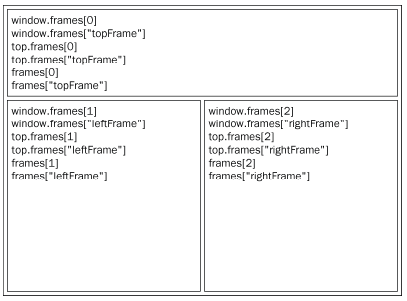
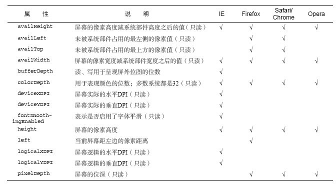
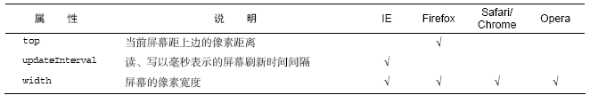

# JavaScript 高级程序设计

## BOM 浏览器对象模型

>要在Web中使用JavaScript，那么BOM无疑是真正的核心，BOM提供了很多对象，用于访问浏览器的功能。W3C为了把浏览器中JavaScript最基本的部分标准化，已经将BOM的主要方面纳入了HTML5的规范中

### window 对象

>BOM的核心对象是window，它表示浏览器的一个实例，在浏览器中，window对象有双重角色，它既是通过JavaScript访问浏览器窗口的一个接口，又是ECMAScript规定的Global对象。

#### 全局作用域

>由于window对象同时扮演着ECMAScript中Global对象的角色，因此所有全局作用域中声明的变量、函数都会变成window对象的属性和方法

```javascript
var age = 29;
function sayAge(){
    console.log(this.age);
}

console.log(window.age); //29
sayAge(); //29
window.sayAge(); //29
```

定义全局变量与在window对象上直接定义属性有一点差别
    
    全局变量不能通过delete操作符删除，而直接在window对象上定义的属性可以

```javascript
var age = 29;
window.color = 'red';

delete window.age; //false

delete window.color; //true

window.age; //29
window.color;//undefined
```

*尝试访问未声明的变量会抛出错误，但是通过查询window对象，可以知道某个可能未声明的变量是否存在*

#### 窗口关系及框架

>如果页面中包含框架，则每个框架都拥有自己的window对象，并且保存在frames集合中。

```html
<html>
    <head>
        <title>Frameset Example</title>
    </head>
    <frameset rows="160,*">
        <frame src="frame.htm" name="topFrame">
        <frameset cols="50%,50%">
            <frame src="" name="leftFrame">
            <frame src="" name="rightFrame">
        </frameset>
    </frameset>     
</html>
```



#### 窗口位置

screenLeft & screenTop

    IE、Safari、Opera、Chrome

screenX & screenY

    Firefox、Safari、Chrome

获取浏览器窗口左边和上边的位置

```javascript
var leftPos = (typeof window.screenLeft == 'number') ? 
                window.screenLeft : window.screenX;
var topPos = (typeof window.screenTop == 'number') ?
                window.screenTop : window.screenY;
```
#### 窗口大小

无法确定浏览器窗口本身的大小，但是可以获得页面视口大小

```javascript
var pageWidth = window.innerWidth,
    pageHeight = window.innerHeight;

if(typeof pageWidth != 'number'){
    if(documnet.compatMode == 'CSS1Compat'){ //标准模式
        pageWidth = document.documentElement.clientWidth;
        pageHeight = document.documentElement.clientHeight;
    } else { //IE6 混杂模式下
        pageWidth = document.body.clientWidth;
        pageHeight = document.body.clientHeight;
    }
}
```

#### 导航和打开窗口

**window.open**

    既可以导航到一个特定的URL，也可以打开 一个新的浏览器窗口，接收四个参数：

    （url，窗口目标，特性字符串，表示新页面是否取代浏览器历史记录中的布尔值）

#### 间歇调用和超时调用

>JavaScript是单线程语言，但它允许通过设置超时值和间歇时间值来调度代码在特定的时刻执行，前者是在指定的时间过后执行代码，而后者则是每隔指定的时间就执行一次代码

**setTimeout([string,func],ms)**

*传递字符串可能导致性能损失，不建议以字符串作为第一个参数*

    第二个参数表示等待多长时间的毫秒数，JavaScript把当前任务添加到队列中，因
    此经过该时间后指定的代码不一定会马上执行。

调用setTimeout()之后，该方法会返回一个数值ID，表示超时调用，这个超时调用ID是执行代码的唯一标识符，通过它可以来取消超时调用

```javascript
//设置超时调用
var timeoutId = setTimeout(function(){},10000);

//取消超时调用
clearTimeout(timeoutId);
```

**setInterval([string,func],ms)**

>一般认为，使用超时调用来模拟间歇调用是一种最佳模式，在开放环境下，很少使用真
正的间歇调用，原因是`后一个间歇调用可能在前一个间歇调用结束之前启动`,s因此，最好不要使用间歇调用

```javascript
//使用setTimeout()来模拟setInterval()
var num = 0,max = 10;

function incrementNumber(){
    num++;

    //如果执行次数未达到max设定的值，则设置另一个超时调用
    if(num < max){
        setTimeout(incrementNumber,500);
    } else {
        console.log('done');
    }
}

setTimeout(incrementNumber,500);
```

#### 系统对话框

>系统对话框与在浏览器中显示的网页没有关系，也不包含HTML，它们的外观由操作系统及浏览器设置决定，不是由CSS决定，此外，通过这几个方法打开的对话框都是同步和模态的。

1. alert()
2. confirm()
3. prompt()

### Location 对象

>Location对象提供了与当前窗口加载的文档有关的信息，还提供了一些导航功能。它既是window对象的属性，也是document对象的属性

**Location对象的属性**


#### 查询字符串参数

通过对location.search返回的内容进行解析，得到每个查询字符串的参数

```javascript
function getQueryStringArgs(){
    //取得查询字符串并去掉开头的问号
    var qs = location.search.length > 0 ? location.search.substring(1) : '',

    //保存数据的对象
    args = {},

    //取得每一项
    items = qs.length ? qs.split('&') : [],
    item = null,
    name = null,
    value = null,

    //在for循环中使用
    i = 0,
    len = items.length;

    //逐个将每一项添加到args对象中
    for(i = 0;i < len;i++){
        item = items[i].split('=');
        name = decodeURIComponent(item[0]);
        value = decodeURIComponent(item[1]);

        if(name.length){
            args[name] = value;
        }
    }

    return args;
}
```

#### 位置操作

使用location对象可以通过很多方式来改变浏览器的位置

```javascript
location.assign('http://example.com');

window.location = 'http://example.com';

location.href = 'http://example.com'; //最常用
```

另外，修改location对象的其他属性也可以改变当前加载的页面，并且修改URL之后，浏览器的历史记录就会生成一条新记录

```javascript
//假设初始URL 为http://www.wrox.com/WileyCDA/

//将URL 修改为"http://www.wrox.com/WileyCDA/#section1"
location.hash = '#section1';

//将URL 修改为"http://www.wrox.com/WileyCDA/?q=javascript"
location.search = '?q=javascript';

//将URL 修改为"http://www.yahoo.com/WileyCDA/"
location.hostname = 'www.yahoo.com';

//将URL 修改为"http://www.yahoo.com/mydir/"
location.pathname = 'mydir';

//将URL 修改为"http://www.yahoo.com:8080/WileyCDA/"
location.port = 8080;
```

*每次修改location的属性(hash除外)，页面都以新的URL重新加载*

使用`replace()`方法，可以改变浏览器位置，但是不会产生历史记录

```html
<!DOCTYPE html>
<html>
<head>
    <title>You won't be able to get back here</title>
</head>
<body>
    <p>Enjoy this page for a second, because you won't be coming back here.</p>
    <script type="text/javascript">
    setTimeout(function () {
    location.replace("http://www.wrox.com/");
    }, 1000);
    </script>
</body>
</html>
```

`reload()`可以重新加载当前显示的页面，在不传递任何参数时，页面就会以最有效的方式重新加载页面（如从浏览器缓存中重新加载）。

```javascript
//最有效方式重新加载，有可能从缓存中加载
location.reload()

//强制从服务器重新加载
location.reload(true);
```

### navigator对象

>最早由Netscape Navigator2.0引入的navigator对象，现在已经成为识别客户端浏览器的事实标准。navigator对象是所有支持JavaScript的浏览器所共有的。但是与其他BOM对象的情况一样，每个浏览器的navigator对象都有自己的一套属性。

**各个浏览器的navigator对象的属性和方法**


#### 检测插件

检测浏览器中是否安装了特定的插件是一种最常见的检测例程。

对于非IE浏览器，可以使用`plugins`数组来进行检测

    plugins属性

    1. name : 插件的名称

    2. desciption ：插件的描述

    3. filename ： 插件的文件名

    4. length： 插件所处理的MIME类型数量

```javascript
//非IE
function hasPlugin(name){
    name = name.toLowerCase();
    var plugins = navigator.plugins,
        i,
        len = plugins.length;

    for (i = 0;i < len;i++){
        if(plugins[i].name.toLowerCase().indexOf(name) > -1){
            return true;
        }
    }

    return false;
}

//检测Flash
hasPlugin('Flash');

//检测QuickTime
hasPlugin('QuickTime')
```

在IE中检测插件的唯一方式就是使用专有的`ActiveXObject`类型，并尝试创建一个特定插件的实例。此外，IE是以COM对象的方式实现插件的，而COM对象使用的唯一标识符来标识，因此要想检查特定的插件，就必须知道其COM标识符。

```javascript
//检测IE中的插件
function hasIEPlugin(name){
    try{
        new ActiveXObject(name);
        return true;
    } catch (ex){
        return false;
    }
}

//检测Flash
hasIEPlugin('ShockwaveFlash.ShockwaveFlash');

//检测QuickTime
hasIEPlugin('QuickTime.QuickTime');
```

鉴于检测两者插件的方法差别太大，因此典型的做法是针对每个插件分别创建检测函数

```javascript
//检测所有浏览器中的Flash
function hasFlash(){
    var result = hasPlugin('Flash'); //在IE中返回false len=0
    if(!result){
        result = hasIEPlugin('ShockwaveFlash.ShockwaveFlash');
    }
    return result;
}
```

#### 注册处理程序

Firefox 2为navigator对象新增了 `registerContentHanlder()` 和 `registerProtocolHandler()` 方法，（这两个方法在HTML5中有定义）

### screen对象

**screen对象属性表**





### history对象

>history对象保存这用户上网的历史记录，窗口被打开的那一刻算起。因为history是window对象的属性，因此每个浏览器窗口、每个标签页乃至每个框架，都有自己的history对象与特定的window对象关联。无处安全方面的考虑，开放人员无法得知用户浏览过的url，不过借由用户访问过的页面列表，同样可以在不知道实际URL的情况下实现后退和前进。

**go([number,string])**

    可以在用户历史记录中任意跳转

```javascript
//如果参数是一个整数值

//后退一页
history.go(-1);
//前进一页
history.go(1);

//如果参数是一个字符串

//跳转到最近的wrox.com页面
history.go('wrox.com');
```

**back() & forward()**

    可以利用这两个方法来代替go()，这两个方法来模拟浏览器的后退和前进

```javascript
//后退一页
history.back();

//前进一页
history.forward();
```

**length**

    保存这历史记录的数量，可以通过检测该属性的值，可以确定用户是否一开始就打
    开了你的页面

```javascript
if(history.length == 0){
    //这应该是用户打开窗口后的第一个页面
}
```


