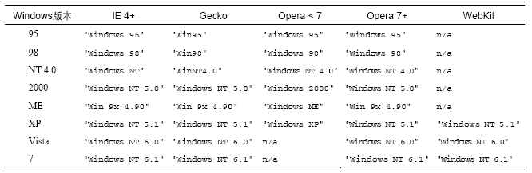

#JavaScript 高级程序设计

##客户端检测

>检测Web客户端的手段很多，而且各有利弊，但是最重要的还是要知道，不到万不得已，就不要使用客户端检测。一言以蔽之，先设计最通用的方案，然后在使用特定于浏览器的技术增强该方案。

### 能力检测

>能力检测，又称特性检测，是最常用也是最为人民广泛接受的客户端形式。它的目的不是识别特定的浏览器，而是识别浏览器的能力。

**基本模式**

```javascript
if(object.propertyInQuestion){
    //使用object.propertyInQuestion
}
```

举例来说，IE5.0之前的版本不支持`doument.getElementById()`，只能使用非标准的`document.all`属性实现相同的目的

```javascript
function getElement(id){
    if(document.getElementById){
        return document.getElementById(id);
    } else if (document.all){
        return document.all[id];
    } else {
        throw new Error('No way to retrieve element');
    }
}
```

能力检测必须理解的两个重要的概念

1. 先检测达成目的的最常用的特性
2. 必须测试实际要用到的特性，避免特性推断

#### 更可靠的能力检测

```javascript
//作者 Peter Michaux
function isHostMethod(object,property){
    var t = typeof object[property];
    return t == 'function' || //!！进行布尔值转换
           (!!(t == 'object' && object[property])) ||
           t == 'unknown';
}
```

*作为开发人员，必须对自己要使用某个功能的风险作出理性的估计*

#### 能力检测，不是某个浏览器检测

***检测某个或者某几个特性并不能确定浏览器***

实际上，根据浏览器不同将能力组合起来是更可取的方式，如果知道自己的应用程序需要使用某些特定的浏览器特性，最好一次性检测所有相关特性

```javascript
//确定浏览器是否具有DOM1级规定的能力
var hasDOM1 = !!(document.getElementById && document.createElement &&
                 document.getElementsByTagName);
```

*在实际开发中，应该将能力检测作为确定下一步解决方案的依据，而不是用它来判断用户使用的是什么浏览器*

### 怪癖检测

>怪癖检测(quirks detection)的目标是识别浏览器的特殊行为，但是与能力检测确认浏览器支持什么能力不同，怪癖检测是想知道浏览器存在什么缺陷（bug）。这通常需要运行一小段代码，以确定某一特性不能正常工作。

例如Safari 3以前版本会枚举被隐藏的属性，下面函数来检测该“怪癖”

```javascript
var hasEnumShadowsQuirk = function(){
    var o = {toString ：function(){}};
    var count = 0;
    for(var prop in o){
        if(prop == 'toString'){
            count++;
        }
    }
    return (count > 1);
}
```

>一般来说，怪癖都是个别浏览器所独有的，而且通常被归为bug。在相关浏览器的新版本中，这些问题可能会也可能不会被修复，由于检测“怪癖”涉及运行代码，因此只检测那些对程序有直接影响的怪癖，而且最好在脚本一开始就执行此类检测，以便尽早解决问题。

### 用户代理检测

>用户代理检测通过检测`用户代理字符串`来确定实际使用的浏览器。在每一次HTTP 请求过程中，用户代理字符串是作为响应首部发送的，而且该字符串可以通过JavaScript的navigator.userAgent 属性访问。在服务器端，通过检测用户代理字符串来确定用户使用的浏览器是一种常用而且广为接受的做法。而在客户端，用户代理检测一般被当作一种万不得已才用的做法，其优先级排在能力检测和（或）怪癖检测之后。

#### 用户代理字符串的历史

1. HTTP 规范（包括1.0 和1.1版）明确规定，浏览器应该发送简短的用户代理字符串，指明浏览器的名称和版本号

2. 早期的浏览器

    1993 年，美国NCSA（National Center for SupercomputingApplications，国家超级计算机中心）发布了世界上第一款Web浏览器Mosaic。这款浏览器的用户代理字符串非常简单，类似如下所示。

    `Mosaic/0.9`

    此后，Netscape Communications公司介入浏览器开发领域后，遂将自己产品的代号定名为Mozilla（MosaicKiller 的简写，意即 Mosaic 杀手）。

    该公司第一个公开发行版，Netscape Navigator 2 的用户代理字符串具有如下格式。
   
    `Mozilla/版本号 [语言] （平台；加密类型）`

3. Netscape Navigator 3 和Internet Explorer 3
    
    1996 年，Netscape Navigator 3 发布，随即超越Mosaic 成为当时最流行的Web 浏览器。而用户代理字符串只作了一些小的改变：
   
    `Mozilla/版本号 （平台；加密类型[;操作系统或CPU说明]）`

    Netscape Navigator 3 发布后不久，微软也发布了其第一款赢得用户广泛认可的Web 浏览器，即Internet Explorer 3。由于Netscape 浏览器在当时占绝对市场份额，许多服务器在提供网页之前都要专门检测该浏览器。如果用户通过IE打不开相关网页，那么这个新生的浏览器很可能就会夭折。于是，微软决定将IE的用户代理字符串修改成兼容Netscape 的形式，结果如下：
    
    `Mozilla/2.0 (compatible; MSIE 版本号; 操作系统)`

4. Netscape Communicator 4 和IE4～IE8

    1997 年8 月，Netscapte Communicator 4发布（这一版将浏览器名字中的Navigator 换成了Communicator）。Netscape 继续遵循了第3 版时的用户代理字符串格式：

    `Mozilla/版本号 (平台; 加密类型 [; 操作系统或CPU 说明])`

    微软在发布Internet Explorer 4 时，顺便将用户代理字符串修改成了如下格式：

    `Mozilla/4.0 (compatible; MSIE 版本号; 操作系统)`

    此后，IE 的版本一直到7 都沿袭了这个模式：

    `Mozilla/4.0 (compatible; MSIE 7.0; Windows NT 5.1)`

    而IE8 的用户代理字符串中添加了呈现引擎（Trident）的版本号：

    `Mozilla/4.0 (compatible; MSIE 版本号; 操作系统; Trident/Trident 版本号)`

    IE9 对字符串格式做了一点调整。Mozilla 版本号增加到了5.0，而Trident的版本号也升到了5.0。IE9默认的用户代理字符串如下：

    `Mozilla/5.0 (compatible; MSIE 9.0; Windows NT 6.1; Trident/5.0)`

5. Gecko

    Gecko 是Firefox 的呈现引擎。当初的Gecko是作为通用Mozilla浏览器的一部分开发的，而第一个采用Gecko 引擎的浏览器是Netscape 6。为Netscape6编写的一份规范中规定了未来版本中用户代理字符串的构成。这个新格式与4.x版本中相对简单的字符串相比，有着非常大的区别，如下所示：

    `Mozilla/Mozilla 版本号 (平台; 加密类型; 操作系统或CPU; 语言; 预先发行版本)Gecko/Gecko 版本号 应用程序或产品/应用程序或产品版本号`

    `Mozilla/5.0 (Windows; U; Windows NT 5.1; en-US; rv:1.8.1.11) Gecko/20071127 Firefox/2.0.0.11`
    
6. WebKit

    2003 年，Apple 公司宣布要发布自己的Web浏览器，名字定为Safari。Safari的呈现引擎叫WebKit，是Linux平台中Konqueror浏览器的呈现引擎KHTML的一个分支。几年后，WebKit 独立出来成为了一个开源项目，专注于呈现引擎的开发。为了确保这款浏览器不被流行的站点拒之门外，Webkit的用户代理字符串就具备了如下格式：

    `Mozilla/5.0 (平台; 加密类型; 操作系统或CPU; 语言) AppleWebKit/AppleWebKit 版本号(KHTML, like Gecko) Safari/Safari 版本号`

    到了Safari 3.0发布时，其用户代理字符串又稍微变长了一点。下面这个新增的Version记号一直到现在都被用来标识Safari 实际的版本号：

    `Mozilla/5.0 (Macintosh; U; PPC Mac OS X; en) AppleWebKit/522.15.5 (KHTML, like Gecko) Version/3.0.3 Safari/522.15.5`

7. Konqueror

    与KDE Linux集成的Konqueror，是一款基于KHTML开源呈现引擎的浏览器。尽管Konqueror 只能在Linux中使用，但它也有数量可观的用户。为确保最大限度的兼容性，Konqueror 效仿IE 选择了如下用户代理字符串格式：

    `Mozilla/5.0 (compatible; Konqueror/ 版本号; 操作系统或CPU )`

    不过，为了与WebKit 的用户代理字符串的变化保持一致，Konqueror3.2又有了变化，以如下格式将自己标识为KHTML：

    `Mozilla/5.0 (compatible; Konqueror/ 版本号; 操作系统或CPU) KHTML/ KHTML 版本号 (like Gecko)`

    `Mozilla/5.0 (compatible; Konqueror/3.5; SunOS) KHTML/3.5.0 (like Gecko)`

8. Chrome

    谷歌公司的Chrome 浏览器以WebKit 作为呈现引擎，但使用了不同的JavaScript 引擎。在Chrome 0.2这个最初的beta版中，用户代理字符串完全取自WebKit，只添加了一段表示Chrome 版本号的信息，格式如下：

    `Mozilla/5.0 ( 平台; 加密类型; 操作系统或CPU; 语言) AppleWebKit/AppleWebKit 版本号 (KHTML,like Gecko) Chrome/ Chrome 版本号 Safari/ Safari 版本`

    Chrome 7 的完整的用户代理字符串如下：

    `Mozilla/5.0 (Windows; U; Windows NT 5.1; en-US) AppleWebKit/534.7 (KHTML,like Gecko) Chrome/7.0.517.44 Safari/534.7`

9. Opera

    仅就用户代理字符串而言，Opera 应该是最有争议的一款浏览器了。Opera 默认的用户代理字符串是所有现代浏览器中最合理的——正确地标识了自身及其版本号。在Opera 8.0 之前，其用户代理字符串采用如下格式：

    `Opera/ 版本号 (操作系统或CPU; 加密类型) [语言]`

    Opera 8 发布后，用户代理字符串的“语言”部分被移到圆括号内，以便更好地与其他浏览器匹配，如下所示：

    `Opera/ 版本号 (操作系统或CPU; 加密类型; 语言)`

    Opera 9 以后，出现了两种修改用户代理字符串的方式。一种方式是将自身标识为另外一个浏览器，如Firefox 或者IE。在这种方式下，用户代理字符串就如同Firefox 或IE 的用户代理字符串一样，只不过末尾追加了字符串Opera及Opera的版本号。下面是一个例子：

    `Mozilla/4.0 (compatible; MSIE 6.0; Windows NT 5.1; en) Opera 9.50`

    Opera 标识自身的另一种方式，就是把自己装扮成Firefox 或IE。在这种隐瞒真实身份的情况下，用户代理字符串实际上与其他浏览器返回的相同——既没有Opera字样，也不包含Opera 版本信息。

    Opera 10 对代理字符串进行了修改。现在的格式是：

    `Opera/9.80 (操作系统或CPU; 加密类型; 语言) Presto/Presto 版本号 Version/版本号`

10. IOS和Android

    移动操作系统iOS和Android默认的浏览器都基于WebKit，而且都像它们的桌面版一样，共享相同的基本用户代理字符串格式。iOS 设备的基本格式如下：

    `Mozilla/5.0 (平台; 加密类型; 操作系统或CPU like Mac OS X; 语言) AppleWebKit/AppleWebKit 版本号 (KHTML, like Gecko) Version/浏览器版本号Mobile/移动版本号 Safari/Safari 版本号`

    Android 浏览器中的默认格式与iOS 的格式相似，没有移动版本号（但有Mobile 记号）。例如：

    `Mozilla/5.0 (Linux; U; Android 2.2; en-us; Nexus One Build/FRF91)AppleWebKit/533.1 (KHTML, like Gecko) Version/4.0 Mobile Safari/533.1`
    
#### 用户代理字符串检测技术

**浏览器检测脚本的思路**

1. 识别呈现引擎
    
    有时候，确切知道浏览器的名字和版本号，还不如确切知道它使用的是什么样的呈现引擎。因此我们编写的脚本主要检测五大呈现引擎：`IE,Gecko,Webkit,KHTML,Opera`

    ```javascript
        var client = function(){

            var engine = {
                //呈现引擎 >0表示检测到的引擎
                ie : 0,
                gecko : 0,
                webkit : 0,
                khtml : 0,
                opera : 0,

                //具体的版本号
                ver : null
            };

            //在此检测呈现引擎、平台和设备

            return {
                engine : engine
            };
        }();
    ```

    **正确的检测引擎顺序**
    
    1. 检测`Opera`，因为它可以完全模仿其他浏览器，要识别它，必须检测window.opera对象
    ```javascript
    if(window.opera){
        engine.ver = window.opera.version();
        engine.opera = parseFloat(engine.ver);
    }
    ```
    2. 检测`WebKit`，因为WebKit的用户代理字符串中包含"Gecko"和"KHTML"，WebKit的用户代理字符串中的"AppleWebKit"是独一无二的
    ```javascript
    var ua = navigator.userAgent;

    if(window.opera){
        engine.ver = window.opera.version();
        engine.opera = parseFloat(engine.ver);
    } else if(/AppleWebKit\/(\S+)/.test(ua)) {
        engine.ver = RegExp['$1'];
        engine.webkit = parseFloat(engine.ver);
    }
    ```
    3. 检测`KHTML`，因为它的用户代理字符包含"Gecko"，此外由于Konqueror3.1及更早版本不包含KHTML的版本，故而使用Konqueror版本来代替
    ```javascript
     var ua = navigator.userAgent;

    if(window.opera){
        engine.ver = window.opera.version();
        engine.opera = parseFloat(engine.ver);
    } else if(/AppleWebKit\/(\S+)/.test(ua)) {
        engine.ver = RegExp['$1'];
        engine.webkit = parseFloat(engine.ver);
    } else if(/KTML\/(\S+)/.test(ua) || /Konqueror\/([^;]+)/.test(ua)){
        engine.ver = RegExp['$1'];
        engine.khtml = parseFloat(engine.ver);
    }
    ```
    4. 检测Gecko
    ```javascript
    var ua = navigator.userAgent;

    if(window.opera){
        engine.ver = window.opera.version();
        engine.opera = parseFloat(engine.ver);
    } else if(/AppleWebKit\/(\S+)/.test(ua)) {
        engine.ver = RegExp['$1'];
        engine.webkit = parseFloat(engine.ver);
    } else if(/KTML\/(\S+)/.test(ua) || /Konqueror\/([^;]+)/.test(ua)){
        engine.ver = RegExp['$1'];
        engine.khtml = parseFloat(engine.ver);
    } else if(/rv:([^\)]+)\) Gecko\/\d{8}/.test(ua)){
        engine.ver = RegExp['$1'];
        engine.gecko = parseFloat(engine.ver);
    }
    ```
    5. 检测IE，IE的版本号位于字符串"MSIE"的后面
    ```javascript
    var ua = navigator.userAgent;

    if(window.opera){
        engine.ver = window.opera.version();
        engine.opera = parseFloat(engine.ver);
    } else if(/AppleWebKit\/(\S+)/.test(ua)) {
        engine.ver = RegExp['$1'];
        engine.webkit = parseFloat(engine.ver);
    } else if(/KTML\/(\S+)/.test(ua) || /Konqueror\/([^;]+)/.test(ua)){
        engine.ver = RegExp['$1'];
        engine.khtml = parseFloat(engine.ver);
    } else if(/rv:([^\)]+)\) Gecko\/\d{8}/.test(ua)){
        engine.ver = RegExp['$1'];
        engine.gecko = parseFloat(engine.ver);
    } else if(/MSIE ([^;]+)/.test(ua)){
        engine.ver = RegExp['$1'];
        engine.ie = parseFloat(engine.ver);
    }
    ```

2. 识别浏览器
    
    有时候，只有呈现引擎还不能说明存在所需的JavaScript功能。例如Safari和Chrome都使用WebKit作为呈现引擎，但是它们的JavaScript引擎却不一样。

    ```javascript
     var client = function(){

            var engine = {
                //呈现引擎 >0表示检测到的引擎
                ie : 0,
                gecko : 0,
                webkit : 0,
                khtml : 0,
                opera : 0,

                //具体的版本号
                ver : null
            };

            var browser = {
                //浏览器
                ie : 0,
                firefox : 0,
                safari : 0,
                konq : 0,
                opera : 0,
                chrome : 0,

                //具体的版本号
                ver : null
            };

            //在此检测呈现引擎、平台和设备

            return {
                engine : engine,
                browser : browser
            };
        }();
    ```

    检测呈现引擎及浏览器

    ```javascript
    var ua = navigator.userAgent;

    if(window.opera){
        engine.ver = browser.ver = window.opera.version();
        engine.opera = browser.opera = parseFloat(engine.ver);
    } else if(/AppleWebKit\/(\S+)/.test(ua)) {
        engine.ver = RegExp['$1'];
        engine.webkit = parseFloat(engine.ver);

        //确定是Chrome还是safari
        if(/Chrome\/(\S+)/.test(ua)){
            browser.ver = RegExp['$1'];
            browser.chrome = parseFloat(browser.ver);
        } else if (/Version\/(\S+)/.test(ua)){
            browser.ver = RegExp['$1'];
            browser.safari = parseFloat(browser.ver);
        } else {
            //近似地确定版本号
            var safariVersion = 1;
            if (engine.webkit < 100){
                safariVersion = 1;
            } else if (engine.webkit < 312){
                safariVersion = 1.2;
            } else if (engine.webkit < 412){
                safariVersion = 1.3;
            } else {
                safariVersion = 2;
            }
            browser.safari = browser.ver = safariVersion;
        }
    } else if(/KTML\/(\S+)/.test(ua) || /Konqueror\/([^;]+)/.test(ua)){
        engine.ver = browser.ver = RegExp['$1'];
        engine.khtml = browser.konq = parseFloat(engine.ver);
    } else if(/rv:([^\)]+)\) Gecko\/\d{8}/.test(ua)){
        engine.ver = RegExp['$1'];
        engine.gecko = parseFloat(engine.ver);

        //确定是不是Firefox
        if(/Firefox\/(\S+)/.test(ua)){
            browser.ver = RegExp['$1'];
            browser.firefox = parseFloat(browser.ver)
        }
    } else if(/MSIE ([^;]+)/.test(ua)){
        engine.ver = browser.ver = RegExp['$1'];
        engine.ie = browser.ie = parseFloat(engine.ver);
    }
    ```

3. 识别平台

    在某些条件下，平台可能是必须关注的问题，那些具有各自平台版本的浏览器在不同平台下可能会有不同的问题。目前三大主流平台`Windows`、`Mac`、`Unix`

    ```javascript
    var client = function(){

            var engine = {
                //呈现引擎 >0表示检测到的引擎
                ie : 0,
                gecko : 0,
                webkit : 0,
                khtml : 0,
                opera : 0,

                //具体的版本号
                ver : null
            };

            var browser = {
                //浏览器
                ie : 0,
                firefox : 0,
                safari : 0,
                konq : 0,
                opera : 0,
                chrome : 0,

                //具体的版本号
                ver : null
            };

            var system = {
                win : false,
                mac : false,
                x11 : false
            };

            //在此检测呈现引擎、平台和设备

            return {
                engine : engine,
                browser : browser,
                system : system
            };
        }();
    ```

    要确定平台，只需检测navigator.platform，它的属性的值包括`Win32 Win64 MacPPc MacIntel X11 Linux i686`

    ```javascript
    var p = navigator.platform
    system.win = p.indexOf('Win') == 0;
    system.mac = p.indexOf('Mac') == 0;
    system.x11 = (p.indexOf('X11') == 0) || (p.indexOf('Linux') == 0);
    ```

4. 识别window操作系统
    
    在Windows平台下，还可以从用户代理字符串中进一步取得具体的操作系统信息。

    

    ```javascript
    if(system.win){
        if(/Win(?:dows )?([^do]{2})\s?(\d+\.\d+)?/.test(ua)){
            if(RegExp['$1'] == 'NT'){
                switch(RegExp['$2']){
                    case '5.0':
                        system.win = '2000';
                        break;
                    case '5.1':
                        system.win = 'XP';
                        break;
                    case '6.0':
                        system.win = 'Vista';
                        break;
                    case '6.1':
                        system.win = '7';
                        break;
                    default:
                        system.win = 'NT';
                        break;
                } else if (RegExp['$1'] == '9x'){
                    system.win = 'ME';
                } else {
                    system.win = RegExp['$1'];
                }
            }
        }
    }
    ```
5. 识别移动设备
    
    ```javascript
     var client = function(){

            var engine = {
                //呈现引擎 >0表示检测到的引擎
                ie : 0,
                gecko : 0,
                webkit : 0,
                khtml : 0,
                opera : 0,

                //具体的版本号
                ver : null
            };

            var browser = {
                //浏览器
                ie : 0,
                firefox : 0,
                safari : 0,
                konq : 0,
                opera : 0,
                chrome : 0,

                //具体的版本号
                ver : null
            };

            var system = {
                win : false,
                mac : false,
                x11 : false,

                //移动设备
                iphone : false,
                ipod : false,
                ipad : false,
                ios : false,
                android : false,
                nokiaN : false,
                winMobile : false
            };

            //在此检测呈现引擎、平台和设备

            return {
                engine : engine,
                browser : browser,
                system : system
            };
        }();
    ```

    1. iPhone
        
        `CPU iPhone OS 3_0 like Mac OS X`

    2. iPad
        
        `CPU OS 3_2 like Mac OS X`

    3. Android
        
        搜索字符串"Android"并取的紧跟其后的版本号

    4. nokiaN
        
        检测用户代理字符串是否存在"NokiaN"

    5. Windows Mobile
        
        `Mozilla/4.0 (compatible; MSIE 4.01; Windows CE; PPC; 240x320)`

6. 识别游戏系统
    
    1. Wii
        
        `Opera/9.10 (Nintendo Wii;U; ; 1621; en)`

    2. Playstation 3

        `Mozilla/5.0 (PLAYSTATION 3; 2.00)`

#### 完整的检测代码

[fullDetection.js](./code/fullDetection.js)


