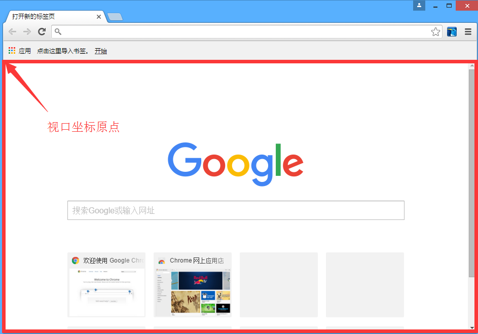
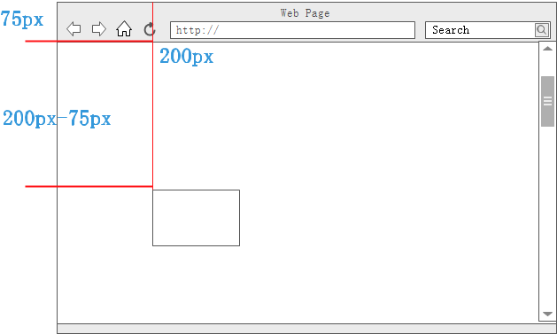
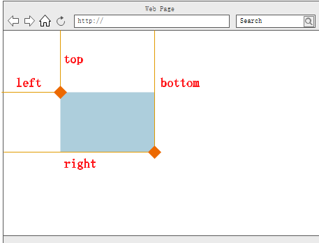

# 元素坐标

> 来源：《JavaScript权威指南》

## 一、文档坐标和视口坐标

### 1-1 X & Y坐标

元素的位置是以像素来度量的，向右代表`X坐标`的增加，向下代表`Y坐标`的增加。

### 1-2 两个坐标原点

1. 视口坐标原点

    `视口`只是实际显示文档内容的浏览器的一部分。

    

2. 文档坐标原点

    1. 如果文档比视口要小，或者没出现滚动，则文档的左上角就是视口的左上角

    2. 如果出现了滚动，文档坐标原点就发生了变化。

    

### 1-3 坐标转换的例子

在文档坐标中，如果一个元素的Y坐标是200px，用户已经把浏览器向下滚动75px，则



### 1-4 获取滚动条位置

```javascript
function getScrollOffsets(w){
    //使用指定的窗口，如果不带参数则使用当前窗口
    w = w || window;

    //除了IE8及更早的版本以外，其他浏览器都能用
    if (w.pageXOffset !== null){
        return {
            x : w.pageXOffset,
            y : w.pageYOffset
        };
    }

    //对标准模式下的IE（或任何浏览器）
    var d = w.document;
    if (document.compatMode == 'CSS1Compat'){
        return {
            x : d.documentElement.scrollLeft,
            y : d.dcoumentElement.scrollTop
        };
    }

    //对怪异模式下的浏览器
    return {
        x : d.body.scrollLeft,
        y : d.body.scrollTop
    };
}
```

### 1-5 查询窗口的视口尺寸

```javascript
function getViewportSize(w){
    w = w || window;

    //除了IE8及更早的版本，其他浏览器都能用
    if (w.innerWidth != null){
        return {
            w : w.innerWidth,
            h : w.innerHeight
        };
    }

    //对标准模式下的IE（或任何浏览器）
    var d = w.document;
    if (document.compatMode == 'CSS1Compat'){
        return {
            w : d.documentElement.clientWidth,
            h : d.documentElement.clientHeight
        };
    }
}
```

## 二、元素的几何尺寸

**getBoundingClientRect()**

这个是判定一个元素的尺寸和位置最简单的方法。现在所有浏览器都实现了。这个方法返回元素在`视口坐标中`的位置。

    (left,top)：表示元素左上角的X和Y坐标

    (right,bottom)：表示元素右上角的X和Y坐标



**getClientRects()**

对于一个内联元素来说，可能跨了多个矩形组成。如果向查询`内联`元素每个独立的矩形，调用这个方法可以获得一个只读的类数组对象，它的每个元素都类似于getBoundingClientRect()返回的矩形对象。

*这两个方法都不是实时的，它们只是调用方法时，文档视觉状态的静态快照，在用户滚动或改变浏览器窗口大小时不会更新它们。*

### 2-1 转化为文档坐标

为了转化为用户滚动浏览器窗口以后仍然有效的文档坐标，需要加上`滚动的偏移量`。

```javascript
var box = e.getBoundingClientRect();
var offsets = getScrollOffsets();
//左上角文档坐标
var x1 = box.left + offsets.x;
var y1 = box.top + offsets.y;
//右下角文档坐标
var x2 = box.right + offsets.x;
var y2 = box.bottom + offsets.y;
```

### 2-2 获取元素的宽和高

```javascript
var box = e.getBoundingClientRect();
var w = box.width || (box.right - box-left);
var h = box.height || (box.bottom - box.top);
```


