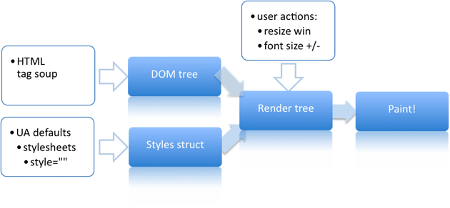
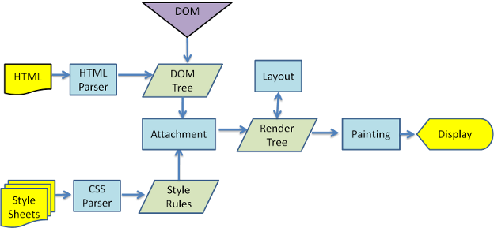
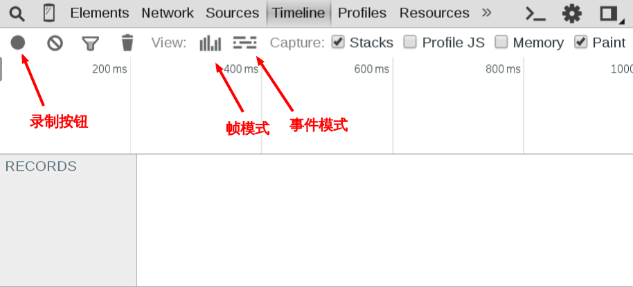

# 网页性能

> 来自：http://www.ruanyifeng.com/blog/2015/09/web-page-performance-in-depth.html

## 网页生成的过程

网页生成过程，大致可以分成五步

    1. HTML代码转化为DOM

    2. CSS代码转化成CSSOM（CSS Object Model）

    3. 结合DOM和CSSOM，生成一棵渲染树（包含每个节点的视觉信息）

    4. 生成布局（layout），即将所有渲染树的所有节点进行平面合成

    5. 将布局绘制（paint）在屏幕上

在这五步里面，第一步到第三部都非常快，`第四步和第五步很耗时`。

## 重排和重绘

网页生成的时候，至少会渲染一次。而我们需要关注的是用户访问过程中，那些会导致网页重新渲染的行为：

    · 修改DOM

    · 修改样式表

    · 用户事件（例如鼠标悬停，页面滚动，输入框输入文字等）

重新渲染，就涉及`重排`和`重绘`

**重排（reflow）**

即重新生成布局，重排必然导致重绘，如元素位置的改变，就会触发重排和重绘。

**重绘（repaint）**

即重新绘制，需要注意的是，`重绘不一定需要重排`，比如改变某个元素的颜色，就只会触发重绘，而不会触发重排。

## 对于性能的影响

重排和重绘会不断触发，这是不可避免的，但是它们非常消耗资源，是导致网页性能低下的根本原因。

提高网页性能，就是`要降低重排和重绘的频率和成本，尽量少触发重新渲染`。

大部分浏览器通过`队列化修改`和`批量显示`优化重排版过程。然而有些操作会强迫刷新并要求所有计划改变的部分立刻应用。

*本资料作为dom操作最佳实践的补充*

## 刷新率

网页动画的每一帧（frame）都是一次重新渲染，每秒低于`24帧`的动画，人眼就能感受到停顿。一般的网页动画，`需要达到每秒30帧到60帧的频率，才能比较流畅`。

而大多数显示器的刷新频率是`60Hz`，为了与系统一致，以及节省电力，浏览器会自动按照这个频率，刷新动画。所以，如果网页能够做到每秒60帧，就会跟显示器同步刷新，达到最佳的视觉效果。这意味着，一秒之内进行60次重新渲染，每次重新渲染的时间不能超过`16.66ms`。

**刷新率**

FPS(frame per second)，即一秒之间能够完成多少次重新渲染

## 开发者工具的Timeline面板

