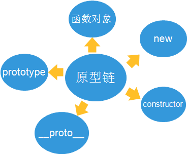
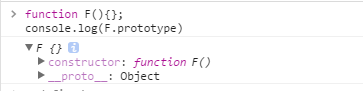
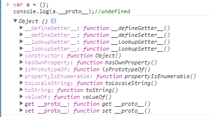
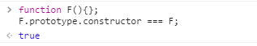
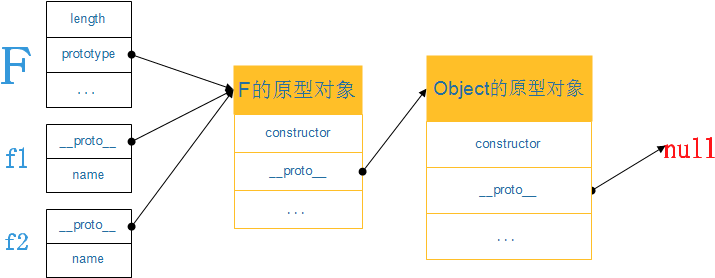

# JavaScript之原型链

> 参考：http://zhangjiahao8961.iteye.com/blog/2070650

## 原型链

**概念**

原型链是一种机制，指的是JavaScript每个对象`包括原型对象`都有一个内置的\[[proto]\]属性指向创建它的函数对象的原型对象，即prototype属性。

**作用**

原型链的存在，只要是为了实现对象属性的`继承`。

**理解**

要理解原型链，需要从几个概念入手。



### 1、函数对象

在JavaScript中，函数即对象。

### 2、原型对象

当定义一个函数对象的时候，会包含一个预定义的属性，叫`prototype`，这就属性称之为原型对象。

```javascript
//函数对象
function F(){};
console.log(F.prototype)
```



```javascript
//普通对象
var a = {};
console.log(a.prototype);//undefined
```

### 3、\_\_proto\_\_

JavaScript在创建对象的时候，都会有一个`[[proto]]`的内置属性，用于指向创建它的函数对象的`prototype`。原型对象也有`[[proto]]`属性。因此在不断的指向中，形成了原型链。

```javascript
//函数对象
function F(){};
var f = new F();
console.log(f.__proto__)
```


```javascript
//普通对象
var a = {};
console.log(a.__proto__);//undefined
```



### 4、new

当使用`new`去调用构造函数时，相当于执行了

```javascript
var o = {};
o.__proto__ = F.prototype;
F.call(o);
```

因此，在原型链的实现上，new起到了很关键的作用。

### 5、constructor

原型对象prototype上都有个预定义的`constructor`属性，用来引用它的函数对象。这是一种循环引用。

```javascript
function F(){};
F.prototype.constructor === F;
```




在实际运用中，经常会有下列的写法

```javascript
function F(){};
F.prototype = {
    constructor : F,
    doSomething : function(){}
}
```

这里要加`constructor`是因为重写了原型对象，constructor属性就消失了，需要自己手动补上。

### 6、原型链的内存结构

```javascript
function F(){
    this.name = 'zhang';
};
var f1 = new F();
var f2 = new F();
```

*为了严谨起见，区分对象和变量*



