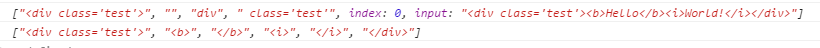
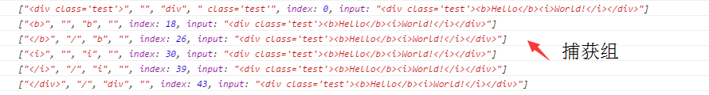
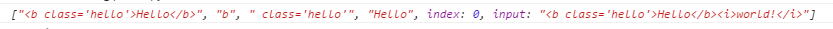
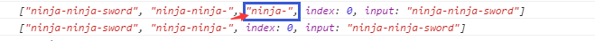
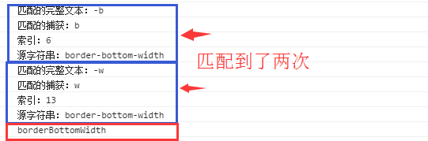

## 正则表达式

> 来源于：《JavaScript 忍者秘籍》

### 1. 创建

创建一个正则表达式，有两种方式

1. 字面量【常用】

    ```javascript
    var pattern = /test/;
    ```

2. 构造RegExp实例

    ```javascript
    var pattern = new RegExp("test");
    ```

两种方式的比较：

1. 如果正则是已知的，则优先选择字面量语法
2. 如果需要在运行时通过动态构建的字符串来创建正则表达式，则通过构造器的方式


此外，还有三个标志可以与正则表达式进行关联

* i : 让正则表达式不区分大小写 [ignore case]
* g : 匹配模式中的所有实例 [global]
* m : 允许匹配多行，例如匹配文本区元素 [multiline]

### 2. 术语与操作符

#### 2-1 精确匹配

如果一个字符不是特殊字符或操作符，则表示该字符必须在表达式中出现、

例如`/test/`中有四个字符，它们表示这四个字符必须按顺序一个接着一个的出现，才能匹配得到。

#### 2-2 匹配一类字符

1. 匹配一个有限字符集中的某一个字符时，可以使用`[]`

    例如`[abc]`表示的是匹配`a,b,c`中的任意一个字符

2. 如果匹配的是有限字符集之外的字符，可以使用`[^]`

    例如`[^abc]`表示的是匹配除`a,b,c`之外的任意的一个字符

3. 制定一个范围，可以使用`[-]`

    例如`[a-m]`表示的是`a`到`m`之间的所有字符（包括a，m，按字典顺序）

#### 2-3 转义

当要匹配特殊字符的时候，需要对其进行转义，例如`$,^,[`等，需要使用反斜杠`\`

例如要匹配`$`，需要这样写`\$`

#### 2-4 匹配开始与结束

1. 符号`^`如果作为正则表达式的第一个字符，则表示要从字符串的开头开始匹配
2. 符号`$`作为正则表达式的最后一个字符，表示该模式必须出现在字符串的结尾

#### 2-5 重复出现

当匹配连续的任意数量相同字符时，可以采用以下的方式

1. `?`：可以定义该字符是可选的，即可以出现1次或者不出现

    `/t?est/`匹配`test`或`est`

2. `+`：一个字符至少出现1次

    `/t+est/`可以匹配`test`，`tttest`

3. `*`：一个字符不出现或者出现多次

    `/t*est/`可以匹配`est`或者`ttest`

4. `{n}`：指定一个数字来表示重复的次数n

    `/a{4}/`表示`aaaa`

5. `{n,m}`：指定一个重复次数的区间n到m

    `/a{1,4}/`匹配一个到4个`a`

6. `{n,}`：表示至少重复n次

    `/a{4,}/`匹配至少4个`a`

在匹配的时候，还有一点要注意的是：贪婪和非贪婪。在默认情况下，它们是贪婪的，即会匹配所有的字符组合，在操作符后面加一个`?`，可以让该表达式成为非贪婪的，进行最小限度的匹配

例如对于`aaa`，使用`/a+/`会匹配`aaa`这三个字符，而`/a+?/`则只匹配一个`a`（一个`a`字符就可以满足条件了）

#### 2-6 预定义字符类

表示匹配一类的字符集，由正则表达式的语法提供

|预预定术语|匹配内容|
|:-- | :-- |
|.|匹配处理新行\n之外的任意字符|
|  |  |
| \s  | 空白字符 |
| \S  |  非空白字符 |
|  |  |
| \w  |  可以构成单词的字符 |
| \W  |  不能构成单词的字符 |
|  |  |
| \d  | 数字 |
| \D  | 非数字 |
|  |  |
| \b | 单词的边界 |
| \B | 不是单词的边界 |
|  |  |
|\t|水平制表符|
|\v|垂直制表符|
|\f|换页符|
|\r|回车符|
|\n|换行符|
|||
|\cA : \cZ|控制符，例如\cM 匹配一个ctrl+m|
|\x0000 : \xFFFF|十六进制的Unicode码|
|\x00 : \xFF|十六进制ASCII码|

#### 2-7 分组

如果想将操作符应用于一组字符串，可以使用`()`，这就是分组的概念。

例如`(ab)+`匹配的就是一个或多个字符串`ab`

当用括号进行分组时，也创建了所谓的捕获(capture) 

#### 2-8 或操作符

用`|`表示或者的关系，例如`a|b`表示匹配`a`或`b`字符

#### 2-9 反向引用

正则表达式中所定义的捕获的反向引用指的是将捕获作为正则表达式中能够成功匹配术语时的候选字符串

这种术语表示法是在反斜杆后面加一个要引用的捕获数量，该数字从1开始，如`\1`,`\2`等

例如我们要匹配标签`<p>1</p>`或者`<strong>2</strong>`，就可以使用反向引用，代码如下：

```javascript
/<(\w+)>(.+)<\/\1>/;
```

### 3. 编译正则表达式

正则表达式是一个多阶段处理的过程，理解每个阶段发生的事情之后，利用正则表达式可以帮助我们优化JavaScript代码。

正则表达式的两个重要阶段是：

1. 编译
    
    发生在正则表达式第一次被创建的时候，在编辑的期间，表达式通过JavaScript引擎进行解析，并转换成其内部表示。通常，浏览器可以很智能地判断相同的正则表达式在何时被使用，并缓存该特定表达式的编译结果，但是我们不能总是依赖于所有浏览器都那么智能，特别是对于一些复杂的表达式，通过对稍后要用的正则表达式进行预定义（因此也叫预编译），可以获得一些速度的提升。

    ```javascript
    //创建编译后的正则表达式
    var re1 = /test/i;

    var re2 = new RegExp("test","i");
    ```

    代码中，正则表达式在创建之后都处于编译后的状态，如果将re1替换成/test/i，那么同一个正则表达式可能被编译多次。


2. 执行：发生在使用编译过的正则表达式进行字符串匹配的时候

    一旦正则表达式被编译了，就可以利用该表达式的`test()`方法收集匹配的元素

    ```javascript
    re1.test("test");// true
    re2.test("Test");//true
    ```

### 4. 捕获匹配的片段

正则表达式的实用性体现在捕获已匹配的结果上，这样我们便可以在其中进行处理。

#### 4-1 执行简单的捕获

举个例子，我们要提取一个元素的透明度，

```javascript
var style = "filter:alpha(opacity=50)";
```

我们在正则中使用`()`对需要提取的数据进行分组，并且利用String对象的match方法，使用局部正则表达式会返回一个数组，该数组包含了在匹配操作中成功匹配的整个字符串以及其他的捕获结果。

```javascript
var arr = style.match(/opacity=([^)]+)/);
```

返回的数组值（以下），捕获组从1开始，0为匹配成功的字符串

```javascript
["opacity=50",50]
```

因此一个元素的透明度即为

```javascript
var opacity = arr[1];
```

*注意到本例子中为局部正则表达式，即没有标志g*

#### 4-2 用全局表达式进行匹配

在使用全局正则表达式和match方法，返回的数组不会包含捕获组的内容，而是匹配结果的列表。

```javascript
var html = "<div class='test'><b>Hello</b><i>World!</i></div>";
var results = html.match(/<(\/?)(\w+)([^>]*?)>/);
var all = html.match(/<(\/?)(\w+)([^>]*?)>/g);
console.log(results);
console.log(all);
```

运行结果为



在使用全局表达式匹配时，如果需要进行捕获，那么可以使用正则表达式的exec()方法，此方法可以对一个正则表达式进行多次调用，每次调用都可以返回下一个匹配的结果。

```javascript
var html = "<div class='test'><b>Hello</b><i>World!</i></div>";
var tag = /<(\/?)(\w+)([^>]*?)>/g,match;
while((match = tag.exec(html)) !== null){
    console.log(match); //每一个match就是包含捕获组的数组
}
```

运行结果为：



#### 4-3 捕获的引用

在两种情形下，会用到引用捕获的匹配的结果

1. 匹配自身(例如标签匹配)，使用反向引用，下面我们匹配到b标签

    ```javascript
    var html = "<b class='hello'>Hello</b><i>world!</i>";
    var pattern = /<(\w+)([^>]*)>(.*?)<\/\1>/;
    var match = pattern.exec(html);
    console.log(match);
    ```

    运行结果：

    

2. 替换字符串(String对象的replace()方法)，使用$1，$2语法来表示捕获的内容

    ```javascript
    "fontFamily".replace(/([A-Z])/g,"-$1").toLowerCase(); //font-family
    ```

#### 4-4 没有捕获的分组

由于小括号有双重责任：不仅要进行分组操作，还可以指定捕获。但是有些情况下，我们只希望小括号进行分组即可，不需要被捕获。

举个例子，对于如下的正则表达式，在单词"sword"之前，允许前缀"ninjia-"出现一次或多次，并且希望捕获整个前缀，那么此时这个正则表达式需要两套小括号。

```javascript
var pattern = /((ninja-)+)sword/;
```

如果像上面那么写的话，就有点问题了。我们不希望(ninja-)被捕获，因为不需要，此时应该开始的括号后加一个`?:`标记，这就是所谓的passive subexpression（被动子表达式）

```javascript
var s = "ninja-ninja-sword";
var pattern1 = /((ninja-)+)sword/;
var pattern2 = /((?:ninja-)+)sword/;
var m1 = s.match(pattern1);
var m2 = s.match(pattern2);
console.log(m1);
console.log(m2);
```

运行结果为



### 5. 函数替换值

String对象的replace()方法是一个强大且灵活的方法，而它最强大的特性是可以接受一个函数作为替换值，当替换值是一个函数时，每个匹配都会调用该函数，并带有一串参数

* 匹配的完整文本
* 匹配的捕获，一个捕获对应一个参数,如果有多个，则为capture1,capture2..
* 匹配的字符在源字符串中的索引
* 源字符串

函数的返回值是即将要替换的值

例子：将横线字符串转换为驼峰拼写法

```javascript
function upper(all, letter, index, originText){
    console.log("匹配的完整文本：" + all);
    console.log("匹配的捕获：" + letter);
    console.log("索引：" + index);
    console.log("源字符串：" + originText);

    return letter.toUpperCase();
}
var replaceHtml = "border-bottom-width".replace(/-(\w)/g,upper);
console.log(replaceHtml);
```

运行结果为



实践一下，我们要将下列的字符`foo=1&foo=2&blah=a&blah=b&foo=3`转成这样的格式`foo=1,2,3&blah=a,b`

```javascript
var source = "foo=1&foo=2&blah=a&blah=b&foo=3";

function compress(source) {
    var keys = {};

    source.replace(/([^&]+)=([^&]+)/g,function (captureText, key, value){
        if(keys[key]){
            keys[key] = keys[key] + "," + value;
        } else {
            keys[key] = value;
        }
    });

    var result = [];

    for(var key in keys){
        result.push(key + "=" + keys[key]);
    }

    return result.join("&");
}

console.log(compress(source));
```

### 6. 实践

