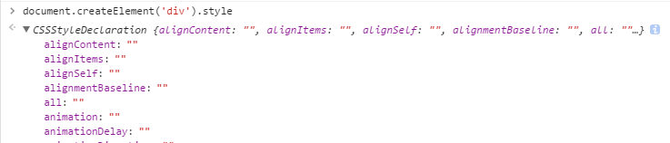
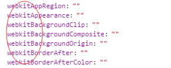

# 前端笔试题

## 2014阿里前端笔试题

### JavaScript篇

1. 现有代码，问输出和输出顺序

    ```javascript
    function test(){
        var a = 1;
        setTimeout(function(){
            alert(a);
            a = 3;
        },1000);
        a = 2;
        setTimeout(function(){
            alert(a);
            a = 4;
        },3000);
    }
    test();
    alert(0);
    ```

    考察点：定时器，event loop，闭包

    setTimeout()只是将任务添加到任务队列中而已，要等到主执行栈中的代码执行完之后，才会调用定时器中的回调函数。

    1. 0
    2. 2（闭包，当test执行完成之后，a为2）
    3. 3（闭包，第一个定时器执行完之后，修改了a的值为3）

2. 请编写一段程序，将一个对象和它直接、间接引用的所有对象的属性字符串放入一个数组，如var o = {a:1,b:2,c:{d:1}}，这里o经过处理后，应该得到['a','b','c','d']

    考察点：递归，for in

    ```javascript
    var arr = [];
    function getAllProperties(o){
        if(o && typeof o === 'object'){
            for(var k in o){
                arr.push(k+'');
                if(typeof o[k] === 'object'){
                    getAllProperties(o[k]);
                }
            }
        }
    }
    console.log(arr);
    ```

3. 返回一个合并过的数组（归并操作）

    var a = [-3,-1,0,1,3,5,7,9], b = [-4,-2,0,2,3,4,5,6,7,8]，返回[-4,-3,-2,-1,0,0,1,2,3,3,4,5,5,6,7,7,8,9]

    ```javascript
    function merge(a,b){
        var tmp = [],
            i = 0,j = 0,
            lenA = a.length,lenB = b.length;
        while(i < lenA && j < lenB){
            if(a[i] <= b[j]){
                tmp.push(a[i++]);
            } else {
                tmp.push(b[j++]);
            }
        }
        while( i < lenA)tmp.push(a[i++]);
        while( j < lenB)tmp.push(b[j++]);
        return tmp;
    }
    ```

4. 当我们使用CSS3新属性，比如：box-shadow或者transition时，我们怎么检测浏览器是否支持这些属性？请设计一个JavaScript函数，该函数接受一个CSS属性名作为参数，并返回一个boolean值，表明浏览器是否支持这个属性。

    考察点：el.style属性，兼容的前缀（ktml,ms,moz,webkit）

    

    


    ```javascript
    var support = function(prop){
        var div = document.createElement('div'),
            vendors = 'ktml,ms,moz,webkit'.split(','),
            len = vendors.length,
            tmp;

        var propArr = prop.split('-');
        for(var i = 1; i < propArr.length; i++){
            propArr[i] = propArr[i].charAt(0).toUpperCase()
                            + propArr[i].substring(1);
        }
        prop = propArr.join('');
        if(prop in div.style)return true;
        while(len--){
            tmp = vendors[len] + prop.charAt(0).toUpperCase()
                    + prop.substring(1);
            if( tmp in div.style)return true;
        }
        return false;
    }
    ```

5. 写一段脚本，实现：当页面上任意一个链接被点击的时候，alert出这个链接在页面上的顺序号，如第一个链接则alert(1), 依次类推；

    考察点：闭包，document.links

    ```javascript
    window.onload = function(){
        var len = document.links.length;
        for(var i = 0; i < len;i++){
            document.links[i].onclick = (function(i){
                return function(){
                    return i+1;
                }
            })(i);
        }
    }
    ```