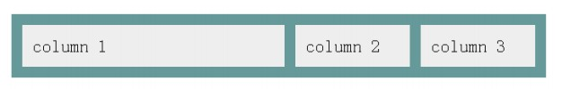
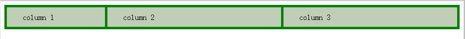
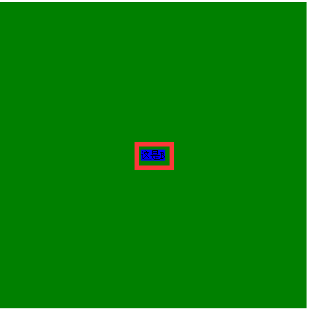
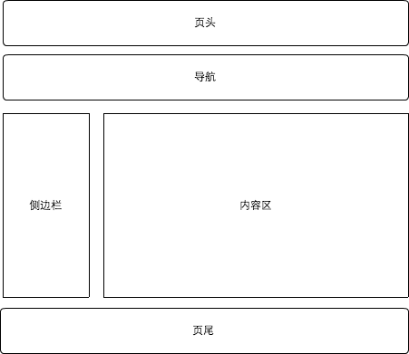

# 前端笔试题

## 2014阿里前端笔试题

### HTML/CSS篇

1. 下图绿色区域的宽度为100%，其中有三个矩形，第一个矩形的宽度是200px，第二个和第三个矩形的宽度相等。请使用CSS3中的功能实现它们的布局。

    

    已知HTML结构是

    ```html
    <div class="box">
        <div>column 1</div>
        <div>column 2</div>
        <div>column 3</div>
    </div>
    ```

    ```css
    .box{
        width:100%;
        height:50px;
        display:-moz-box;
        display:-webkit-box;
        display:box;
        background:green;
    }
    .box div{
        background:rgba(236, 224, 224, 0.82);
        height:40px;
       line-height:40px;
       text-indent:2em;
    }
    .box div{
        -moz-box-flex:1;
        -webkit-box-flex:1;
        box-flex:1;
        margin-right:5px;
        margin-top:5px;
    }
    .box div:first-child{
        width:200px;
        margin-left:5px;
        -moz-box-flex:0;
        -webkit-box-flex:0;
        box-flex:0;
    }
    ```

    

2. 有两个盒子 A、B，B 在 A 盒子中，它们的 CSS 是这么定义的：

    ```css
    .A {
        position:relative;
        width:500px;
        height: 500px;
        background-color:green;
    }
    .B {
        position:absolute;
        max-width:300px;
        max-height:300px;
        background-color:blue;
    }
    ```

    如何实现 B 在 A 中水平方向和垂直方向居中?这道题的问题在于B是没有`固定宽度和高度`的。

    ```hml
    <div class="A">
        <div class="B">这是B</div>
    </div>
    ```

    ```css
    .A{
        position:relative;
        width:500px;
        height: 500px;
        background-color:green;
        display:-moz-box;
        display:-webkit-box;
        display:box;
        -moz-box-align:center;
        -webkit-box-align:center;
        box-align:center;
        -moz-box-pack:center;
        -webkit-box-pack:center;
        box-pack:center;
    }
    .B{
        /* position:absolute; 如果这个属性存在，则设置box-* 无效*/
        max-width:300px;
        max-height:300px;
        background-color:blue;
    }
    ```

    

3. 请用html5标准完成以下页面布局（要求完整书写整个页面的html代码，不需要写CSS）

    

    ```html
    <!DOCTYPE html>
    <html>
        <head>
            <meta charset="utf-8">
            <title>demo</title>
        </head>
        <body>
            <header></header>
            <nav></nav>
            <div>
                <aside></aside>
                <section></section>
            </div>
            <footer></footer>
        </body>
    </html>
    ```

