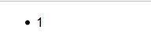

# JavaScript 小技巧

## 编写一个函数将元素顺序反转

```html
<ul id="target">
    <li>1</li>
    <li>2</li>
    <li>3</li>
</ul>
```

**考察点**

1. DOM基本操作

2. 对于一个子节点来说，只能成为一个父元素的子节点。

    ```javascript
    var target = document.getElementById('target'),
    frag = document.createDocumentFragment(),
    i;

    for(i = target.children.length-1; i >= 1; --i){
        frag.appendChild(target.children[i]);
    }
    ```

    运行结果

    

3. DocumentFragment


**完整程序**

```javascript
var target = document.getElementById('target'),
    frag = document.createDocumentFragment();

while(target.lastChild){
    frag.appendChild(target.lastChild);
}

target.appendChild(frag);
```
