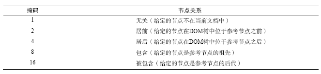

#JavaScript 高级程序设计

## DOM扩展

对DOM的两个主要的扩展是`SelectorAPI`和`HTML5`，此外还有一个比较少人关注的Element Traversal规范

###新的集合类型

**DOMTokenList**

具有以下属性和方法

* length：包含元素个数

* add(value)：将给定的字符串值添加到列表中。如果值已经存在，就不添加了。

* contains(value)：表示列表中是否存在给定的值，如果存在则返回true，否则返回false。

* remove(value)：从列表中删除给定的字符串。

* toggle(value)：如果列表中已经存在给定的值，删除它；如果列表中没有给定的值，添加它。

**DOMStringMap**

名值对的集合

### 选择符API

Selectors API [www.w3.org/TR/selectors-api]是由W3C发起制定的一个标准，致力于让浏览器原生支持CSS查询。相比于众多实现这一功能的JavaScript库，原生的API由于可以在浏览器内部通过编译后的代码来完成，极大地改善了性能。

Selectors API Level 1的核心是两个方法：`querySelector`和`querySelectorAll()`。目前已完全支持Selectors API Level 1的浏览器有IE8+、Firefox 3.5+、Safari 3.1+、Chrome和Opera 10+

1. querySelector(selector)
    
    接收一个CSS选择符，返回与该模式匹配的第一个元素，如果没有找到匹配的元素，返回null

    ```javascript
    //取得body元素
    var body = document.querySelector('body');

    //取得ID为myDiv的元素
    var myDiv = document.querySelector('#myDiv');

    //取得类为selected的第一个元素
    var selected = document.querySelector('.selected');
    ```

    *如果传入了不被支持的选择符，querySelector()会抛出错误*

2. querySelectorAll(selector)

    与querySelector类似，返回的是一个NodeList的实例。具体来说，返回的值，其底层实现则类似与一组元素的快照，`而非不断对文档进行搜索的动态查询`。这样做，可以避免使用NodeList对象通常会引起的大多数性能问题。

    ```javascript
    //取得<div>中的所有<em>元素
    var ems = document.getElementById('myDiv').querySelectorAll('em');
    var em,i,len;

    for(i = 0,len = ems.length;i < len;i++){
        em = ems[0]; //em = ems.item(0)
        //执行别的操作
    }
    ```

3. matchesSelector(selector)

    接收CSS选择符，如果调用元素与该选择符匹配，返回true，否则返回false

    *截至2011 年年中，还没有浏览器支持matchesSelector()方法；不过，也有一些实验性的实现。IE 9+通过msMatchesSelector()支持该方法，Firefox 3.6+通过mozMatchesSelector()支持该方法Safari 5+和Chrome 通过webkitMatchesSelector()支持该方法*

    ```javascript
    //包装函数
    function matchesSelector(element,selector){
        if(element.matchesSelecor){
            return element.matchesSelector(selector);
        } else if (element.msMatchesSelector){
            return element.msMatchesSelector(selector);
        } else if (element.mozMatchesSelector){
            return element.mozMatchesSelector(selector);
        } else if (element.webkitMatchesSelector){
            return element.webkitMatchesSelector(selector);
        } else {
            throw new Error('Not Supported.')
        }
    }

    if(matchesSelector(document.body,'body.page1')){
        //执行操作
    }
    ```

### 元素遍历

对于元素间的空格，IE9及之前的版本不会返回文本节点，而其他所有浏览器都会。这样导致了在使用childNodes和firstChild等属性时的行为不一致，为了弥补这一差异，而又同时保持DOM规范不变。Element Traversal 规范 [www.w3.org/TR/ElementTraversal/] 新定义了一组属性。

* childElementCount：返回子元素（不包括文本节点和注释）的个数。

* firstElementChild：指向第一个子元素；firstChild 的元素版。

* lastElementChild：指向最后一个子元素；lastChild 的元素版。

* previousElementSibling：指向前一个同辈元素；previousSibling 的元素版。

* nextElementSibling：指向后一个同辈元素；nextSibling 的元素版。

目前支持的浏览器有IE9+、Firefox 3.5+、Safari 4+、Chrome和Opera 10+

```javascript
//使用以前的方法，主要是判断是否是元素
var i,
    len,
    child = element.firstChild;
while(child !== element.lastChild){
    if(child.nodeType === 1){
        processChild(child);
    }
    child = child.nextSibling;
}


//使用Element Traversal新增的元素
var i,
    len,
    child = element.firstElementChild;

while(child !== element.lastElementChild){
    processChild(child);
    child = child.nextElementSibling;
}
```

### HTML5

HTML5围绕如何使用新增标记定义了大量的JavaScript API。其中一些API与DOM重叠，定义了浏览器应该支持的DOM扩展。本节只讨论与DOM节点相关的内容。

#### 与类相关的扩充

为了让开发人员适应并增加对class属性的新认识，HTML5新增了很多API，致力于简化CSS类的用法

1. getElementsByClassName(className)

    接收一个参数，即一个包含一或多个类名的字符串，返回带有指定类的所有元素的NodeList。（与其他返回NodeList对象的DOM方法一样具有同样的性能问题）    
    
    目前支持的浏览器有、Firefox 3+、Safari 3.1+、Chrome和Opera 9.5+。

    ```javascript
    //取得所有类中包含username和current的元素，类名先后顺序无所谓
    var allCurrentUserNames = document.getElementsByClassName('username current');
    ```
2. classList
    
    在操作类名时，需要通过className属性添加、删除和替换类名。因为className中是一个字符串，所有即使只修改字符串的一部分，`也必须每次都设置整个字符串的值`。

    为了简化这些操作，HTML5新增了一种可以操作类名的方式，那就是为所有元素添加classList属性，这个属性是新集合类型DOMTokenList的实例。
    
    目前支持浏览器：Firefox 3.6+和Chrome。
    
    如有：

    ```html
    <div class="bd user disabled">...</div>    
    ```

    要从中删除一个类名，则：

    ```javascript
    //删除user
    var classNames = div.className.split(/\s+/);

    //找到要删除的类名
    var pos = -1,
        i,
        len;
    for(i = 0,len = classNames.length;i < len;i++){
        if(classNames[i] === 'user'){
            pos = i;
            break;
        }
    }

    //数组，删除该项
    classNames.splice(i,1);

    //把剩下的类名拼接，并重新设置
    div.className = classNames.join(' ');
    ```

    利用classList，则只需要一行代码

    ```javascript
    div.classList.remove('user');
    ```

#### 焦点管理

HTML5添加了辅助管理DOM焦点的两个功能。这两个功能的最重要的用途是提高Web应用的`无障碍性`。无障碍Web应用的一个主要标志就是恰当的焦点管理。

    元素获得焦点的方式有

    1. 页面加载

    2. 用户输入（通常是Tab键）

    3. 在代码中调用focus()

1. document.activeElement

    这个属性始终会引用DOM中当前获得了焦点的元素。默认情况下，文档刚刚加载完成时，这个属性保存的document.body的引用；文档加载期间，这个属性的值为null

    ```javascript
    var button = document.getElementById('myButton');
    button.focus();
    document.activeElement === button //true
    ```

2. document.hasFocus

    用于确定文档是否获得了焦点

    ```javascript
    var button = document.getElementById('myButton');
    button.focus();
    document.hasFocus();//true
    ```

支持的浏览器有：IE 4+、Firefox 3+、Safari 4+、Chrome 和Opera 8+。

#### HTMLDocument的变化

HTML5扩展了HTMLDocument，增加了新的功能。不过这些变化是基于那些已经得到很多浏览器完美支持的专有扩展，因此，很多浏览器很早就已经支持这些功能了。

1. document.readyState

    IE4最早为document对象引入了readyState属性。这个属性可能的值：

    * loading：正在加载文档
    
    * complete：已经加载完文档
    
    支持的浏览器：IE4+、Firefox 3.6+、Safari、Chrome 和Opera 9+。

    ```javascript
    if(document.readyState === 'complete'){
        //文档加载之后的操作
    }
    ```
   
2. document.compatMode

    自从IE6开始区分渲染页面的模式是标准还是混杂的，检测页面的兼容模式就成为了浏览器的必要功能。

    * 在标准模式下，document.compatMode为"CSS1Compat"
    
    * 在混杂模式下，document.compatMode为"BackCompat"

    支持的浏览器：IE6+、Firefox 3.1+、Safari、Chrome 和Opera 9+。

    ```javascript
    if(document.compatMode === 'CSS1Compat'){
        console.log('Standards mode');
    } else {
        console.log('Quirks mode');
    }
    ```

3. document.head

    引用<head\>元素

    支持的浏览器：Chrome、Firefox较新的版本、Safari 5

    ```javascript
    var head = document.head || document.getElementsByTagName('head')[0];
    ```

#### 字符集属性

跟文档字符集有关的属性

1. charset
    
    表示文档中实际使用的字符集，也可以用来指定新字符集。

    支持的有：IE 、Firefox 、Safari 、Opera 和Chrome

    ```javascript
    console.log(document.charset); //GBK
    document.charset = 'UTF-8';
    ```

2. defaultCharset

    表示根据默认浏览器及操作系统的设置，当前文档默认的字符集

    支持的有：IE、Safari 和Chrome。

    ```javascript
    if(document.charset != document.defaultCharset){

    }
    ```

#### 自定义数据属性

HTML5 规定可以为元素添加非标准的属性，但要添加前缀data-，目的是`为元素提供与渲染无关的信息，或者提供语义信息`。这些属性可以任意添加、随便命名，只要以data-开头即可

```html
<div id="myDiv" data-appid="12345" data-myname="zhang">...</div>
```

添加自定义属性，可以通过元素的`dataset`属性（DOMStringMap的一个实例）,或者`getAttribute()`来访问

```javascript
var div = document.getElementById('myDiv');

//取得自定义属性的值
var appId = div.dataset.appid; //12345  div.getAttribute('appid');
var myName = div.dataset.myname; // zhang

//设置
div.dataset.appid = 23456;

```

#### 插入标记

在需要给文档插入大量新的HTML标记的情况下，可以直接插入HTML字符串。

1. innerHTML
    
    * 读模式下，返回与调用元素的所有子节点的对应的HTML标记
    
        不同浏览器返回的文本格式会有所不同，IE和Opera会将所有标签转换为大写形式，而Safari、Chrome和Firefox则会原原本本地按照原先文档中的格式返回HTML。

    * 写模式下，会根据指定的值创建新的DOM树，这个DOM树完全替换调用元素的子节点

    使用这个属性有一些限制，比如，在大多数浏览器中，通过innerHTML插入&lt;script&gt;元素并不会执行其中的脚本。

    并不是所有元素都支持innerHTML属性。不支持的有

    `<col> <colgroup> <frameset> <head> <html> <style> <table> <tbody> <thead> <tfoot> <tr>`

2. outerHTML

    * 读模式下，返回调用它的元素及所有子节点的HTML标签
   
    * 写模式下，根据指定的HTML字符串创建新的DOM子树

    支持的浏览器：IE4+、Safari 4+、Firefox、Chrome 和Opera 8+

3. insertAdjacentHTML(pos,html)

    接收两个参数：插入位置和要插入的HTML文本

    第一个参数必须是下列值之一：

    * 'beforebegin'：在当前元素之前插入一个紧邻的同辈元素
    
    * 'afterbegin'：在当前元素之下插入一个新的子元素或在第一个子元素之前再插入新的子元素
    
    * 'beforeend'：在当前元素之下插入一个新的子元素或在最后一个子元素之后再插入新的子元
    
    * 'afterend'：在当前元素之后插入一个紧邻的同辈元素

    支持的浏览器：IE、Firefox 8+、Safari、Opera 和Chrome

    ```javascript
    //作为前一个同辈元素插入
    element.insertAdjacentHTML('beforebegin','<p>hello</p>');

    //作为第一个子元素插入
    element.insertAdjacentHTML('afterbegin','<p>hello</p>');

    //作为最后一个元素插入
    element.insertAdjacentHTML('beforeend','<p>hello</p>');

    //作为后一个同辈元素插入
    element.insertAdjacentHTML('afterend','<p>hello</p>');
    ```

**内存与性能问题**

1. 内存占用

    本小节介绍的方法替换子节点，可能会导致浏览器的内存占用问题，尤其在IE中，问题更加明显。在函数带有事件处理程序或引用了其他JavaScript对象子树时，就有可能导致内存占用问题。因此，`在进行替换的时候，最好先手工删除要替换的元素的所有事件处理程序和JavaScript对象属性`。

2. 性能

    通过这些方法设置时，会创建一个HTML解析器，这个解析器是在浏览器级别的代码(通常是C++编写的)基础上运行的，因此比执行JavaScript代码创建DOM节点要快得多。不可避免的，创建和销毁HTML解析器也会带来性能损失。因此，`最好能够将设置innerHTML或outerHTML的次数控制在合理的范围内。`

    ```javascript
    //bad code
    for (var i =0, len = values.length; i < len; i++){
        ul.innerHTML += '<li>' + values[i] +'</li>'; //要避免这种频繁的操作
    }

    //better way
    for (var i = 0, len = values.length; i < len; i++){
        itemsHtml += '<li>' + values[i] + '</li>';
    }
    ul.innerHTML = itemsHtml;
    ```

#### scrollIntoView([boolean])

可以在所有HTML元素上调用，通过滚动浏览器窗口或某个容器元素，调用元素就可以出现在视口中。

* 参数为true或不传参，窗口滚动之后会让调用元素的顶部尽可能平齐

* 参数为false，调用元素会仅可能全部出现在视口中。

支持的浏览器：IE、Firefox、Safari Chrome和Opera

```javascript
//让元素可见
document.forms[0].scorllIntoView();
```

### 专有扩展

>虽然所有浏览器开发商都知晓坚持标准的重要性，但在发现某项功能缺失时，这些开发商都会一如既往地向DOM中添加专有扩展，以弥补功能上的不足。表面上看，这种各行其事的做法似乎不太好，但实际上专有扩展为Web开发领域提供了很多重要的功能，这些功能最终都在HTML5 规范中得到了标准化。

即便如此，还有大量专有的DOM扩展没有成为标准。

#### 文档模式【IE】

IE8引入了一个新的概念叫"文档模式(document mode)"。页面的文档模式决定了可以使用什么功能，也就是使用哪个级别的CSS，可以使用哪些JavaScript的API，以及如何看待文档类型(doctype)

到了IE9，总共有4种文档模式

1. IE5：以混杂模式渲染页面。IE8 及更高版本中的新功能都无法使用。

2. IE7：以IE7 标准模式渲染页面。IE8 及更高版本中的新功能都无法使用。

3. IE8：以IE8标准模式渲染页面。IE8中的新功能都可以使用，因此可以使用Selectors API、更多CSS2级选择符和某些CSS3功能，还有一些HTML5的功能。不过IE9中的新功能无法使用。

4. IE9：以IE9 标准模式渲染页面。IE9中的新功能都可以使用，比如ECMAScript5、完整的CSS3以及更多HTML5 功能。这个文档模式是最高级的模式。

要强制浏览器以某种模式渲染页面，可以使用`HTTP头部信息的X-UA-Compatible`,或者通过等价的`<meta>`标签来设置

```html
<meta http-equiv="X-UA-Compatible" content="IE=Edge">       
```

其中，`IE=Edge`表示始终以最新的文档模式来渲染页面。忽略文档类型声明[最常用]

此外，还可以取其他不同的值：


此外，可以通过IE8新增的`document.documentMode`来获取给定页面使用的是什么文档模式。

#### children属性

由于IE9之前的版本与其他浏览器在处理文本节点中的空白符时有差异，因此就出现了children属性。这个属性是HTMLCollection 的实例，只包含元素中同样还是元素的子节点。

支持的浏览器有：IE5、Firefox 3.5、Safari 2（但有bug）、Safari 3（完全支持）、Opera8和Chrome（所有版本）。IE8及更早版本的children属性中也会包含注释节点，但IE9 之后的版本则只返回元素节点。

#### contains(node)

在实际开发中，经常需要知道某个节点是不是另一个节点的后代。由祖先节点调用这个方法，检测参数传入的节点，如果被检测的节点是后代节点，则返回true，否则返回false。

支持的浏览器有IE、Firefox 9+、Safari、Opera 和Chrome。

```javascript
document.documentElement.contain(document.body); //true
```

此外，使用DOM Level 3中的compareDocumentPosition也能够确定节点间的关系，这个方法返回表示该关系的位掩码(bitmask)



支持contains()方法的浏览器有IE9+、Firefox、Safari、Opera 9.5+和Chrome

使用以上两个方法，可以得到一个同样的contains函数

```javascript
function contains(refNode,otherNode){
    if(typoef refNode.contains === 'function' &&
     (!client.engine.webkit || client.engine.webkit >= 522)){
        return refNode.contains(otherNode);
     } else if (typeof refNode.compareDocumentPosition === 'function'){
        return !!(refNode.compareDocumentPosition(otherNode) & 16);
     } else {
        var node = otherNode.parentNode;
        do{
            if (node === refNode){
                return true;
            } else {
                node = node.parentNode;
            }
        } while (node !== null);

        return false;
     }
}
```

#### 插入文本【IE】

1. innerText

2. outerText
    
    由于这个属性会导致调用它的元素不存在，因此并不常用。我们也建议读者尽可能不要使用这个属性。

#### 滚动

1. scrollIntoViewIfNeeded(alginCenter)
    
    只在当前元素在视口中不可见的情况下，才滚动浏览器窗口或容器元素，最终让它可见。如果当前元素在视口中可见，这个方法什么也不做。如果将可选的alignCenter 参数设置为true，则表示尽量将元素显示在视口中部（垂直方向）。Safari 和Chrome 实现了这个方法。

2. scrollByLines(lineCount)
    
    将元素的内容滚动指定的行高，lineCount 值可以是正值，也可以是负值。Safari 和Chrome 实现了这个方法。

3. scrollByPages(pageCount)

    将元素的内容滚动指定的页面高度，具体高度由元素的高度决定。Safari 和Chrome 实现了这个方法。

```javascript
//将页面主体滚动5行
document.body.scrollByLines(5);

//在当前元素不可见的时候，让它进入浏览器的视口
document.images[0].scrollIntoViewIfNeeded();

//将页面主体往回滚动1页
document.body.scrollByPages(-1)
```

