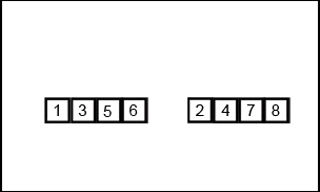

# 数据库背后的原理

> 原文：http://coding-geek.com/how-databases-work/  
> 译文：http://blog.jobbole.com/100349/?hmsr=toutiao.io&utm_medium=toutiao.io&utm_source=toutiao.io

这是一篇很优秀的文章，可以大大提高对数据库的认识。

## 目录

* [1. 基础回顾](#1)
    - [1.1 O(1) vs O(n^2)](#1.1)
        + 1.1.1 时间复杂度
        + 1.1.2 算算它们的区别
        + 1.1.3 进一步说
    - [1.2 归并排序](#1.2)
        + 合并操作
        + 算法流程
        + 归并排序的强大之处
    - [1.3 数组，数和哈希表](#1.3)
        + 数组
        + 树与数据库索引
        + 哈希表
* [2. 数据库总览](#2)
* [3. 客户端管理](#3)
* [4. 查询管理](#4)
    - [4.1 解析查询](#4.1)
    - [4.2 重写查询](#4.2)
    - [4.3 统计](#4.3)
    - [4.4 优化查询](#4.4)
    - [4.5 执行查询](#4.5)
* [5. 数据管理](#5)
    - [5.1 缓存管理](#5.1)
    - [5.2 事务管理](#5.2)
* [6. 总结](#6)

<h2 id="1">基础回顾</h2>

这一章节的介绍是理解数据库各方面设计的基础。

<h3 id="1.1">O(1) vs O(n^2)</h3>

在如今，开发者可能很少会在意`时间复杂度`这种东西。而数据库不一样，它经常要面临着在有限时间内处理大量的数据。同时，理解`时间复杂度`也是理解`基于成本优化(cost based optimization)`这个概念的基础。

#### 时间复杂度

1. 时间复杂度

    它是指一个算法处理一堆数据所需要的时间，通常使用数学符号`O(big O notation)`来描述。这个符号通常使用一个函数来描述给定输入数据的情况下一个算法所需要的运算次数。

    例如：一个算法是O(n)表示这个算法处理n个数据需要n次运算。

2. 增长率

    

    实际上，我们真正关心的是当随着数据量的增长，运算次数是怎么样增长的，即增长率的问题。在这幅图中可以看到五种不同的增长，可以看到当数据量从1条增长到10亿条的时候，运算次数的变化：

    * O(1)或者固定复杂度的运算次数保持不变
    * O(log(n))即使在10亿数据量时运算次数也很低
    * O(n^2)运算次数快速膨胀
    * 另外两种也运算次数也增长的很快

#### 算算它们的区别

其实当数据量比较小的时候，O(1)和O(n^2)的差别并不大，但是当数据量大的时候，它们之间的差别就非常地大了。举个例子说，当一个算法需要去处理1000 000个数据（对于数据库来说，这数量也不算大）

* 一个O(1)的算法需要1次运算
* 一个O(log(n))的算法需要14次运算
* 一个O(n)的算法需要1000 000次运算
* 一个O(n*log(n))的算法需要14 000 000次运算
* 一个O(n^2)的算法需要1000 000 000 000次运算

当你使用一个O(n^2)的算法时，你可能要去喝杯咖啡才能得到结果，如果在数据量后面加个0，估计你得睡一觉才能得到结果了。

#### 进一步说

通常对于一个算法来说，它的时间复杂度有三种情况：

* 平均情况
* 最好情况
* 最差情况

而我们通常说的一个算法的时间复杂度一般是指最差的情况下。

此外，除了时间复杂度之外，还需要特别注意的：

* 一个算法的内存消耗
* 一个算法的I/O消耗

这两者同样很重要。

在接下来的章节，我们会谈论到一些算法和数据结构，和本章节对应起来，你可能对它们有更加深刻的理解

* 在一个哈希表中搜索一个元素的时间复杂度为O(1)
* 在一棵均衡树中搜索一个元素的时间复杂度O(log(n))
* 一个数组里面搜索的时间复杂度为O(n)
* 最好的排序算法的时间复杂度为O(n*log(n))
* 一个不好的排序算法的时间复杂度为O(n^2)

> 扩展阅读：http://blog.jobbole.com/55184/

<h3 id="1.2">归并排序</h3>

1. 归并排序在数据库中有着广泛的应用，在后面部分的`查询优化`中会再次提到。
2. 归并排序有助于理解数据库的常见的连接操作（合并联接）。

#### 合并操作

归并排序的技巧就是：运算N次，将两个大小为N/2的有序数组合并为一个大小为N的有序数组。这一部的操作就叫做`合并（merge）`。

用一个gif图来显示这个过程吧

#### 算法流程

归并排序算法其实很好了解，总体上分为两个阶段

1. 拆分，从大数组拆分成小数组
2. 合并，将排好序的小数组进行合并有序的大数组

#### 归并排序的强大之处

1. 原地算法

    归并排序的实现可以在原有的数组上实现，以便于节省内存空间，属于原地算法的一种。

2. 外部排序

    归并排序可以实现外部排序。通过同时使用磁盘空间和内存来进行大数据的排序。

*分布式合并排序是Hadoop的关键组件之一。*

> 归并排序：http://blog.jobbole.com/79293/  
> 原地算法：https://en.wikipedia.org/wiki/In-place_algorithm  
> 外部排序：https://en.wikipedia.org/wiki/External_sorting

