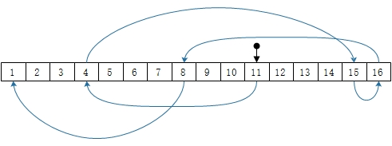

# 计算机基础

## 磁盘

### 磁盘臂调度算法

假设目前正在11柱面，有4，15，16，8，1的请求

1. 先来先服务（FCFS）

    

2. 最短寻道优先（SSF）

    下一次总是处理与磁头距离最近的请求以使寻道时间最小化

    

    *当磁盘负载很重，那么大部分时间磁盘臂将停留在磁盘的中部区域，而两端极端区域的请求将不得不等待*

3. 电梯算法（扫描算法）

    保持按照一个方向移动，直到那个方向上没有请求为止，然后改变方向。

    
