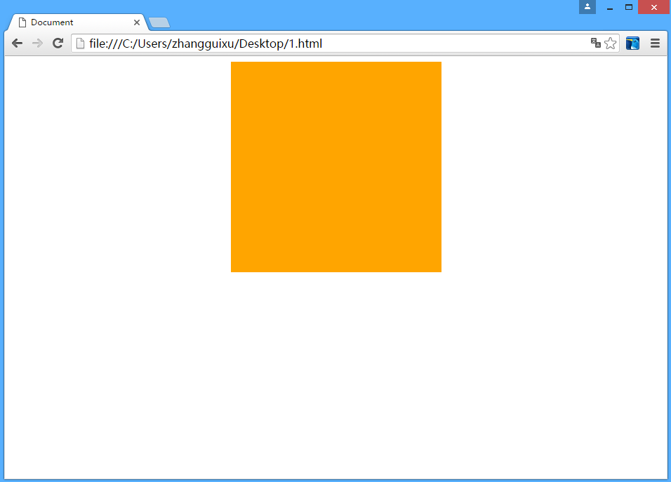
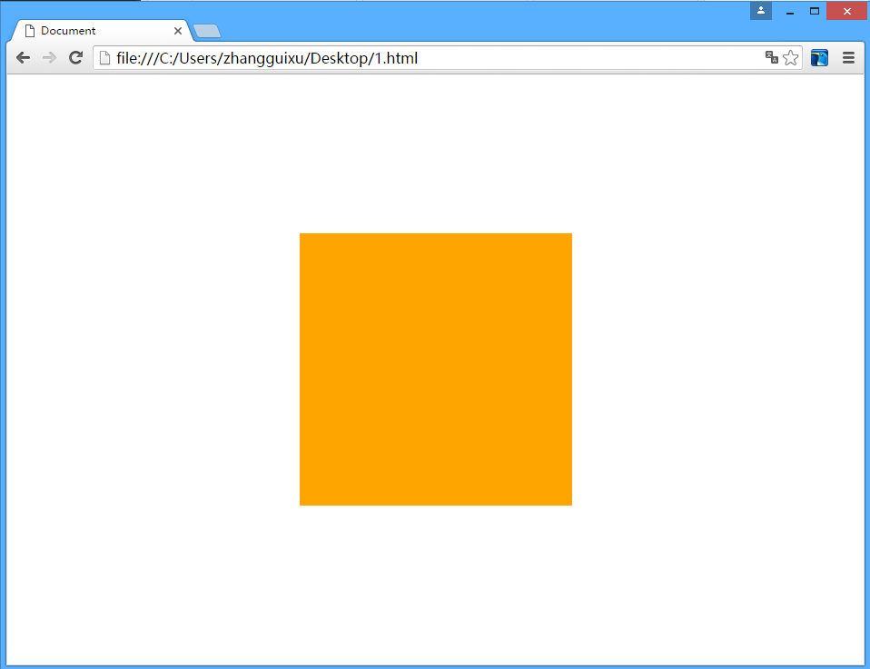

# css基础

## 实现水平垂直居中的常用方法

### 1. 水平居中

1. 指定width

2. 使用margin

```html
<!DOCTYPE html>
<html lang="en">
<head>
    <meta charset="UTF-8">
    <title>Document</title>
    <style>
        .content{
            width: 300px; /*必须指定宽度*/
            height: 300px;
            margin: 0 auto;/*水平居中*/
            background: orange;
        }
    </style>
</head>
<body>
    <div class="content"></div>
</body>
</html>
```

运行结果为



### 2. 垂直居中

1.设置html，body的宽高为100%

2.清除默认的padding，margin

3.使用relative进行偏移50%；

5. 使用margin-top向上偏移div高度的一半

```html
<!DOCTYPE html>
<html lang="en">
<head>
    <meta charset="UTF-8">
    <title>Document</title>
    <style>
        html,body{
            margin: 0;
            padding: 0;
            width: 100%;
            height: 100%;
        }
        .content{
            width: 300px; /*必须指定宽度*/
            height: 300px;
            margin: 0 auto;/*水平居中*/
            background: orange;
            position: relative;
            top: 50%;
            margin-top: -150px;
        }
    </style>
</head>
<body>
    <div class="content"></div>
</body>
</html>
```

运行结果




