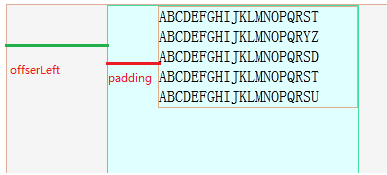

# 元素的位置和大小

> http://www.cnblogs.com/fangjins/archive/2012/08/02/2619835.html

##  宽度

关于宽度，有两个概念

1. 元素内容区宽度，即width
2. 元素所占宽度:width + padding + border

*随着padding值的增大，内容区宽度（width）不会改变，而元素所占的宽度会增大*

### padding vs margin

margin是一个定位的概念，作用是让元素与周围元素产生距离，跟元素所占的大小无关。

**padding是一个元素所占大小的概念，margin是个定位的概念。**

## 偏移量

偏移量（offset）是个元素相对元素的概念。

元素相对于父元素进行偏移，父元素必须满足其`position`为`relative,absolute,fixed`，如果父元素不满足，则向祖先元素寻找，最终找到`body`

### offsetLeft

offsetLeft：元素所占区域的左边缘到父元素的左边缘

*元素的padding会影响到offsetLeft*

### offsetWidth

offsetWidth：元素在水平方向所占空间大小，即元素宽度，（可见的）水平滚动条的宽度，内边距，边框等四者的总和

即：offsetWidth = width + padding + border + 滚动

## 客户区

在浏览器中，客户区表达了元素可以渲染的区域（边框与滚动条不算）

因此，clientWidth与offsetWidth的差别就是在于边框与滚动条，即

clientWidth = width + padding

**client的意义体现在document.clientWidth真实的反映了窗口的大小**

## 滚动

当有滚动条时，就必须考虑滚动条隐藏掉的元素的区域

