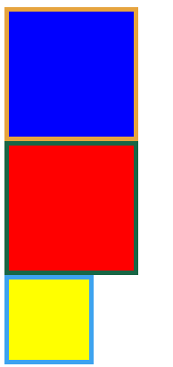
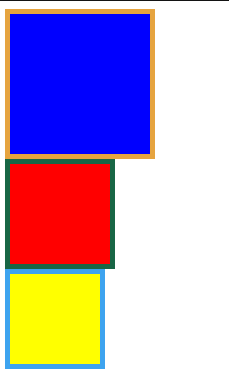

# css3基础

> 来源：http://www.cnblogs.com/zhaoran/archive/2013/05/24/3097482.html

## box-sizing


这个属性是关于元素width的计算是否考虑border和padding

* content-box(default)：border和padding不计算入width之内
* padding-box：padding计算入width内
* border-box：border和padding计算入width之内

### 例子

```html
<!DOCTYPE html>
<html lang="en">
<head>
    <meta charset="UTF-8">
    <title>Document</title>
    <style>
    .content-box{
        box-sizing:content-box;
        -moz-box-sizing:content-box;
        width: 100px;
        height: 100px;
        padding: 20px;
        border: 5px solid #E6A43F;
        background: blue;
    }
    .padding-box{
        box-sizing:padding-box;
        -moz-box-sizing:padding-box;
        width: 100px;
        height: 100px;
        padding: 20px;
        border: 5px solid #186645;
        background: red;
    }
    .border-box{
        box-sizing:border-box;
        -moz-box-sizing:border-box;
        width: 100px;
        height: 100px;
        padding: 20px;
        border: 5px solid #3DA3EF;
        background: yellow;
    }
    </style>
</head>
<body>
    <div class="content-box"></div>
    <div class="padding-box"></div>
    <div class="border-box"></div>
</body>
</html>
```

chrome的运行效果



firefox的运行效果



