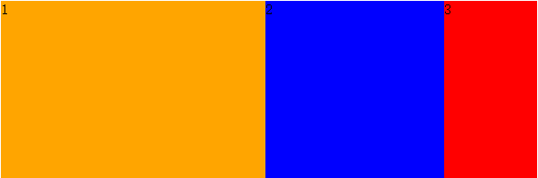

# CSS3基础

## flex布局

> 来源：http://www.warting.com/web/201402/68557.html

### 1. 基本认识

`display:box`是css3新添加的盒子模型属性，它的出现可以解决布局方式。经典的应用场景有：

* 垂直等高

* 水平均分

* 按比例划分

示例html代码

```html
<article>
    <section>1</section>
    <section>2</section>
    <section>3</section>
</article>
```

### 2. box-flex属性

1. 作用：主要让子容器针对父容器按一定的规则进行划分

    ```css
    article{
        width:600px;
        height:200px;
        display:-moz-box;
        display:-webkit-box;
        display:box;
    }
    section:nth-child(1){
        background:orange;
        -mox-box-flex:3;
        -webkit-box-flex:3;
        box-flex:3;
    }
    section:nth-child(2){
        background:blue;
        -mox-box-flex:2;
        -webkit-box-flex:2;
        box-flex:2;
    }
    section:nth-child(3){
        background:red;
        -mox-box-flex:1;
        -webkit-box-flex:1;
        box-flex:1;
    }
    ```

    

2. 子容器中的内容如果要居中，只能是在父容器添加`text-align:center`

3. 若有子容器设置了固定宽度，则直接应用设置的宽度值，其他没有设置的则在父容器的宽度基础上减去子容器设置的固定宽度，在剩下的宽度值的基础上按照一定的比例进行分配。

4. 若有子容器设置了间隙，则父容器的宽度会减去间隙值，再按比例分配

###


