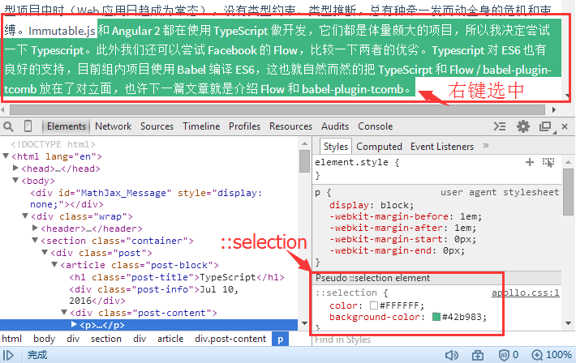
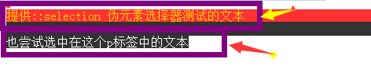

# ::selection

> https://developer.mozilla.org/zh-CN/docs/Web/CSS/::selection

## 概述

::selection CSS伪元素应用于文档被用户高亮的部分



只有一小部分CSS属性可以用于`::selection`选择器

* color
* background-color
* cursor
* outline
* text-decoration
* text-emphasis-color
* text-shadow【支持的浏览器不多】

## 示例

```html
<!DOCTYPE html>
<html lang="en">
<head>
    <meta charset="UTF-8">
    <title>Document</title>
    <style>
        ::-moz-selection {
            color : gold;
            background : red;
        }
        ::selection {
            color : gold;
            background : red;
        }

        p::-moz-selection {
            color : white;
            background : black;
        }
        p::selection {
            color : white;
            background : black;
        }
    </style>
</head>
<body>
    <div>提供::selection 伪元素选择器测试的文本</div>
    <p>也尝试选中在这个p标签中的文本</p>
</body>
</html>
```

运行效果如下：



