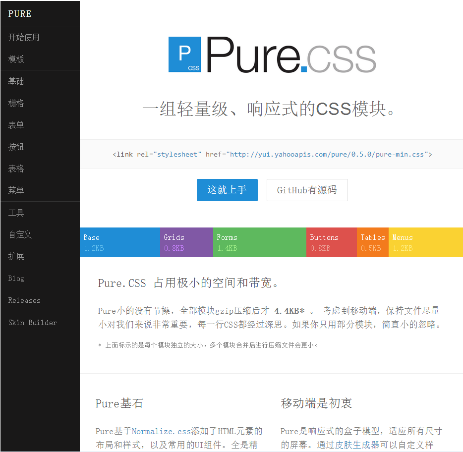
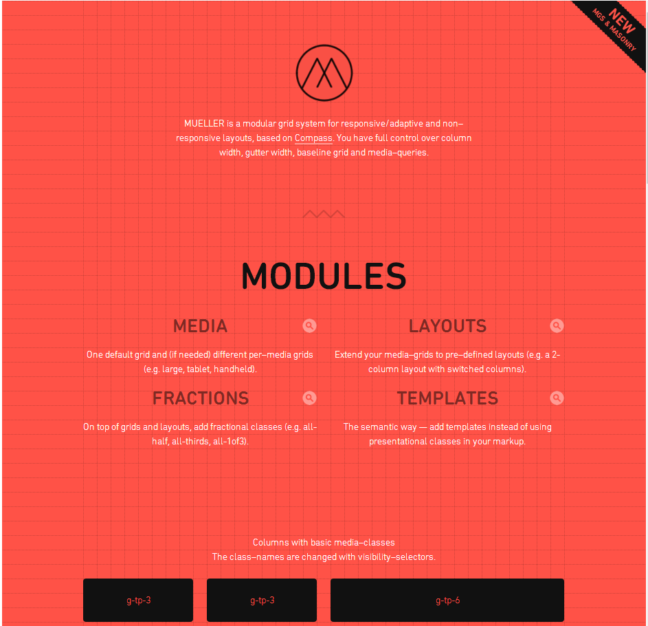

# CSS框架收集录

## bootstrap

这个框架是本人用的最多的框架，大而全，而且版本也一直在更新，几乎是后来CSS框架的标杆，文档齐全，而且有很多优秀的案例。

开发时都是基于sass进行开发的，在这过程中可以去除掉很多冗余的样式。bootstrap为移动端也添加了很多CSS样式来进行优化。

感觉不足的地方就是其插件是基于jquery的：在移动端的交互方面没有做优化（tap事件的不存在）。

> 项目地址：http://www.bootcss.com/

## pure.css

1. 优势：

    * 占用极小的空间和带宽。
    *   Pure小的没有节操，全部模块gzip压缩后才 4.4KB* 。 考虑到移动端，保持文件尽量小对我们来说非常重要，每一行CSS都经过深思。如果你只用部分模块，简直小的忽略。

2. License

    [Yahoo BSD License](https://github.com/yahoo/pure-site/blob/master/LICENSE.md)

3. 主页风格

    

> 项目地址：http://www.purecss.org/

## Mueller

1. 特点

    基于Compass的`模块`，支持响应式/自适应和非响应式布局。你可以完全自由控制列宽、栅格以及媒体查询。主页上也只有这一模块的说明。
    *主页很晃眼，看久了受不了。*

2. 主页风格

    

> 项目地址：http://muellergridsystem.com/

