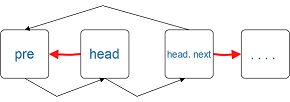

# Data Structures & Algorithm with JavaScript

> 算法参考：http://algorithm.yuanbin.me/zh-hans/ <br>

> 实现参考：https://github.com/LukeLin/data-structure-with-js

## 1. Rectangular Array

### 实现思路

javascript只支持一维数组，但是通过`在数组里面保存数组元素`的方式，可以轻松创建多维数组。

```javascript
//最简单的实现
var arr = [[1,2],[2,3],[3,4]];
```

## 2. Linked List

### 2-1 反转

1. 单向链表

    

    pre，head，head.next之间的三值交换操作

2. 双向链表

    

    pre和next值的交换操作

### 2-2 dummy node

Dummy node（哑节点）是链表问题中的一个重要的技巧，它是一个虚拟节点，就是在链表表头head前加一个节点指向head，即`dummy -> head`。

它的作用是保证链表的head不会在删除操作中丢失，当链接的head有可能变化时，使用dummy node可以很好的简化代码，最终返回dummy.next即新的链表。

### 2-3 快慢指针

快慢指针指的是向前移动的步长，每次移动的步长较大的即为`快指针`，步长较小的即为`慢指针`。常用的快慢指针一般是在单链表中让快指针每次向前移动2，慢指针则每次向前移动1。快慢指针主要有两个应用：

1. **快速找出未知长度的链表的中间节点**

    设置两个指针`fast`和`low`，都指向单链表的头节点，由于`fast`的移动速度是`slow`的2倍，所以当`fast`指向末尾节点的时候，`slow`刚好就在中间。

2. **判断单链表是否有环**

    利用快慢指针的原理，由于`fast`的移动速度是`slow`的2倍，如果`fast == null`说明该单链表以null结尾，不是循环链表；如果`fast == slow`，则快指针追上慢指针，说明该链表是循环链表。

## 3. Binary Tree

### 3-1 基本知识

1. 二叉树

    二叉树是每个节点最多有两个子树的树结构，子树有左右之分。二叉树常用于实现`二叉查找树`和`二叉堆`。

2. 二叉树的节点计算

    1. 二叉树第i层至多有<a href="http://www.codecogs.com/eqnedit.php?latex=2^{i-1}" target="_blank"></a>个节点。

    2. 深度为k的二叉树至多有<a href="http://www.codecogs.com/eqnedit.php?latex=2^{k}-1" target="_blank"></a>个节点。

    3. 任何一棵二叉树T，如果其终端节点数为<a href="http://www.codecogs.com/eqnedit.php?latex=n_{0}" target="_blank"></a>，度为2的节点数为<a href="http://www.codecogs.com/eqnedit.php?latex=n_{2}" target="_blank"></a>，则<a href="http://www.codecogs.com/eqnedit.php?latex=n_{0}=n_{2}&plus;1" target="_blank"></a>。

3. 满二叉树

    一棵深度为k，且有<a href="http://www.codecogs.com/eqnedit.php?latex=2^{k}-1" target="_blank"></a>个节点称之为满二叉树

4. 完全二叉树

    深度为k，有n个节点的二叉树，当前仅当每个节点都与深度为k的满二叉树中序号为1至n的节点对应时，称之为完全二叉树。完全二叉树中重在`节点标号对应`。


### 树的遍历

1. 深度优先

    先访问子节点，再访问父节点，最后访问第二个子节点。根据根节点相对于左右节点的访问先后顺序可细分为以下三种方式：

    1. 前序：先根后左再右
    2. 中序：先左后根再右
    3. 后序：先左后右再根

    前中后是相对于`根节点的访问`来说的。

2. 广度优先

    先访问根节点，沿着树的宽度遍历子节点，直到所有的节点均被访问为止。

### 二叉查找树（BST）

二叉查找树的特点

1. 每个节点的键都大于等于左子树中的任意节点的键，而小于右子树的人鱼节点的键。

2. 使用`中序遍历`可得到有序数组。

### 树类的复杂度分析

可统计针对每个节点`被访问的次数`，进而求的总的时间复杂度。


