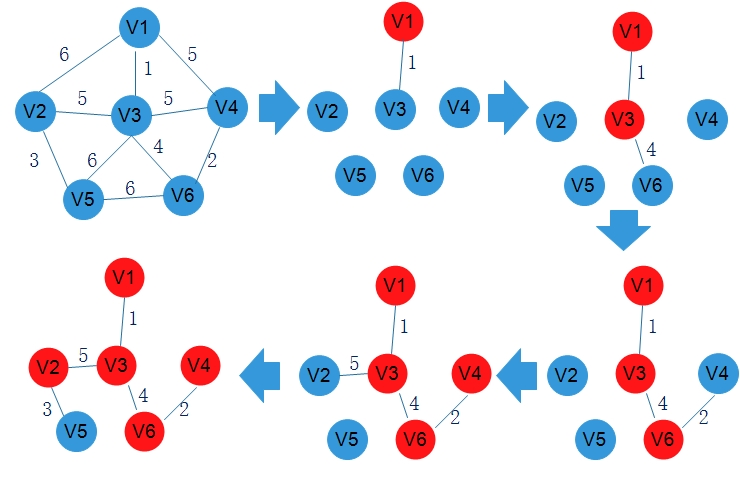

# 数据结构

## 图

### 1. 基本概念

1. 无向图

    * 无向完全图：含有`n`个顶点的无向完全图有`n(n-1)/2`条边

2. 有向图

    * 有向完全图：含有`n`个顶点的有向完全图有`n(n-1)`条边

3. 连通图

    图G中任意两个顶点都是连通的，则称图G为连通图

    * 连通分量（无向图）

        无向图中的极大连通子图称为连通分量

    * 强连通图（有向图）

        在有向图中，若从顶点v到顶点w和从顶点w到顶点v之间都有路径，则称这个顶点是`强连通`的。图中任何一堆顶点都是强连通的，则称此图为强连通图。

4. 顶点的度

    定义为以该顶点为一个端点的边的数目

    * 在无向图中，全部顶点的度之和等于边数的两倍

    * 在有向图中，全部顶点的度之和等于边数

### 2. 存储表示

1. 邻接矩阵法

    结点数为n的图G=(V,E)的邻接矩阵A是nxn的，将G的顶点编号为V1,V2,...,Vn。若(Vi,Vj)∈E，则A[i][j] = W/1，否则A[i][j] = 0

    *稠密图比较适合使用邻接矩阵的表示方法*

2. 邻接表法

    邻接表就是对图G中的每个顶点Vi建立一个单链表，第i个单链表中的结点表示依附于顶点Vi的边。

    * 存储无向图的空间为O(V+2E)

    * 存储有向图的空间为O(V+E)

    * 对于稀疏图很省空间

    * 查找边的效率比较高

### 3. 遍历

1. 深度优先搜索

    基本思想是：首先访问图中某一起始顶点v，然后由v出发，访问与v邻接且未被访问的任一顶点W1，再访问与W1邻接且未被访问的任意顶点W2，...，重复上述过程，当不能再继续向下访问时，依次退回到最近被访问的顶点，若它还有邻接顶点未被访问到，则从该点开始继续上述搜索过程，直到图中所有顶点均被访问过为止。

2. 广度优先搜索

    基本思想是：首先访问起始顶点V，接着由V出发，依次访问V的各个未访问过的邻接顶点W1,W2,W3,...,Wi，然后再一次依次访问 W1,W2,W3,...,Wi 的所有未被访问过的邻接顶点，以此类推，直到图中所有顶点都被访问过为止。类似的思想还应用与Dijkstra单源最短路径算法和Prim最小生成树算法。

### 4. 应用

#### 4-1 最小生成树

1. 最小生成树的性质

    假设G=（V,E）是一个带权连通无向图，U是顶点集V的一个非空子集，若(u,v)是一条具有最小权的边，其中u∈U，v∈V-U，则必存在一棵包含边(u,v)的最小生成树

2. Prim算法（以点为中心的）

    1. 初始化：向空树T=(Vt,Et)中添加图G=(V,E)的任一顶点u0，使Vt={u0}，Et={}
    2. 循环：从G中选择满足{(u,v)|u∈Vt,v∈V-Vt}且具有最小权值的边(u,v)，并置Vt=Vt∪{v},Et=Et∪{(u,v)}

    

    Prim的算法时间复杂度是O(V^2)，不依赖于E，因此适合求解`边稠密`的图的最小生成树

3. Kruskal算法（以边为中心的）

    1. 初始化：Vt=V，Et={},即每个顶点构成一个独立的树，T此时是一个仅含V个顶点的森林。
    2. 循环：按G的边的权值递增顺序依次从E-Et中选择一条边，如果这条边加入T后不构成回路，则将其加入Et，否则舍弃，直到Et中含有n-1条边

    

    通常采用堆来存放边的集合，则每次选择最小权值的边只需O(logE)的时间，又生成树T中所有的边可以视为一个等价类，每次添加新的边类似于等价类的过程，由此可以采用并查集的数据结构来描述T，从而构造T的事件复杂度为O(ElogE)，因此kruskal算法适合于`边稀疏而顶点多`的图。

#### 4-2 最短路径

**Dijkstra算法**

1. 辅助数组

    * dist[]：记录从源点V0到其他顶点当前的最短路径长度，dist[i]=arcs[0][i]
    * path[]：path[i]表示从源点到顶点i之间的最短路径的前驱结点。

2. 初始化：集合S初始为{0}，dist[]的初始值为arcs[0][i]

3. 从顶点集合V-S中选出Vj，满足dist[j]=Min{dist[i] Vi∈V-S}，Vj就是当前求得的一条从V0出发的最短路径的终点，令S=S∪{j}

4. 修改从V0出发到集合V-S上的任意顶点Vk可达的最短距离长度：如果dist[j]+arcs[j][k]<dist[k],则令dist[k]=dist[j]+arcs[j][k]

5. 重复3-4操作共n-1次，直到所有顶点都包含在S中

