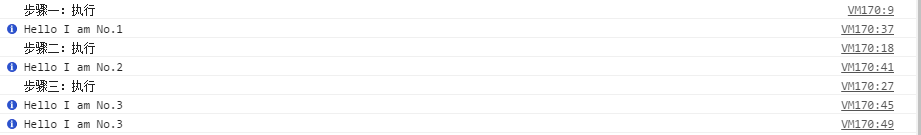

# JavaScript 新特性

> 参考1: https://segmentfault.com/a/1190000005078431 <br>
> 参考2: http://www.infoq.com/cn/news/2011/09/js-promise

## Promise

在编写JavaScript的时候，我们经常会写出各种嵌套在一起的回调函数：

```javascript
$.get('url',function(){
    $.get('url1',function(){
        $.get('url2',function(){
            //dosomething
        });
    });
});
```

这样的代码一旦嵌套的层次变多了，就会变得难以维护，而Promise的出现就是为了解决这一问题的。

### 什么是Promise

Promise是一个类，而且已经成为ES6的标准，目前有部分浏览器已经支持了，如chrome32，firefox等。

### 告别异步嵌套

**1. then链式调用**

这个函数避免了异步函数之间的层层嵌套，将原来的异步函数的嵌套函数转变为便于维护的链式步骤关系。

1. `then()`方法接收两个参数用于处理完成和拒绝状态
2. `then()`返回一个新的promise，意味着能够被链式调用

```javascript
Promise.prototype.then = function(onResolved,onRejected){
    //do something
}
```

**2. resolve和reject**

这两个方法来执行从未完成到已完成和从未完成到拒绝状态转变。


```javascript
Promise.prototype.resolve = function (value) {
     /* move from unfulfilled to resolved */
 };
 Promise.prototype.reject = function (error) {
     /* move from unfulfilled to rejected */
 };
```

### 示例

```javascript
var val = 0;
//step1
function step1(resolve,reject){
    console.log('步骤1：执行');
    if(val >= 1){
        resolve('Hello I am No.1');
    } else if (val === 0){
        reject(val);
    }
}
//step2
function step2(resolve,reject){
    console.log('步骤2：执行');
    if( val === 1){
        resolve('Hello I am No.2');
    } else if (val === 0){
        reject(val);
    }
}
//step3
function step3(resolve,reject){
    console.log('步骤三：执行');
    if (val === 1) {
        resolve('Hello I am No.3');
    } else if (val === 0) {
        reject(val);
    }
}

new Promise(step1)
    .then(function(val){
        console.info(val);
        retrun new Promise(step2);
    })
    .then(function(val){
        console.info(val);
        return new Promise(step3);
    })
    .then(function(val){
        console.info(val);
        return val;
    })
    .then(function(val){
        console.info(val);
        return val;
    });
```




### Promise常用的关键点

1. 在Promise定义时，函数已经执行了

    Promise的构造函数只接受一个参数，即带有异步逻辑的函数，在`new Promise(fn)`时已经执行了，只不过在没有执行`then()`之前不会执行`resolve()`或`reject()`

2. 在`then()`中的`reslove()`中如何return

    在then方法中通常传递两个参数，一个`resolve`，一个`reject()`。resolve函数必须返回一个值才能将链式调用进行下去

    * resolve返回一个新的Promise

        返回一个新的Promise之后再调用的then就是新的Promise中的逻辑了

    * resolve返回一个值

        返回一个值会传递到下一个then的resolve方法参数中
