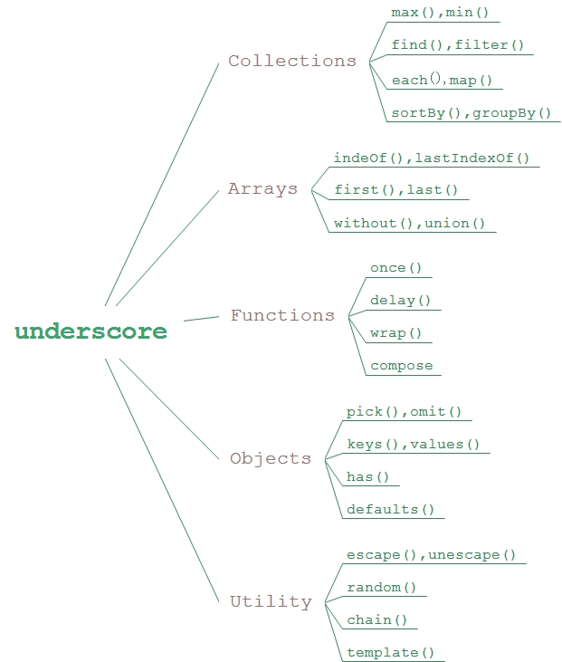

# underscore

依赖库underscore是一个非常简洁、实用的JavaScript库，包含60多个独立的函数，这些函数可以在不扩展原生JavaScript对象的情况下，为代码的开发提供丰富的使用功能。

## 1. underscore的类型模块



## 2. underscore对象封装

underscore没有对原生的JavaScript对象进行扩展，而是调用_()方法进行封装，一旦封装完成，原生的JavaScript对象便成为一个underscore对象。

```javascript
var data = {
    name : 'zhang'
};
var o = _(data);
console.log(o.value().name);
```

## 3. Collection

1. each(list,iterator,[context]) & map(list,iterator,[context])

    都是根据一定的条件遍历集合中的每个元素，each()并无返回，map()会返回一个新的过滤后的集合内容。

    ```javascript
    _.each([1,2,3,4,5,6],function(n){
        if(! (n % 2))console.log(n);
    });//[2,4,6]
    ```

    ```javascript
    var arr = _.map([1,2,3,4,5,6],function(n){
        if( ! (n % 2))return n;
    });
    console.log(arr);//[undefined,2,undefined,4,undefined,6]
    ```

    如果参数list列表是一个JavaScript对象，则迭代器为(value,key,list)

    ```javascript
    var obj = {
        a : '1',
        b : '2',
        c : '3'
    }
    _.each(obj,function(v,k,obj){
        return console.log(k + '->' + v);
    });
    ```

2. find() & filter()