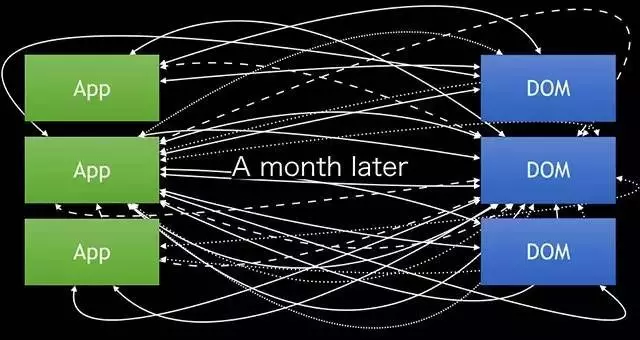
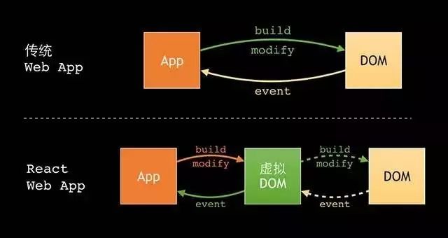

# react

## 概述

React 起源于 Facebook 的内部项目，因为FB对市场上所有 JavaScript MVC 框架，都不满意，就决定自己写一套，用来架设Instagram的网站。做出来以后，发现这套东西很好用，就在2013年5月开源了。

由于React的设计思想极其独特，属于革命性创新，性能出众，代码逻辑却非常简单。所以，越来越多的人开始关注和使用，认为它可能是将来 Web 开发的主流工具。

与其他的MV*框架不一样，它只处理`view`逻辑。

### JSX

JSX是一种语法糖，React提供了一个预编译工具`react-tools`，可以把jsx自动编译为js代码

### 虚拟DOM

作为React最大的亮点。

传统的web app和DOM直接狡猾，由app来控制DOM的构建和渲染、元素属性的读写、事件的注册和销毁等，这样随着项目的发展，极有可能会带来难以解决的混乱。

这时，React的虚拟DOM和单项数据流就能很好的解决这个问题。虚拟DOM则是在DOM的基础上建立了一个抽象层，我们对数据和状态所做的任何改动，都会被自动且高效的同步到虚拟DOM，最后再批量同步到DOM中。

**原理**

React会在内存中维护一个虚拟DOM树，当我们对这个树进行读或写的时候，实际上是对虚拟DOM进行的。当数据变化时，然后React会自动更新虚拟DOM，然后拿新的虚拟DOM和旧的虚拟DOM进行对比，找到有变更的部分，得出一个Patch，然后将这个Patch放到一个队列里，最终批量更新这些Patch到DOM中。

1. 优点

    这样的机制可以保证即便是根节点数据的变化，最终表现在DOM上的修改也只是受这个数据影响的部分，可以保证非常高效的渲染。

2. 缺点

    首次渲染大量DOM时因为多了一层虚拟DOM的计算，会比innerHTML插入方式慢，所以使用时需要确保不要一次性渲染大量DOM。

