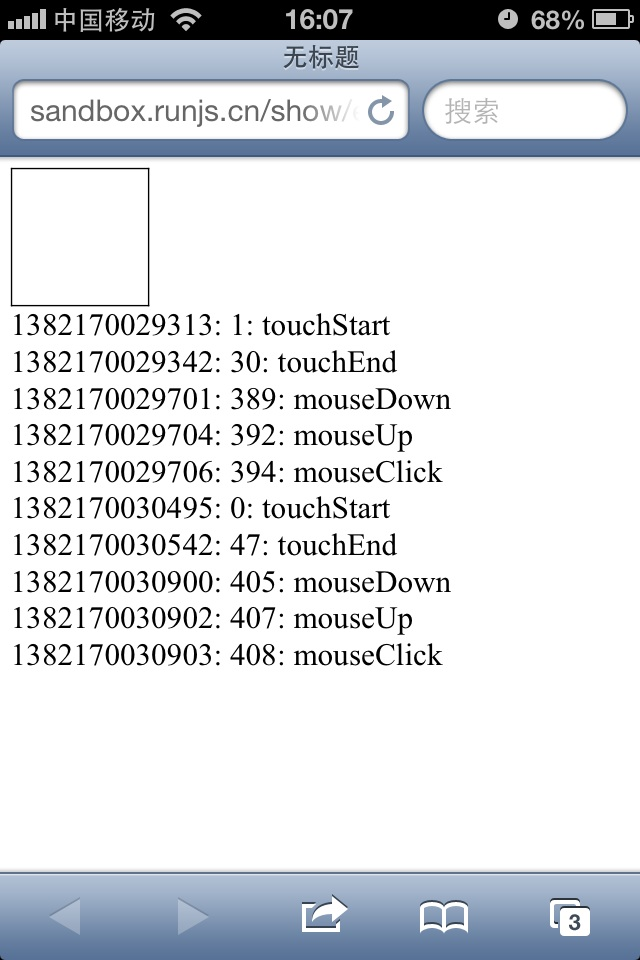

# fastclick

> https://github.com/ftlabs/fastclick/
> http://www.cnblogs.com/yexiaochai/p/3377900.html
> https://developer.mozilla.org/en-US/docs/Web/API/Document/createEvent

消除点击300ms延迟的小型库，优化移动端的交互

优势：没有tap事件的`点透现象`

## 背景知识

### 鼠标事件



### 注释名词

1. synthetic clicks     

    the clicks that were not generated by human but instead was generated using JS or some other automation tool
    即fastclick触发的click（通过touch事件判断的click，然后触发click回调函数）

2. native clicks

    实际点击，来源于用户

### event

**1. event.stopImmadiatePropagation()**

如果某个元素有多个相同类型事件的事件监听函数,则当该类型的事件触发时,多个事件监听函数将按照顺序依次执行.如果某个监听函数执行了 event.stopImmediatePropagation()方法,则除了该事件的冒泡行为被阻止之外(event.stopPropagation方法的作用),该元素绑定的其余相同类型事件的监听函数的执行也将被阻止.

*此方法是FastClick的核心方法*

**2. event.changedTouches**

这个TouchList对象列出了和这个触摸事件对应的Touch对象。

对于touchstart事件, 这个TouchList对象列出在此次事件中新增加的触点。对于 touchmove事件，列出和上一次事件相比较，发生了变化的触点。对于touchend ，列出离开触摸平面的触点（这些触点对应已经不接触触摸平面的手指）。

对于touchenter事件和touchleave事件，列出从上一次事件触发到这一次事件触发的过程中，离开或者进入目标element的触点

**3. document.createEvent(Interface)**

创建一个事件类型对象，只能是存在的事件类型，例如

1. UIEvents
2. MouseEvents
3. HTMLEvents

**4.  EventTarget.dispatchEvent(eventObject)**

在特定的事件中触发一个事件

## 源码解析

```javascript
/*
    @Param layer : 
*/
function FastClick(layer) {
    'use strict';
    var oldOnClick; //存储用户传入的点击回调函数

    this.trackingClick = false; //是否跟踪一个点击

    this.trackingClickStart = 0;

    this.targetElement = null;

    this.touchStartX = 0;

    this.touchStartY = 0;

    this.lastTouchIdentifier = 0;

    this.touchBoundary = 10;//touchmove最大距离，如果小于10则是点击

    this.layer = layer;

    //旧版本的安卓 bind的原生实现
    function bind(method,context) {
        return function() { return method.apply(context,arguments);};
    }
    
    //是否是安卓系统
    var deviceIsAndroid = navigator.userAgent.indexOf('Android') > 0;

    //是否是IOS系统
    var deviceIsIOS = /iP(ad|hone|od)/.test(navigator.userAgent);

    //需要针对IOS4系统
    var deviceIsIOS4 = deviceIsIOS 
                    && (/OS 4_\d(_\d)?/).test(navigator.userAgent);

    //IOS6+？系统
    var deviceIsIOSWithBadTarget = deviceIsIOS
                 && (/OS ([6-9]|\d{2})_\d/).test(navigator.userAgent); 

    //针对安卓系统的，事件的捕获阶段（会比冒泡阶段先执行）
    if(deviceIsAndroid) {
        layer.addEventListener('mouseover', bind(this.onMouse, this), true);
        layer.addEventListener('mousedown', bind(this.onMouse, this), true);
        layer.addEventListener('mouseup', bind(this.onMouse, this), true);
    }

    //利用的捕获阶段，从父元素获取点击事件
    layer.addEventListener('click',bind(this.onClick.this),true);

    //冒泡阶段进行处理，来判断是否触发click
    //感觉这边做法有点低效
    layer.addEventListener('touchstart', bind(this.onTouchStart, this), false);
    layer.addEventListener('touchmove', bind(this.onTouchMove, this), false);
    layer.addEventListener('touchend', bind(this.onTouchEnd, this), false);
    layer.addEventListener('touchcancel', bind(this.onTouchCancel, this), false);
    
    //hack,不支持Event#stopImmediateProgation的情况
    //通过修改layer的事件监听添加和删除方法来实现这个功能
    if(!Event.prototype.stopImmediatePropagation) {
        layer.removeEventListener = function(type, callback,capture){
            var rmv = Node.prototype.removeEventListener;
            if(type === 'click'){ //只针对click事件
                rmv.call(layer,type,callback.hijacked || callback,capture);
            } else {
                rmv.call(layer,type,callback,capture);
            }
        };
        
        layer.addEventListener = function(type,callback,capture){
            var adv = Node.prototype.addEventListener;
            if(type === 'click') { //添加一个
                adv.call(layer,type,callback.hijacked || 
                        (callback.hijacked = function(event) {
                             //如果设置了event.propagationStopped
                             if(!event.propagationStopped){
                                callback(event);
                             }   
                        }),capture);
            }
        };
    }

    //如果元素采用了原始的方式进行绑定，则
    //则将它读取处理出来，采用事件监听的API进行绑定，
    if (typeof layer.onclick === 'function'){
        //只处理原始方式绑定的
        oldOnClick = layer.onclick;
        layer.addEventListener('click',function(event){
            oldOnClick(event);
        },false);
        //清除句柄
        layer.onclick = null;
    }

}

FastClick.prototype.onMouse = function(event) {
    'use strict';

    if(!this.targetElement) {
        return true;
    }
    //自定义的event属性
    if(event.forwardedTouchEvent) {
        return true;
    }
    //自定义的event属性
    if(!event.cancelable) {
        return true;
    }
    
    //如果不需要此次点击，或者取消点击
    if(!this.needsClick(this.targetElement) 
        || this.cancelNextClick) {
        /*  
            取消其他的回调函数
        */
        if(event.stopImmediatePropagation) {
            event.stopImmediatePropagation();
        } else {
            //hack,当浏览器不支持stopImmediatePropagation
            event.propagationStopped = true;
        }

        //取消事件
        event.stopPropagation();
        event.preventDefault();

        return false;
    }

    return true;
}

/*
    根据元素的类型，判断是否需要触发native click
*/
FastClick.prototype.needsClick = function (target) {
    'use strict';
    switch (target.nodeName.toLowerCase()) {
        // Don't send a synthetic click to disabled inputs (issue #62)
        case 'button':
        case 'select':
        case 'textarea':
            if(target.disabled) {
                return true;
            }
            break;
        case 'input':
            // File inputs need real clicks on iOS 6 due to a browser bug (issue #68)
            if ((deviceIsIOS && target.type === 'file') || target.disabled) {
                return true;
            }

            break;
        case 'label':
        case 'video':
            return true;
    }
    
    //class=needsclick的也会触发native click
    return (/\bneedsclick\b/).test(target.className);
}

/*
    分发一个点击事件对象给一个特定的元素
*/
FastClick.prototype.sendClick = function(targetElement,event){
    'use strict';
    var clickEvent,touch;

    /*
        bug修复
        On some Android devices activeElement needs
         to be blurred otherwise the synthetic click
          will have no effect (#24)
    */
    if(document.activeElement && 
        document.activeElment !== targetElement){
        document.activeElement.blur();
    }

    touch = event.changedTouches[0];

    //创建一个点击事件
    clickEvent = document.createEvent('MouseEvents');
    clickEvent.initMouseEvent(
        this.determineEventType(targetElement),
        true,
        true, 
        window, 
        1, 
        touch.screenX, 
        touch.screenY, 
        touch.clientX, 
        touch.clientY, false, false, false, false, 0, null);
    //额外属性，用于跟踪创建的点击事件
    clickEvent.forwardedTouchEvent = true;
    //在该元素上触发点击事件
    targetElement.dispatchEvent(clickEvent);
}

//主要用于排除表单元素select的点击事件，下拉，系统默认
FastClick.prototype.determineEventType = function(targetElement) {
    'use strict';
    //Issue #159: Android Chrome Select Box does not open with a synthetic 
    // click event
    if (deviceIsAndroid && targetElement.tagName.toLowerCase() === 'select') {
        return 'mousedown';
    }

    return 'click';
}

/**
 * @param {EventTarget|Element} targetElement
 */
FastClick.prototype.focus = function (targetElement) {
    'use strict';
    var length;

    // Issue #160: on iOS 7, some input elements (e.g. date datetime) throw a vague TypeError on setSelectionRange. These elements don't have an integer value for the selectionStart and selectionEnd properties, but unfortunately that can't be used for detection because accessing the properties also throws a TypeError. Just check the type instead. Filed as Apple bug #15122724.
    if (deviceIsIOS && targetElement.setSelectionRange && targetElement.type.indexOf('date') !== 0 && targetElement.type !== 'time') {
        length = targetElement.value.length;
        targetElement.setSelectionRange(length, length);
    } else {
        targetElement.focus();
    }
};

//检测元素是否在一个可滚动层中
FastClick.prototype.updateScrollParent = function(targetElement){
    'use strict';
    var scrollParent,parentElement;
    //第一次执行为undefined
    scrollParent = targetElement.fastClickScrollParent;

    if (!scrollParent || !scrollParent.contains(targetElement)) {
        parentElement = targetElement;
        do {
            if (parentElement.scrollHeight > parentElement.offsetHeight) {
                scrollParent = parentElement;
                targetElement.fastClickScrollParent = parentElement;
                break;
            }

            parentElement = parentElement.parentElement;
        } while (parentElement);
    }

    // Always update the scroll top tracker if possible.
    if (scrollParent) {
        scrollParent.fastClickLastScrollTop = scrollParent.scrollTop;
    }
}

//处理点击文本的情况,bug修复
FastClick.prototype.getTargetElementFromEventTarget = function(eventTarget){
    'use strict';
    // On some older browsers (notably Safari on iOS 4.1
    // - see issue #56) the event target may be a text node.
    if (eventTarget.nodeType === Node.TEXT_NODE) {
        return eventTarget.parentNode;
    }
    return eventTarget;
}

//在touch start，记录位置和偏移量
FastClick.prototype.onTouchStart = function (event) {
    'use strict';
    var targetElement,touch,selection;

    //忽略multiple touches（多个手指触摸的情况）
    // Ignore multiple touches, otherwise pinch-to-zoom is
    // prevented if both fingers are on the FastClick element (issue #111).
    if (event.targetTouches.length > 1) {
        return true;
    }
    // 处理事件目标为TEXT_NODE的bug
    targetElement = this.getTargetElementFromEventTarget(event.target);
    
    //获取touch事件对象
    touch = event.targetTouches[0];

    //IOS bug修复
    if(deviceIsIOS) {
        // Only trusted events will deselect text on iOS (issue #49)
        selection = window.getSelection();
        if (selection.rangeCount && !selection.isCollapsed) {
            return true;
        }

        if (!deviceIsIOS4) {

            // Weird things happen on iOS when an alert or confirm dialog is opened from a click event callback (issue #23):
            // when the user next taps anywhere else on the page, new touchstart and touchend events are dispatched
            // with the same identifier as the touch event that previously triggered the click that triggered the alert.
            // Sadly, there is an issue on iOS 4 that causes some normal touch events to have the same identifier as an
            // immediately preceeding touch event (issue #52), so this fix is unavailable on that platform.
            if (touch.identifier === this.lastTouchIdentifier) {
                event.preventDefault();
                return false;
            }

            this.lastTouchIdentifier = touch.identifier;

            // If the target element is a child of a scrollable layer (using -webkit-overflow-scrolling: touch) and:
            // 1) the user does a fling scroll on the scrollable layer
            // 2) the user stops the fling scroll with another tap
            // then the event.target of the last 'touchend' event will be the element that was under the user's finger
            // when the fling scroll was started, causing FastClick to send a click event to that layer - unless a check
            // is made to ensure that a parent layer was not scrolled before sending a synthetic click (issue #42).
            this.updateScrollParent(targetElement);
        }
    }

    this.trackingClick = true; //标志追踪此次事件
    this.trackingClickStart = event.timeStamp; //记录时间
    this.targetElement = targetElement; //目标对象

    this.touchStartX = touch.pageX; //x坐标
    this.touchStartY = touch.pageY;//y坐标

    // Prevent phantom clicks on fast double-tap (issue #36)
    if ((event.timeStamp - this.lastClickTime) < 200) {
        event.preventDefault();
    }

    return true;
};

//判断触点是否偏移出判定点击的条件的距离,true表示非点击
FastClick.prototype.touchHasMoved = function (event) {
    'use strict';
    var touch = event.changedTouches[0], //获取touch对象
        boundary =this.touchBoundary; //10px

    if (Math.abs(touch.pageX - this.touchStartX) > boundary ||
        Math.abs(touch.pageY - this.touchStartY) > boundary){
            return true;
    }
    return false;
}

//touch move，判断是否需要触发点击事件
FastClick.prototype.onTouchMove = function (event) {
    'use strict';
    //如果已经判断此次不是点击事件，直接返回
    if(!this.trackingClick){
        return true;
    }

    //如果不是点击（比例说是滑动）,取消跟踪点击
    if (this.targetElement !== 
          this.getTargetElementFromEventTarget(event.target) || 
          this.touchHasMoved(event)) {
        this.trackingClick = false;
        this.targetElement = null;
    }

    return true;
}

FastClick.prototype.onTouchEnd = function (event) {
    'use strict';
    var forElement,
        trackingClickStart,
        targetTagName,
        scrollParent,
        touch,
        targetElement = this.targetElement;
    
    //如果不需要跟踪点击了
    if(!this.trackingClick){
        return true;
    }

    // Prevent phantom clicks on fast double-tap (issue #36)
    if ((event.timeStamp - this.lastClickTime) < 200) {
        this.cancelNextClick = true;
        return true;
    }

    // Reset to prevent wrong click cancel on input (issue #156).
    this.cancelNextClick = false;

    //更新最后点击的时间
    this.lastClickTime = event.timeStamp;

    trackingClickStart = this.trackingClickStart;

    //停止跟踪点击
    this.trackingClick = false;

    //置0
    this.trackingClickStart = 0;

    // On some iOS devices, the targetElement supplied with the event is invalid if the layer
    // is performing a transition or scroll, and has to be re-detected manually. Note that
    // for this to function correctly, it must be called *after* the event target is checked!
    // See issue #57; also filed as rdar://13048589 .
    if (deviceIsIOSWithBadTarget) {
        touch = event.changedTouches[0];

        // In certain cases arguments of elementFromPoint can be negative, so prevent setting targetElement to null
        targetElement = document.elementFromPoint(touch.pageX - window.pageXOffset, touch.pageY - window.pageYOffset) || targetElement;
        targetElement.fastClickScrollParent = this.targetElement.fastClickScrollParent;
    }


};

//touch cancel的情况下，停止追踪点击
FastClick.prototype.onTouchCancel = function () {
    'use strict';
    this.trackingClick = false;
    this.targetElement = null;
};

//判断是否允许一个真实的点击
FastClick.prototype.onClick = function (event) {
    'use strict';
    var permitted;

    // It's possible for another FastClick-like library delivered with third-party code to fire a click event before FastClick does (issue #44). In that case, set the click-tracking flag back to false and return early. This will cause onTouchEnd to return early.
    if (this.trackingClick) {
        this.targetElement = null;
        this.trackingClick = false;
        return true;
    }

    // Very odd behaviour on iOS (issue #18): if a submit element is present inside a form and the user hits enter in the iOS simulator or clicks the Go button on the pop-up OS keyboard the a kind of 'fake' click event will be triggered with the submit-type input element as the target.
    if (event.target.type === 'submit' && event.detail === 0) {
        return true;
    }
    
    //判断函数
    permitted = this.onMouse(event);

    // Only unset targetElement if the click is not permitted. This will ensure that the check for !targetElement in onMouse fails and the browser's click doesn't go through.
    if (!permitted) {
        this.targetElement = null;
    }

    // If clicks are permitted, return true for the action to go through.
    return permitted;
};


```


