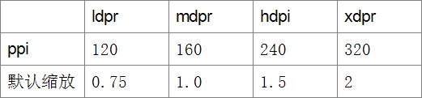
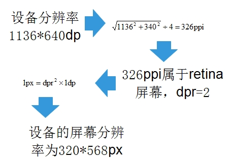
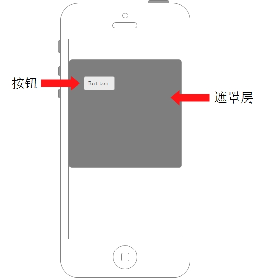

# 移动Web基础

>来源： http://www.imooc.com/video/9579

## 一、像素基础

### 1-1 概念

1. px: css pixels，逻辑像素，浏览器使用的抽象单位
2. dp: device independent pixels，设备无关像素
3. dpr: device pixel ratio，设备像素缩放比
4. dpi: 打印机每英寸可以喷的墨汁点
5. ppi: 屏幕每英寸的像素数量，即单位英寸内的像素密度

### 1-2 联系

1. ppi、dpr

    

    *dpr>=2的都属于retina屏幕，retina屏幕会引起很多的移动端样式的问题*

2.  dpr、pixel、dp

    

    公式换算：

    

### 1-3 整体联系



## 二、viewport

### 2-1 概念

移动端的页面会经过两层的处理

1. 页面渲染在一个viewport上，先保证排版正确。
2. 对页面进行缩放

### 2-2 viewport分类

1. layout viewport：底层，无法控制
2. visual viewport：上层，窗口缩放scale

### 2-3 实践方案

1. 方案1：根据设备的实际宽度来设计（常用）
2. 方案2：1px = 1dp，缩放0.5，这样子1px边框和高清图片都不需要处理

### 2-4 最佳实践

```html
<meta name="viewport" content="width=device-width,initial-scale=1
                                user-scalable=no">
```

## 三、 移动web布局

### 3-1 Flexbox弹性布局

| flex | flex-box[兼容性较好] |
| :--- | :------- |
| diplay:-webkit-flex | display:-webkit-flex-box|
| -webkit-flex:1 | -webkit-flex-box-flex:1|
| justify-content:center | box-pack:center |
|align-items:center| box-align:center|

### 3-2 响应式布局

**响应式设计的核心**

```css
@media screen and (max-width:1024px){
    /**/
}
```

1. 媒体类型：screen,print,handheld,all
2. 常用查询属性

    * width/height
    * devive-width/device-height
    * orientation(landscape/portrait)

**响应式设计的点**

1. 百分比布局

    如果仅仅使用媒体查询来适应不同的固定宽度设计，只会从一组css到另一组css的切换，两种之间没有任何平滑渐变，当没有命中媒体查询时，表现就会变得不可控制。

2.  弹性图片

    ```css
    img{
        max-width:100%;
    }
    ```

3. 重新布局，显示与隐藏

    1. 同比例缩减元素尺寸
    2. 调整页面结构布局
    3. 隐藏冗余的元素

    *经常需要切换位置的元素可以使用绝对定位，减少重绘，提高渲染性能*

4.  响应式设计的优缺

    根据响应式设计的理念，一个页面需要包含所有不同的设备的屏幕的样式和图片，当一个移动设备访问一个响应式的页面时，就会下载其他不同设备的冗余样式。

## 四、特殊样式处理

### 4-1 高清图片

在移动web页面上渲染图片，为了避免图片产生模糊，图片的宽高应该用物理像素单位渲染，即是`100*100px`的图片就应该使用`100*100dp`。

```css
width : (w_value/dpr)px;
height : (h_value/dpr)px;
```

### 4-2 1像素边框

这个问题同样是retina屏幕导致的，根本原因是`1px的边框使用2dp的渲染`。

### 4-3 相对单位rem

* em在多次嵌套下会变的很难计算。
* rem能作为全局统一设置的度量。

**不适用rem的情况：font-size**

一般来讲font-size是不应该使用rem等相对单位的，因为字体的大小是趋向于阅读的实用性，并不适合参与排版布局。

### 4-4 多行文本溢出

1. 单行文本溢出

    ```css
    .inaline{
        overflow : hidden;
        white-space : nowrap;
        text-overflow : ellipsis;
    }
    ```

2. 多行文本溢出

    ```css
    .intwoline{
        display : -webkit-box !important;
        overflow : hidden;

        text-overflow : ellipsis;
        word-break : break-all;

        -webkit-box-orient : vertical;
        -webkit-line-clamp : 2; /*行数*/
    }
    ```

## 五、交互优化

### 5-1 Tap事件

1. click事件的300ms延迟触发（历史原因）

2. Tap事件的原理

    

    在`touchstart`时记录事件，手指位置，在`touchend`时进行比较，如果手指位置为同一个位置（或允许移动一个非常小的位移且事件间隔小于200ms），且过程中未曾触发过`touchmove`，即可认为触发了手持设备上的`click`，一般称为`tap事件`

3. 点透的bug

    

    点击button正上方的遮罩层时，遮罩层消失后，也会触发button的click事件，原因也是click事件的延迟300ms触发。这种现象叫做`点透bug`。

### 5-2 Touch事件基础

**基础知识**

*触摸才是移动设备交互的核心事件*

1. 基础事件有

    * touchstart
    * touchmove
    * touchend
    * touchcancel

2. touch event的常用属性

    * clientX/clientY
    * identifier
    * pageX/pageY
    * target

3. touch事件包含的专有的触摸属性

    * touches：跟踪触摸操作的touch对象数组
    * targetTouches：特定事件目标的touch对象数组
    * changeTouches：上次触摸改变的touch对象数组

**bug**

在Android只会触发一次touchstart，一次touchmove，不会触发touchend。

解决方法：在touchmove中加入event.prevetDefault()，但event.preventDefault()会导致默认的行为不发生（如页面滚动）。

**常见交互**

1. 弹性滚动
2. 下拉刷新
3. 上拉加载


## 五、资源

> http://www.cnblogs.com/PeunZhang/p/3407453.html