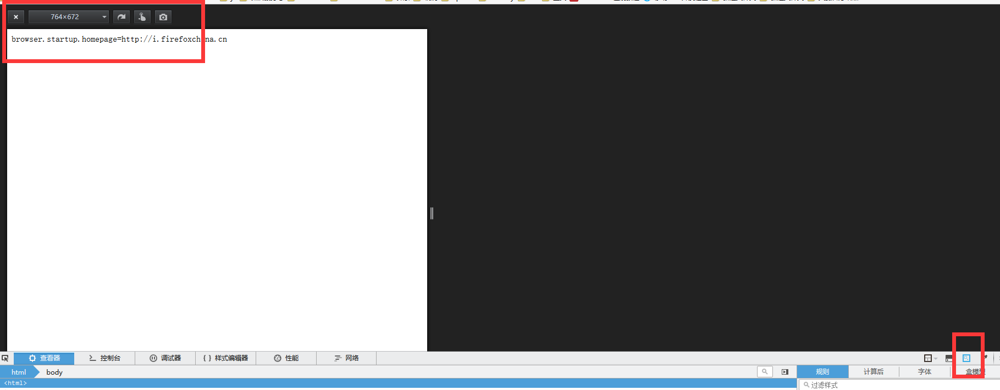
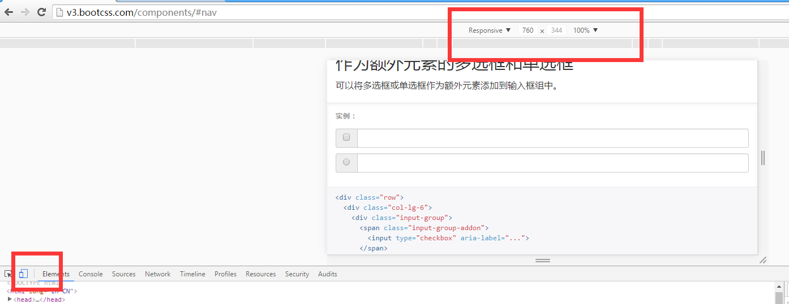

# 移动端项目构建-1

## 前期准备

### 开发工具的选择

1. firefox

    

2. chrome

    

### 调试

* [通过 Mac 远程调试 iPhone/iPad 上的网页](http://blog.wpjam.com/m/ios-safari-remote-debugging/)
* [Android上的远程调试](http://www.seejs.com/archives/296)
* Android 设备 Chrome 远程调试
* [uc浏览器开发者调试](http://plus.uc.cn/document/webapp/doc5.html)