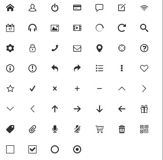

# 移动端项目构建-7

> 来源：http://www.w3cplus.com/mobile/mobile-terminal-refactoring-icons.html

## 图标

### 1. 雪碧图

把所有图标都放在一个大图中。考虑到retina屏，我们的图标应该设计为实际大小的2倍，然后设置background-size为实际大小，图中的每个icon大小为24px，实际以12px使用。

以下面的msg icon为例


```css
%icon-msg{
    display:inline-block;
    vertical-align:-2px;
    background:url(../img/icon-msg.png) no-repeat;
    background-size:26px 26px;
}
.icon-info{
    @extend %icon-msg;
    background-position:-14px 0;
    width:12px;
    height:12px;
}
.icon-alert{
    @extend %icon-msg;
    background-position:0 -14px;
    width:12px;
    height:12px;
}
```

### 2. base64

图标较小时可以使用，注意其缺点就是不能缓存，且是原来二进制图标数据体积的两倍。

### 3. 直接绘制

可以借助css3来直接绘制一些简单的图标，如


active状态下，通过after生成一个长方形，然后设置其border-bottom和border-left，通过rotate旋转45即可，那个勾就是两条边框。

```css
$primary:                        #0078e7 !default;

.icon-checkbox{
    width: 16px;
    height: 16px;
    display: inline-block;
    vertical-align: middle;
    border: 1px solid #ccc;
    background-color: #fff;
    line-height: 1;
    text-align: center;
    margin-right: 5px;
    &.active{
        border-color: $primary;
        &::after{
            content: "";
            width: 8px;
            height: 3px;
            border-bottom: 2px solid $primary;
            border-left: 2px solid $primary;
            display: block;
            margin-top: 3px;
            margin-left: 2px;
            @include rotate(-45deg);
        }
    }
}
```

### 4. 字体图标



使用的步骤

1. 在scss文件中导入sandal的base文件及font-face文件

    ```css
    @import  "d:/sandal/base";
    @import "d:/sandal/ext/font-face/font-face";
    ```

2. 根据自己需要覆盖font-face文件夹中的变量，注意变量应该在导入font-face之前

    ```css
    $fontFamliy: icomoon !default;
    $fontFilePath: "../fonts/icomoon" !default;
    $fontClassPrefix: if !default;
    $fontClassAllSwitch: true !default;
    $fontClassOutput: () !default;
    $fontPseudo: true !default;// 是否采用伪元素（before）生成图标
    ```

3. 把font-face目录下的fonts文件夹拷贝进解析后的css文件夹同目录下

    ```html
    <i class="icon-font-wifi"></i>
    ```

**关于使用字体图标**

1. 把对应的字符编码直接写在html中，然后设置字体即可；
2. html为空白标签，通过before或after的content来设置其内容，再设置字体

