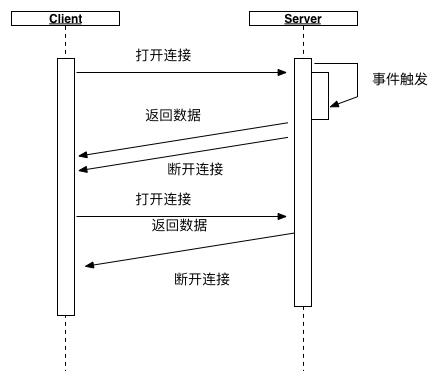
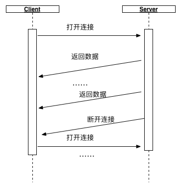
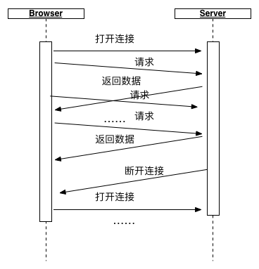

# 浏览器与服务器的消息通信

> 来源：http://blog.brucefeng.info/post/brower-server-msg

主要讨论的是一个浏览器与服务器端`实时通信`的问题。

## 一、Ajax轮询

采用常规的Ajax轮询，每10s或30s轮询一次。

**优点**

实现简单

**缺点**

并不是真正的实时通信，不顾及应用的状态的改变而盲目检测更新，导致服务器资源的浪费。此外，还会加重网络负载，拖累服务器。

## 二、Comet

Comet是一种用于Web的推送技术，能使服务器实时地更新的信息传送到客户端，而无须客户端发出请求。目前有两种实现方式。

### 实现1：长轮询

长轮询（long polling）是在打开一条连接以后保持，等待服务器推送来数据再关闭，有两者实现方式。

**1. HTTP长轮询**

利用JSONP方式，把script标签附加到页面上，让脚本执行，服务器会挂起连接直到有事件发生，接着把脚本内容发送回浏览器，然后重新打开另一个script标签来获取下一个事件，从而实现长轮询的模型。

**2. XHR长轮询**

这是比较常用的方式。客户端打开一个到服务器端的Ajax请求，然后等待响应，服务器端需要一些特定的功能来允许请求被挂起，只要一有事件发生，服务器端就会在挂起的请求中送回响应并关闭该请求。客户端在处理完服务器返回的信息后，再次发出请求，重新建立连接，如此循环。

**优点**

客户端很容易实现良好的错误处理系统和超时管理，实现成为与Ajax轮询的方式类似。

**缺点**

需要服务器端有特殊的功能来临时挂起连接。
当客户端发起的连接较多时，服务器端会长期保持多个连接，具有一定的风险。

### 实现2：iframe

通过在HTML页面里嵌入一个隐藏帧，然后将这个隐藏帧的src属性设为对一个长连接的请求，服务器端就能源源不断地往客户端输入数据。

**优点**

这种方式每次数据传送不会关闭连接（连接只会在通信出现错误时，或是连接重建时关闭）。

**缺点**

IE、Morzilla、Firefox下端的进度栏都会显示加载没有完成，而且IE上方的图标会不停的转动，表示加载正在进行。不过在IE下，有解决的办法。

### 实现框架

1. CometD

2. Atmosphere

3. Pushlet

### 实现主要点

1. 不要在同一个客户端同时使用超过两个的HTTP长连接。

    HTTP1.1规范中规定，客户端不应该与服务器端建立超过两个的HTTP连接，新的连接会被阻塞，在IE浏览器中严格遵守了这种规定。

2. 服务端的性能和可扩展性。

    一般Web服务器会为每个连接创建一个线程。如果在大型商业应用中使用Comet，服务器端需要维护大量并发的长连接。在这种应用背景下，服务器需要考虑负载均衡和集群技术，或是在服务器端为长连接做一些改进。

3. 在客户和服务器之间保持"心跳"信息。

    在浏览器与服务器之间维持一个长连接会为通信带来一些不确定性：因为数据传输是随机的，客户端不知道何时服务器才有数据传送。服务器端需要确保当客户端不再工作时，释放为这个客户端分配的资源，防止内存泄漏。因此需要一种机制使双方知道双方都在正常运行。
    服务器端在阻塞读时会设置一个时限，超时后阻塞读调用会返回，同时发给客户端没有新数据到达的心跳信息。此时如果客户端已经关闭，服务器往通道写数据会出现异常，服务器端就会及时释放为这个客户端分配的资源。
    如果客户端使用的是基于 AJAX 的长轮询方式；服务器端返回数据、关闭连接后，经过某个时限没有收到客户端的再次请求，会认为客户端不能正常工作，会释放为这个客户端分配、维护的资源。
    当服务器处理信息出现异常情况，需要发送错误信息通知客户端，同时释放资源、关闭连接。

## 三、WebSocket

WebSocket是HTML5开始提供的一种在单个TCP连接上进行全双工通讯的协议。WebSocket通讯协议于2011年被IETF定为标准RFC 6455，WebSocketAPI被W3C定为标准。在WebSocket API中，浏览器和服务器只需要做一个握手的动作，然后，浏览器和服务器之间就形成了一条快速通道。两者之间就直接可以数据互相传送。

### 浏览器版本支持

| 浏览器 | 版本支持 |
| :----- | :------- |
| chrome | 4+ |
| firefox | 4+ |
| IE | 10+ |
| opera | 10+ |
| safari | 5+ |
