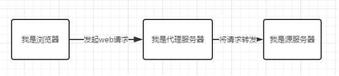
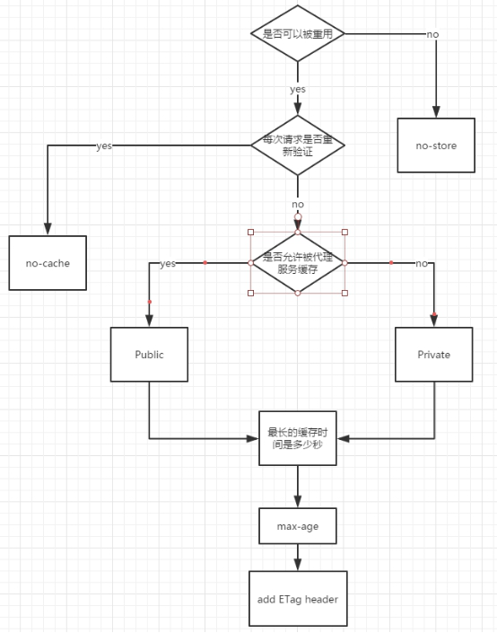
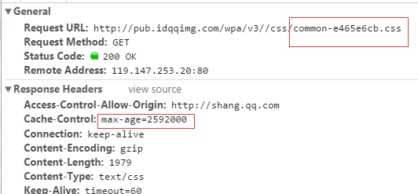
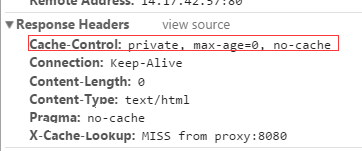
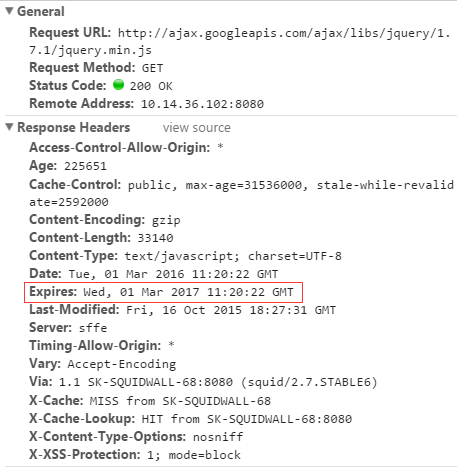
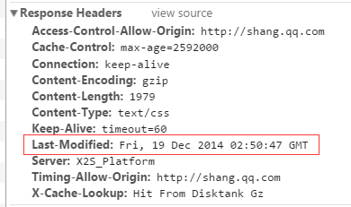
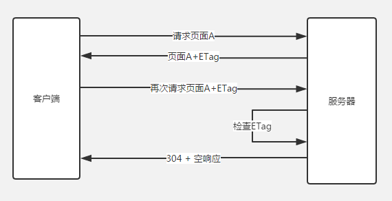
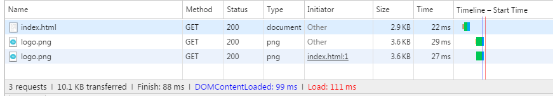
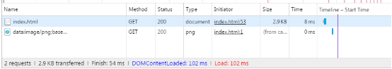

# Web Cache

> 来源：http://www.alloyteam.com/2016/03/discussion-on-web-caching/  

> 在前端开发中，性能一直都是被大家所重视的一点，然而判断一个网站的性能最直观的就是看网页打开的速度。其中提高网页反应速度的一个方式就是使用缓存。一个优秀的缓存策略可以缩短网页请求资源的距离，减少延迟，并且由于缓存文件可以重复利用，还可以减少带宽，降低网络负荷。

## 缓存分类

Web缓存有：

1. 数据库缓存

2. 代理服务器缓存（共享缓存）

3. CDN缓存

4. 浏览器缓存

## 浏览器缓存

页面的缓存状态是由`header`决定的，header的参数有四种。

### 一、Cache-Control

1. max-age

    单位为s，指定设置缓存最大有效时间，定义的是时间长短。当浏览器向服务器发送请求后，在max-age这段时间里浏览器就不会再向服务器请求。

    

2. s-maxage

    单位为s，同max-age，只用于共享缓存（CDN缓存），会覆盖max-age和Expires header

3. public

    指定响应会被缓存，并且在多用户间共享。默认是public

4. private

    只作为私有的缓存，不能在用户间共享。如果是要求HTTP认证，响应会自动设置为private

5. no-cache

    指定不缓存响应，表明资源不进行缓存

    

    但是设置了no-cache之后并不代表浏览器不缓存，而是在缓存前要向服务器确认资源是否被更改。因此如果要防止缓存，除了设置no-cache之外，还要加上private，将过期时间设置为过去的时间

6. no-store

    绝对禁止缓存

7. must-revalidate

### 二、 Expires

用来指定缓存过期事件，是服务器端的具体时间点。也就是说

`Expires = max-age + 请求事件`

需要和`Last-modified`结合使用。Expires是Web服务器响应消息头字段，在响应http请求时告诉浏览器在过期时间前浏览器可以直接从浏览器缓存数据，而无需再次请求。

### 三、Last-modified

服务器端文件的最后修改时间，需要和`Cache-control`共同使用，是检查服务器端资源是否更新的一种方式。当浏览器再次请求时，会向服务器传送`If-Modified-Since`报头，询问`Last-Modified`时间点之后资源是否被修改过。如果没有修改，则返回码为`304`，使用缓存。如果修改过，则再次去服务器请求资源，返回码和首次请求相同为`200`，资源为服务器最新资源。

### 四、ETag

ETag:是服务器端根据实体内容生成一段hash字符串，标识资源的状态，浏览器会将这串字符串传回服务器，验证资源是否已经修改。

使用ETag可以解决Last-modified存在的一些问题

1. 某些服务器不能精确得到资源的最后修改时间；

2. 如果资源修改非常频繁，且在秒以下的时间内进行修改；

3. 一些资源的最后修改事件改变了，但是内容没有改变；

在这些情况下，Last-Modified无法正确判定资源是否修改，而ETag则不会。

### 五、HTML5的缓存方式

1. LocalStorage

    * 是一种本地存储的公共资源，域名下很多应用共享这份资源会有风险

    * 是以页面域名划分的，如果有多个等价域名之间的LocalStorage不互通，则造成缓存多份浪费

    * 在PC兼容性不好，而且当网络速度快，协商缓存响应快时，使用LocalStorage比不上304。并且不能缓存css文件。

    * 在移动端，由于网速慢，使用LocalStorage要快于304

    

    

2. SessionStorage

    只存储到特定的会话中，不属于持久化的存储，所以关闭浏览器就会清除数据。

### 六、总结请求缓存的流程

