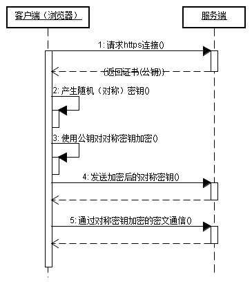

# HTTP协议

## HTTP基本知识

### 概念

HTTP(Hyper Text Transfer Protocol)，即超文本传输协议，目前网页传输的通用协议。

### 特点

1. 支持客户/服务器模式

2. 简单快速

    客户向服务器请求服务时，只需传送请求方法和路径

3. 灵活

    HTTP允许传输任意类型的数据对象，传输的类型有`Content-Type`加以标记

4. 无连接

    无连接的含义是限制每次连接只处理一个请求，服务器处理完客户端的请求，并且收到客户端的应答后，即断开连接。采用这种方式可以节省传输时间。

5. 无状态

    HTTP协议是无状态的。无状态是指协议对于事务处理没有记忆能力，缺少状态意味着后续处理需要前面的信息，则它必须重传，这样可能导致每次连接传送的数据量增大。另一方面，在服务器不需要先前信息的时候，它的应答会较快。

### 详解

#### 组成

1. message-header

    http header消息通常分为4个部分

    * general header
    * request header
    * response header
    * entity header

    由于之间的界限不是很明确，大致分为`Request`和`Response`两个部分

2. message-body

#### URL

URL是一种特殊类型的URI，包含了用于查找某个资源足够的信息，它的格式为

    http://host[":"port][abs_path]

#### Request

http请求由3个部分组成

1. 请求行

    请求行的格式：

    `Method Request-URI HTTP-Version CRLF（换行或回车）`

    * Method（请求方法）

        | 请求方法 | 说明 |
        |:----------| :---- |
        | GET | 请求获取Request-URI所标识的资源 |
        | POST | 在Request-URI所标识的资源后附加新的数据 |
        | HEAD | 请求获取由Request-URI所标识的资源的响应消息报头 |
        | PUT | 请求服务器存储一个资源，并用Request-URI作为标识 |
        | DELETE | 请求服务器删除Request-URI所标识的资源 |
        | TRACE | 请求服务器回送收到的请求信息，主要用于测试或诊断 |
        | CONNECT | 保留 |
        | OPTIONS | 请求查询服务器的性能，或者查询与资源相关的选项和需求 |

    * Request-URI（统一资源标识符）

    * HTTP-Version

        目前有HTTP1.0/HTTP1.1

2. 消息报头（在HTTP Header详述）

3. 请求正文

#### Response

http响应也是3个部分组成：

1. 状态行

    格式

    `HTTP-Version Status-Code Reason-Phrase CRLF`

    * HTTP-Version

    * Status-Code（状态代码）

        | 响应类别 | 说明 |
        | :------- | :--- |
        | 1xx | 指示信息，表示请求已接收，继续处理 |
        | 2xx | 成功，表示请求已被成功接收、理解、接受 |
        | 3xx | 重定向，要完成请求必须更进一步的操作 |
        | 4xx | 客户端错误，请求有语法错误或请求无法实现 |
        | 5xx | 服务器端错误，服务器未能实现合法的请求 |

        常见的状态码

        | 状态码 | 说明 |
        | :----- | :--- |
        | 200 OK | 客户端请求成功 |
        | 304 OK | 从缓存中读取数据 |
        | 401 Unauthorized | 请求未经授权 |
        | 403 Forbidden | 服务器收到请求，但是拒绝服务 |
        | 404 Not Found | 请求资源不存在 |
        | 500 Internal Server Error | 服务器发送不可预期的错误 |
        | 503 Server Unavaliable | 服务器当前不能处理客户端的请求 |

    * Reason-Phrase（状态代码的文本描述）

2. 消息报头（在HTTP Header详述）

3. 响应正文

## HTTP Header

### Request部分

| header | 说明 | 示例 |
| :----- | :--- | :--- |
| Accept | 指定客户端能够接收的内容类型 | Accept:text/plain,text/html |
| Accept-Charset | 浏览器可以接收的字符编码集 | Accept-Charset:iso-8889-5 |
| Accept-Encoding | 指定浏览器可以支持的web服务器返回的内容压缩编码类型 | Accept-Encoding: compress,gzip |
| Accept-Language | 浏览器可接受的语言 | Accept-Language:en,zh |
| Accept-Ranges | 可以请求网页实体的一个或多个子范围字段 | Accept-Ranges:bytes|
| Authrization | HTTP授权的授权证书 | Authorization:Basic jpvcGVuIHNlc2FtZQ==|
| Cache-Control | 指定请求和响应遵循的缓存机制 | Cache-Control:no-cache |
| Connection | 表示是否需要持久连接（HTTP1.1默认）| Connection:close |
| Cookie | 发送请求时，会将请求域名下的所有Cookie值一起发送给服务器 | Cookie:$Version=1;Skin=new;
| Content-Length | 请求内容长度 | Content-Length:348 |
| Content-Type | 请求的与实体对应的MIME信息 | Content-Type:application/x-www-form-urlencoded |
| Date | 请求发送的时间 | Date:Tue,15,Nov 2015 08:12:31 GMT |
| Expect | 请求的特定的服务器行为 | Expect:100-Continue |
| From | 发出请求的用户的Email | From:user@email.com |
| Host | 指定请求的服务器域名和端口号 | Host:www.example.com |
| If-Match | 只有请求内容与实体相匹配才有效 | If-Match: "737060cd8c284d8af7ad3082f209582d" |
| If-Modified-Since | 如果请求的部分在指定时间之后被修改则请求成，未被修改则返回304 | If-Modified-Since: Sat,29 Oct 2010 19:43:32 GMT |
| If-None-Match | 如果内容未改变返回304，参数为服务器之前发送的Etag，与服务器回应的Etag比较判断是否改变 | If-Node-Match: "737060cd8c284d8af7ad3082f209582d" |
| If-Range | 如果实体未改变，服务器发送客户端丢失的部分，否则发送整个实体，参数也为Etag | If-Range: "737060cd8c284d8af7ad3082f209582d" |
| If-Unmodified-Since | 只在实体在指定时间之后未被修改才请求成功 | If-Unmodified-Since: Sat, 29 Oct 2010 19:43:31 GMT |
| Max-Forwards | 限制信息通过代理和网关传送的时间 | Max-Forwards:10 |
| Pragma | 用来包含实现特定的指令 | Pragma:no-cache |
| Proxy-Authorization | 连接到代理的授权证书 | Proxy-Authorization:Basic jpvcGVuIHNlc2FtZQ== |
| Range | 只请求实体的一部分，指定范围 | Range:bytes=500-999 |
| Referer | 先前网页的地址，当前请求网页紧随其后 | Referer:www.example.com/home |
| TE | 客户端愿意接受的传输编码，并通知服务器接收尾加头信息 | TE:trailers,deflate;q=0.5 |
| Upgrade | 向服务器指定某种传输协议以便服务器进行转换 | Upgrade: HTTP/2.0, SHTTP/1.3, IRC/6.9, RTA/x11 |
| User-Agent | User-Agent的内容包含发出请求的用户信息 | User-Agent: Mozilla/5.0 (Linux; X11) |
| Via | 通知中间网关或代理服务器地址，通信协议 | Via: 1.0 fred, 1.1 nowhere.com (Apache/1.1) |
| Warning | 关于消息实体的警告信息 | Warn：Warn: 199 Miscellaneous warning |

### Response部分

| header | 说明 | 示例 |
| :----- | :--- | :--- |
| Accept-Ranges | 表明服务器是否支持指定范围请求及哪种类型的分段请求 | Accept-Ranges:bytes |
| Age | 从原始服务器到代理缓存形成的估算时间（以秒计）| Age:12 |
| Allow | 对某网络资源的有效请求行为，不允许返回405 | Allow:GET,HEAD |
| Cache-Control | 告诉所有缓存机制是否可以缓存及哪种类型 | Cache-Control:no-cache |
| Content-Encoding | Web服务器支持的返回内容压缩编码类型 | Content-Encoding-gzip |
| Content-Language | 响应体的语言 | Content-Language:en,zh |
| Content-Location | 请求资源可替代的备用的另一地址 | Content-Location:/index.htm |
| Content-MD5 | 返回资源的MD5校验值 | Content-MD5:Q2hlY2sgSW50ZWdyaXR5IQ== |
| Content-Type | 返回内容的MIME类型 | Content-Type:text/html;charset=utf-8 |
| Date | 原始服务器消息发出的时间 | Date:Tue,15 Nov 2010 08:12:31 GMT |
| ETag | 请求变量的实体标签的当前值 | ETag:"737060cd8c284d8af7ad3082f209582d" |
| Expires | 响应过期的日期和时间 | Expires:Thu, 01 Dec 2010 16:00:00 GMT |
| Last-Modified | 请求资源的最后修改时间 | Last-Modified: Tue, 15 Nov 2010 12:45:26 GMT |
| location | 用来重定向接收方到非请求URL的位置来完成请求或标识新的资源 | location: http://example.com |
| Pragma | 包括实现特定的指令，它可应用到响应链上的任何接收方 | Pragma:no-cache |
| Proxy-Authenticae | 它指出认证方案和可应用到代理的该URL上的参数 | Proxy-Authenticate:Basic |
| refresh | 应用于重定向或一个新的资源被创造，在5秒之后重定向 | Refresh:5;url=http://example.com |
| Retry-After | 如果实体暂时不可取，通知客户端在指定时间之后再次尝试 | Retry-After:120 |
| Server | Web服务器软件名称 | Server: Apache/1.3.27 (Unix) (Red-Hat/Linux) |
| Set-Cookie | 设置Http Cookie | Set-Cookie: UserID=JohnDoe; Max-Age=3600; Version=1 |
| Trailer | 指出头域在分块传输编码的尾部存在 | Trailer:Max-Forwards |
| Transfer-Encoding | 文件传输编码 | Transfer-Encoding:chunked |
| Vary | 告诉下游代理是使用缓存响应还是原始服务器请求 | Vary:* |
| Via | 告知代理客户端响应是通过哪里发送的 | Via: 1.0 fred, 1.1 nowhere.com (Apache/1.1) |
| Warning | 警告实体可能存在的问题 | Warning: 199 Miscellaneous warning
| WWW-Authenticate | 表明客户端请求实体应该使用的授权方案 | WWW-Authenticate: Basic |

## 页面中的HTTP

*来源于《JavaScript权威指南》第18章*

### JavaScript操纵HTTP的方法

1. 用脚本设置window对象的location属性

2. 调用表单对象的submit()方法

3. Ajax技术的实现

### Ajax

#### 概念

描述了一种主要使用脚本操作HTTP的Web应用架构。

#### 特点

使用脚本操纵HTTP和Web服务器进行数据交换，不会导致页面重载。

#### Comet

Comet是和使用脚本操纵HTTP的Web应用架构相关的术语。在Comet中，Web服务器发起通信并异步发送消息到客户端。如果客户端要响应服务器发送的消息，则会使用Ajax技术发送或请求数据。

在Ajax中，客户端从服务器端`拉`数据；在Comet中，服务器向客户端`推`数据。

#### 实现Ajax传输的方式

1. 的src属性

    这个元素无法实现完整的Ajax传输协议，因为`数据交换是单向`的，客户端发送数据到服务器，但服务器的响应一直是张图片导致客户端无法轻易从中提取信息。

2. <iframe\>的src属性

    为了把这个元素作为Ajax的传输协议来使用，脚本首先要把发送给Web服务器的信息编码到URL中，然后设置这个元素的src为URL。服务器能创建一个包含响应内容的HTML文档，并把它返回给Web浏览器，并且在<iframe\>中显示。

    此外，<iframe\>还需对用户不可见。

    脚本能通过遍历<iframe\>的文档对象来读取服务器端的响应，这种访问受限于`同源策略`。

3. &lt;script&gt;的src属性（JSONP）

    &lt;script&gt;的src属性能设置URL并发起HTTP GET请求。它可以`跨域通信而不受限于同源策略`。使用基于&lt;script&gt;的Ajax传输协议时，服务器的响应采用JSON编码的数据格式，当执行脚本时，JavaScript解析器能自动将其"解码"。

    由于使用JSON数据格式，因此这种Ajax传输协议又叫`JSONP`。

4. XMLHttpRequest对象

    XMLHttpRequest对象定义了用脚本操纵HTTP的API，包含GET和POST请求的能力，异步使用，能用于HTTP和HTTPS请求，能获取任何类型的文本文档。

#### XMLHttpRequest

**实例化**

```javascript
var request = new XMLHttpRequest(); //IE7+和其他浏览器
```

**HTTP请求（4个部分）**

1. HTTP请求方法或"动作"

    * GET：当请求对服务器没有任何副作用以及当服务器的响应是可缓存的。

    * POST：常用于HTML表单，在请求主体中包含额外的数据，且这些数据常存储到服务器上的数据库中（副作用）

    * HEAD：得到广泛支持

2. 正在请求的URL

    如果指定绝对URL，协议、主机和端口通常必须匹配所在的文档对应的内容，跨域的请求通常会报错（2级的XmlHttpRequest规范允许）。


以上的调用`open()`来设置

```javascript
request.open('GET', //开始一个HTTP GET请求
            'data.csv'); //URL的内容
```

3. 可选的请求头集合

    调用`setRequestHeader()`来设置请求头，当对相同的头调用多次的setRequestHeader()，新值不会取代之前指定的值，相反，HTTP请求将包含这个头的多个副本或这个头指定多个值。

    此外，XMLHttpRequest将自动添加某些头而防止伪造它们，因此无法自行指定这些头。

    `
        Accept-Charset    Content-Transfer-Encoding TE
        Accept-Encoding   Date                      Trailer
        Connection        Expect                    Transfer-Encoding
        Content-Length    Host                      Upgrade
        Cookie            Keep-Alive                User-Agent
        Cookie2           Referer                   Via
    `

    常见的，在POST请求中，需要设置请求主题的MIME类型

    ```javascript
    request.setRequestHeader('Content-Type','text/plain');
    ```

4. 可选的请求主体，并向服务器发送请求

    ```javascript
    request.send(null);//GET 方法
    request.send(data); //POST 方法，发送一些表单数据之类的
    ```

**HTTP响应（3个部分）**

1. 一个数字和文字组成的状态码，用来显示请求的成功和失败

    `status`和`statusText`来获取状态码

2. 一个响应头集合

    `getResponseHeader()`和`getAllResponseHeaders()`能查询响应头。XmlHttpRequest会自动处理cookie：它会在getAllResponseHeaders()头返回中过滤掉cookie头，而如果给getResponseHeader()传递"Set-Cookie"和"Set-Cookie2"则返回null。

3. 响应主体

    从`responseText`属性中得到响应主体的文本形式。

**异步使用**

发送请求后，即调用send()，为了响应准备就绪时得到通知，必须监听XMLHttpRequest对象上的`readystatechange`事件。为了理解这个事件类型，必须了解一下readyState属性。

readyState是一个整数，指定了HTTP请求的状态。

| 常量（旧版本IE不支持） | 值 | 含义 |
| :--------------------- | :--| :--- |
| UNSET | 0 | open()尚未调用 |
| OPENED | 1 | open()已调用 |
| HEADERS_RECEIVED | 2 | 接收到头信息 |
| LOADING | 3 | 接收到响应体 |
| DONE | 4 | 响应完成 |

```javascript
//发出一个HTTP GET请求以获得指定URL的内容的完整例子
function getText(url,callback){
    var request = new XMLHttpRequest();
    request.open('GET',url);
    request.onreadystatechange = function(){
        if (request.readyState === 4 && request.status === 200){
            var type = request.getResponseType('Content-Type');
            if(type.match(/^text/)){
                callback(request.responseText);
            }
        }
    }
    request.send(null);
}
```

## HTTPS基本知识

### 概念

HTTPS(Hypertext Transfer Protocol over Secure Socket Layer)，基于SSL的HTTP协议，提供了身份验证与加密通信方法，现在被广泛用于互联网上安全敏感的通信。

### 连接过程



1. 客户端使用https的URL访问Web服务器，要求与Web服务器建立SSL连接

2. Web服务器收到请求后，会将网站的证书信息（证书中包含公钥）传送一份给客户端

3. 客户端与Web服务器开始协商SSL连接的安全等级，也就是信息加密的等级。

4. 客户端根据双方同意的安全等级，建立会话密钥，然后利用网站的公钥会话密钥加密，并传送给网站

5. Web服务器利用自己的私钥解密出会话密钥

6. Web服务器利用会话密钥加密与客户端之间的通信。

### 与HTTP区别

1. https协议需要到ca申请证书

2. http是明文传输；https是加密传输

3. http连接简单，无状态；https是有ssl+http协议构建的可进行加密传输、身份认证的网络协议

4. 端口不同：http是80；https是443

