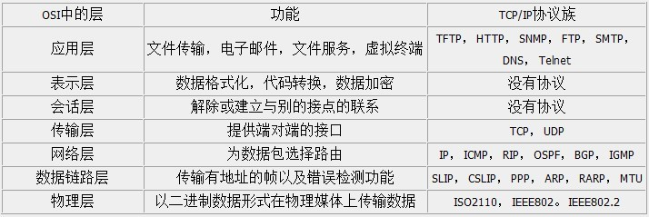
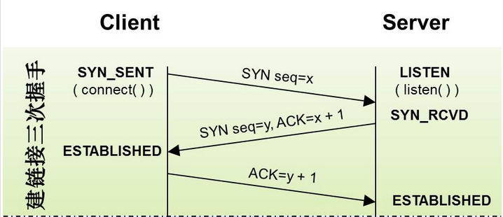
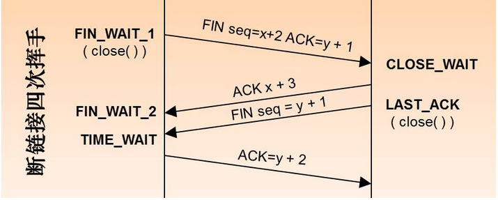

# 网络协议 - TCP

> 参考：https://segmentfault.com/a/1190000004569460

## OSI七层模型

## TCP

TCP是属于传输层的协议，用于建立`可靠`的连接。

    TCP的可靠性是通过顺序编号和确认（ACK）来实现，保证数据流以正确的顺序送达对方。

### 一、TCP报头

#### 报头字段详解

1. source port/destination port：指定端口，实现端到端的连接。

2. Sequence Number：一般由客户端发送，用来表示报文段在第一个数据字节在数据流的序号，主要用来解决网络包乱序的问题。

3. ACK：用来存储客户端发来的seqNumber的下一个信号(seq+1)，只有当TCP Flags中的ACK为1时才有效。主要是用来解决不丢包的问题。

4. TCP flags：

    * ACK：通常是服务器端返回，用来表示应答是否有效。1为有效，0为无效。

    * SYN：是有客户端发送，用来建立连接的，第一次握手SYN=1,ACK=0;第二次握手时，SYN=1,ACK=1

    * FIN：用来表示是否结束该次TCP链接。通常当你数据发送完毕后，会自动带上FIN，然后断开连接

    * URG：当为1时，用来保证TCP连接不被中断，并且该次TCP内容数据的紧急程度提升

    * PSH：表示，当数据包得到后，立马给应用程序使用（PUSH到最顶端）

    * RST：用来确保TCP连接的安全。表示一个连接复位的请求，如果发生错误连接，则reset一次，重新连。当然也可以用来拒绝非法数据包。

### 二、TCP三次握手

**三次握手过程**

1. 第一次握手

    客户端向服务器发送一个SYN包，并且添加上seqNumber，然后进入SYN_SEND状态，并且等待服务器的确认。

2. 第二次握手

    服务器接受SYN包，并且进行确认，如果该请求有效，则将TCP Flag中的ACK标识位置1，然后将ACKNumber置为SeqNumber+1，并且添加上自己的SeqNumber（y），完成后，返回客户端，服务器端进入SYN_RECV状态。

3. 第三次握手

    客户端接受ACK+SYN报文后，获取服务器发送的seqNumber（y），并且将新头部的ACKNumber变为（y+1），然后发送给服务器，完成TCP3次连接，此时服务器和客户端进入ESTABLISED状态。

**为什么是3次握手**

1. 为什么不能是4次

    因为3次已经足够，节省资源。

2. 为什么不能是2次

    2次在某些情况下不适用。例如客户端发送A请求，由于网络延迟等原因，A请求还未达到服务器端，客户端在得不到响应的情况下，又发送了B请求，这次正常响应，服务器收到B请求，响应客户端，建立了连接，之后，A请求终于到达服务器，服务器会认为A请求是合理请求，响应，建立了连接。但是客户端由于A请求得不到回应，已经废弃了。这样就导致服务器一直挂着A请求的连接，导致资源的浪费。

### 三、TCP四次挥手

**四次挥手过程**

1. 第一次挥手

    A机设置seqnumber和acknumber之后，向B机发送`FIN`包，表示已无数据需要发送，然后A机进入FIN_WAIT_1状态。

2. 第二次挥手

    B机收到A机的FIN包，B会给A发送一个`ACK`包，并且将acknumber变为A的seqnumber+1。当A接收到之后，则变成FIN_WAIT_2状态，表示已经得到B的许可，进行关闭操作。不过此时，B机还是可以向A机发送请求。

3. 第三次挥手

    B向A发送`FIN`包，请求关闭，然后B进入CLOASE_WAIT状态。

4. 第四次挥手

    A接收B的FIN包之后，发送一个ACK包给B，B接收到之后，就断开了。A会等待`2MSL`之后，如果没有回复，确保服务器端确实是关闭了，然后A也关闭连接。A、B都进入CLOSE状态。

**MSL**

MSL，即`Maximum Segment Lifetime`，报文最大生存时间。在实际应用中常用是30s、1分钟、2分钟等。

