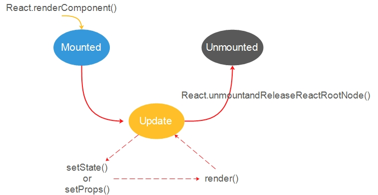
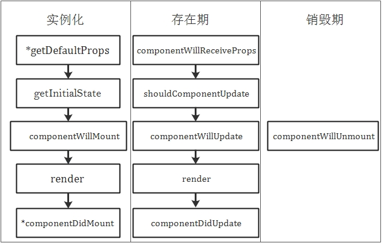

# 组件的生命周期

React为每个组件提供了生命周期`hook函数`去响应不同的时刻

## 生命周期方法

### 实例化

*在实例中，任何复杂的值，比如说对象和数组，都会在所有实例中共享*

**getDefaultProps**

对于组件类来说，只会调用一次，对于那些没有被父辈组件指定`props`属性的新建实例来说，这个方法返回的对象可用于为实例设置默认的props值。

**getInitialState**

每创建一个实例，就调用一次这个方法，在这里可以用来初始化每个实例的state，在这个方法中，已经可以访问到`this.props`。

**componentWillMount**

该方法会在完成首次渲染之前被调用，即在调用render之前，可以修改state的最后机会

**render**

唯一必须的方法，这个方法的目的是创建一个虚拟的DOM，用来表示组件的输出，render方法必须满足：

* 只能通过`this.props`和`this.state`访问数据
* 可以返回null，false或者任何react组件
* 只能出现一个顶级组件（不能返回一组元素）
* 必须纯净，即不能在这个方法修改组件的状态或者修改DOM的输出

**componentDidMount**

在render方法成功调用并且真实的DOM已经渲染之后，可以在componentDidMount方法内部通过`this.getDOMNode()`方法访问到真实的DOM

*当React运行在服务器端时，componentDidMount不会被调用*

### 存在期

**componentWillReceiveProps**

在任意时刻，组件的props都可以通过父辈组件来更改，出现这个情况时，这个方法会被调用，可以在这个方法内部更改props对象及更新state的机会

**shouldComponentUpdate**

如果确定某个组件或者它的任何子组件不需要渲染新的props或state，则该方法返回false。这意味着React会跳过调用render方法，以及位于render前后的hook函数：componentWillUpdate和componentDidUpdate

*非必需的方法，谨慎使用，可能会导致bug*

**componentWillUpdate**

组件会在接收到新的props或者state进行渲染之前，调用该方法

*不要这此方法内更新state或者props*

**componentDidUpdate**

可以在此方法内部更新已经渲染好的DOM

### 销毁期

**componentWillUnmount**

在移除组件之前做一些清理工作，如撤销一下定时器或者添加的事件监听器

## 反模式

