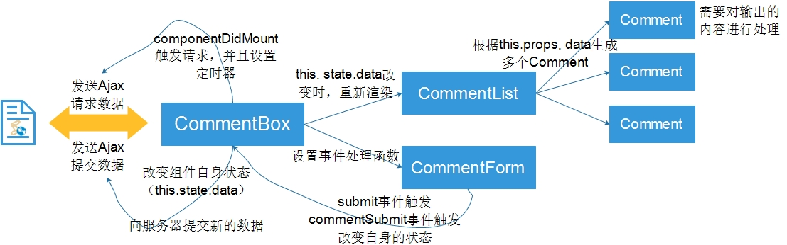
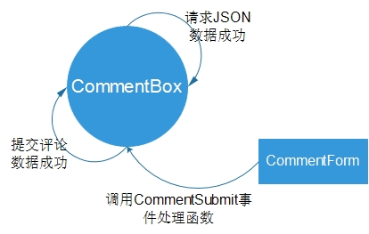

# React-tutorial例子全解析

## 起步

1. 下载[例子](https://github.com/reactjs/react-tutorial)，然后进行解压
2. 由于采用的node环境，因此下载解压之后，只需在所在目录运行

    ```javascript
    npm install
    node server.js
    ```

3. 采用默认端口设置，只需打开浏览器，访问`http://localhost:3000/`

    

## 目录结构说明

*react-tutorial*

    --node_modules
        --body-parser：express中间件，用于接收和解析json数据
        --express：express框架
    --public
        --css
            --base.css：基本样式文件
        --scripts
            -- example.js：React应用js文件
        index.html：基本的HTML结构
    --.editorconfig：用于在不同的编辑器中统一编辑风格（文件编码）的配置文件
    --.gitignore：git相关配置文件
    --app.json：web app的相关信息
    --comments.json：上传的评论数据
    --LICENSE：项目代码使用协议
    --package.json：项目所依赖的包，npm install的安装包的配置文件
    --README.md：项目说明书，里面有使用说明
    --requirements.txt：不清楚
    --server.js：服务器端的js代码

## App功能

此项目构建了一个简单的应用，如图所示


## 服务器端

*服务器端的功能还是相对简单的，通过代码注释的形式来分析*

1. 导入了依赖的模块

    ```javascript
    var fs = require('fs');  //读写文件
    var path = require('path'); //路径
    var express = require('express'); //express框架
    var bodyParser = require('body-parser'); //中间件
    ```

2. 生成app，并且进行配置

    ```javascript
    //获取comments.json文件的路径
    var COMMENTS_FILE = path.join(__dirname, 'comments.json');

    //设置端口
    app.set('port', (process.env.PORT || 3000));

    //设置静态文件的文件目录路径
    app.use('/', express.static(path.join(__dirname, 'public')));
    //启用bodyParser中间件接收请求，并且接收并解析json数据
    app.use(bodyParser.json());
    app.use(bodyParser.urlencoded({extended: true}));
    ```

3. 设置响应头部信息

    ```javascript
    app.use(function(req, res, next) {
        //允许跨域 CORS
        res.setHeader('Access-Control-Allow-Origin', '*');
        //缓存设置
        res.setHeader('Cache-Control', 'no-cache');
        next();
    });
    ```

4. 设置get请求url对应的处理函数（获取评论json数据）

    ```javascript
    app.get('/api/comments', function(req, res) {
        //读取comments.json文件，并且解析为json数据
        fs.readFile(COMMENTS_FILE, function(err, data) {
            if (err) {
              console.error(err);
              process.exit(1);
            }
            //读取成功后，返回
            res.json(JSON.parse(data));
        });
    });
    ```

5. 设置post请求url对应的处理函数（提交评论数据）

    ```javascipt
    app.post('/api/comments', function(req, res) {
        //先读取comments.json文件
        fs.readFile(COMMENTS_FILE, function(err, data) {
            if (err) {
              console.error(err);
              process.exit(1);
            }
            //将文件内容解析为json数据
            var comments = JSON.parse(data);
            //获取新评论
            var newComment = {
              id: Date.now(),
              author: req.body.author,
              text: req.body.text,
            };
            //添加json数组中
            comments.push(newComment);
            //将json数据写回到comments.json文件中,并且返回全部的评论数据
             fs.writeFile(COMMENTS_FILE, JSON.stringify(comments, null, 4), function(err) {
                  if (err) {
                    console.error(err);
                    process.exit(1);
                  }
                  res.json(comments);
            });
        });
    });
    ```

6. 启动，监听端口

    ```javascript
    app.listen(app.get('port'), function() {
      console.log('Server started: http://localhost:' + app.get('port') + '/');
    });
    ```

## web端

web端核心在于`example.js`文件，结合官网的资料，我们对这个应用进行分析，学习如何构建一个简单的react应用。

### 组件结构

React践行了`Web Components`的理念，依照组件化的开发方式，我们来分析这个应用的组件结构（如图所示）：


即是：

    - CommentBox
        - CommentList
            - Comment
        - CommentForm

组件之间的关系图为：



#### 组件Comment

如上述的结构图，我们从最底层开始编写组件`Comment`，这个组件需要做两件事情

1. 接收上层组件`CommentList`传递的数据，动态渲染虚拟DOM节点，则从`props`中读取数据

    ```javascript
    //评论人
    {this.props.author}
    //评论的内容
    {this.props.children}
    ```

2. 由于评论是支持MarkDown语法的，因此需要使用第三放库`marked`对用户输入的内容进行处理。

    ```javascript
    var rawMarkup = marked(this.props.children.toString(), {sanitize: true});
    ```

3. 此外，输出的内容要解析为HTML，而在默认情况下，基于预防XSS攻击的考虑，React对输出的内容是不解析为HTML的。此时，需要利用到特殊的属性`dangerouslySetInnerHTML`，要将内容放到一个对象的`_html`属性中，然后将这个对象赋值给`dangerouslySetInnerHTML`属性

    ```javascirpt
    var html = {_html:"输出的html内容"};
    <span dangerouslySetInnerHTML={html} />
    ```

```javascript
var Comment = React.createClass({
    rawMarkup : function() {
        var rawMarkup =  marked(this.props.children.toString(),{sanitize:true});
        return {_html : rawMarkup}; //React的规则，会读取这个对象的_html内容，
    },
    render : function() {
        return (
            <div className="comment">
                <h2 className="commentAuthor">
                    {this.props.author}
                </h2>
                <span  dangerouslySetInnerHTML={this.rawMarkup()} />
            </div>
        );
    }
});
```

#### 组件CommentList

组件`CommentList`需要做的就是接收上一层组件`CommentBox`传递过来的数据，然后根据数据生成多个子组件`Comment`

```javascript
var CommentList = React.createClass({
    render : function() {
        var commentNodes = this.props.data.map(function(comment){
            return (
                <Comment author={comment.author} key={comment.id}>
                    {comment.text}
                </Comment>
            );
        });
        return (
            <div className="commentList">
                {commentNodes}
            </div>
        );
    }
})
```

在生成子组件`Comment`时，将每个子组件的key属性设置为`comment.id`，这是因为`key`是一个可选的唯一标识符，通过它可以给组件设置一个独一无二的键，并确保它在一个渲染周期中保持一致，使得React能够更加智能地决定应该重用一个组件，还是销毁并重新创建一个组件，进而提升渲染性能。

#### 组件CommentForm

组件`CommentForm`需要做的就是两件事情

1. 管理自身的状态`this.state`（即表单中输入的评论人和评论内容）

    1. 当表单输入发生变化时
    2. 当表单提交时

2. 当submit事件触发时，调用上一层组件`CommentBox`的事件处理函数，改变组件`CommentBox`的状态。

```javascript
var CommentForm = React.createClass({
    getInitialState : function() {
        //设置初始状态，
        return {author:'',text:''};
    },
    handleAuthorChange : function(e) {
        this.setState({
            author : e.target.value
        });
    },
    handleTextChange : function(e) {
        this.setState({
            text : e.target.value
        });
    },
    handleSubmit : function(e) {
        e.preventDefault();
        var author = this.state.author.trim();
        var text = this.state.text.trim();
        if(!text || !author){ //为空验证
            return;
        }
        //触发评论提交事件，改变父组件的状态
        this.props.onCommentSubmit({author:author,text:text});
        //改变自身的状态
        this.setState({author:'',text:''});
    }
});
```

在这里有一个值得注意的点，那就是抽象的自定义事件`commentSubmit`和真实的事件`submit`之间的联系，这是一个相当实用的技巧，在接下来的章节可以看到是如何实现的。

#### 组件CommentBox

作为整个应用的顶层组件，`CommentBox`需要做的事情有：

1. 从服务器端请求已有的评论数据
2. 将新的评论数据上传到服务器
3. 管理自身的状态，根据状态对视图进行渲染（状态改变的示意图如下）

    

```javascript
var CommentBox = React.createClass({
    getInitialState : function(){
        return {data : []};
    },
    loadCommentsFromServer : function() {
        //使用了jQuery的Ajax
        $.ajax({
            url : this.props.url,
            dataType : 'json',
            cache : false,
            success : function(data) {
                this.setState({data:data});
            }.bind(this),
            error : function(xhr,status,err){
                console.err(this.props.url,status,err.toString());
            }.bind(this)
        });
    },
    componentDidMount : function() {
        /*
        这个方法属于React组件生命周期方法，在render方法成功调用并且真实的DOM
        已经渲染之后，调用此方法，这个方法发送json数据请求，并且设置一个定时器
        ，每隔一段时间就向服务器请求数据
        */
        this.loadCommentsFromServer();
        setInterval(this.loadCommentsFromServer,this.props.pollInterval);
    },
    handleCommentSubmit : function(comment) {
        /*
        这个方法也是比较有意思：
        1. 自定义了一个commentSubmit事件，并且此方法作为该事件的处理函数。
        2. 此方法是在子组件CommentForm的submit事件处理函数中调用
        */
        var comments = this.state.data;
        comment.id = Date.now();
        var newComments = comments.concat([comment]);
        //改变自身状态
        this.setState({data:newComments});
        $.ajax({
            url : this.props.url,
            dataType: 'json',
            type : 'POST',
            data : comment,
            success : function(data) {
                this.setState({data:data});
            }.bind(this),
            error : function(xhr,status,err) {
                //还原数据
                this.setState({data:comments});
                console.err(this.props.url,status,err.toString());
            }.bind(this)
        });
    },
    render : function() {
        return (
            <div className="commentBox">
                <h1>Comments</h1>
                <CommentList data={this.state.data} />
                <CommentForm onCommentSubmit={this.handleCommentSubmit} />
            </div>
        );
    }
});
```

最后，只需将组件`CommentBox`挂载到真实的DOM节点上，就可以看到效果了

```javascript
ReactDOM.render(
    <CommentBox url="/api/comments" pollInterval={2000} />,
    document.getElementById('content')
);
```


