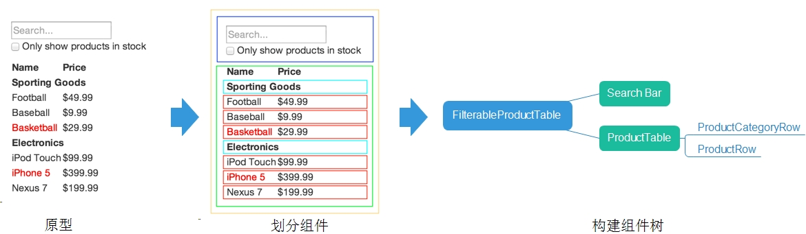
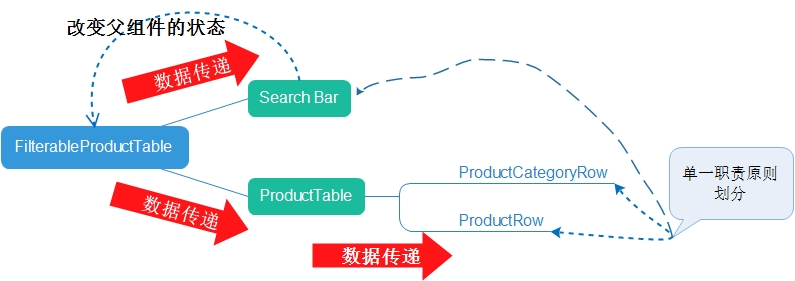

# [译]Thinking in React

> 原文：http://facebook.github.io/react/docs/thinking-in-react.html

## 前言

`Thought is the seed of action`

这是放置在官方的`QUICK START`中的一篇博文，文章的目的是教会我们用`React`的方式去思考如何构建一个应用。

本文并非为了翻译，而是注重表达自己学习过程中的解读，加深对`React`组件化开发方式的认知，如果需要查看原文的翻译，可以[戳这里](http://reactjs.cn/react/docs/thinking-in-react.html)

## 理解React的组件化开发

假如我们要构建一个这样的应用


后台已经有JSON API提供这样的数据

```javascript
[
  {category: "Sporting Goods", price: "$49.99", stocked: true, name: "Football"},
  {category: "Sporting Goods", price: "$9.99", stocked: true, name: "Baseball"},
  {category: "Sporting Goods", price: "$29.99", stocked: false, name: "Basketball"},
  {category: "Electronics", price: "$99.99", stocked: true, name: "iPod Touch"},
  {category: "Electronics", price: "$399.99", stocked: false, name: "iPhone 5"},
  {category: "Electronics", price: "$199.99", stocked: true, name: "Nexus 7"}
];
```

接下来，我们分为5步来构建这样的一个商品搜索的应用。

### 步骤1：将UI拆分成组件树

在此步骤，我们要完成这样的一个过程：



那么问题来了，如何划分组件？文章给出了两个思考这个问题的角度。

1. 单一功能原则

    举例来说，在写程序的时候，通常为了实现某一单一的功能而创建一个函数或者一个对象，划分组件也是类似的一个思路。`单一功能原则`，指的是在理想状态下一个组件应该只做一件事情。当一个组件的功能变多了，就应该拆分成若干个小的组件。

    > 扩展：单一职责原则（SRP：Single responsibility principle）又称单一功能原则，面向对象五个基本原则（SOLID）之一。它规定一个类应该只有一个发生变化的原因。该原则由罗伯特·C·马丁（Robert C. Martin）于《敏捷软件开发：原则、模式和实践》一书中给出的。马丁表示此原则是基于汤姆·狄马克(Tom DeMarco)和Meilir Page-Jones的著作中的内聚性原则发展出的。

    笔者认为，运用这一原则可以定位到应用的最小功能模块，从而划分出最低层的组件。然而，这一原则并不能完全概况组件化开发的理念，单一职责原则实质上提供的是模块化的思想，指导开发者编写低耦合、高内聚的代码。组件化则是一个更为复杂的概念：组件有层级关系，父子组件会涉及数据传递（有时候是双向的），子组件有时候也会改变父组件的状态。如图所示：

    

2. 数据与UI的对应关系

    用户的界面和数据模型在`信息构造（information architecture）`方面具有一致性，即用户界面可以很好地映射到一个构建正确的JSON数据模型上。因此在将用户界面划分成组件的时候，就是将其划分成能与数据模型一一对应的部分。

知道了如何划分组件，我们就对原型进行划分


在这个APP中，有5个组件，他们分别是

1. `FilterableProductTable`（橙色）：包含整个例子的容器
2. `SearcBar`（蓝色）：接收用户的输入
3. `ProductTable`（绿色）：展示并且根据用户的输入过滤商品
4. `ProductCategoryRow`（青色）：显示每个类别信息
5. `ProductRow`（红色）：展示一行产品信息

实际上对`ProductTable`的划分是不够完美的，因为表格的头部（即Name、Price一行）并不是它的一部分，而是可以单独划分出来的组件。由于表格的头部目前相对的简单，就简单地处理了。但是当表格的头部变得复杂起来的时候，讲道理的话，应该将其单独划分成组件`ProductTableHeader`。

这样，我们也可以很容易得到组件树：

* `FilterableProductTable`

    * `SearchBar`

    * `ProductTable`

        * `ProductCategoryRow`
        * `ProductRow`

### 步骤2：创建静态的版本

我们只对核心的代码进行说明，如果需要可以自行下载完整的[demo]()

```html
<div id="container">
    <!-- This element's contents will be replaced with your component. -->
</div>
```

