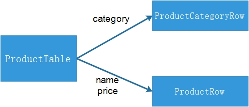
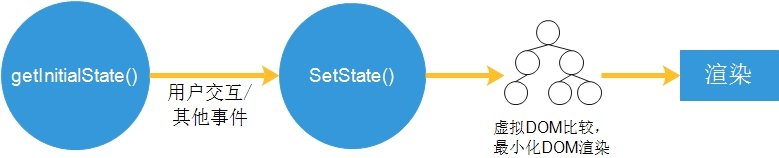
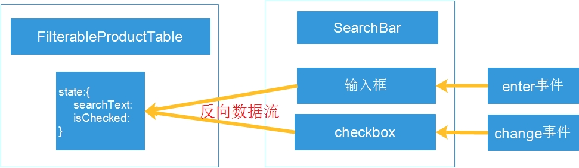

# [解读]Thinking in React

> 原文：http://facebook.github.io/react/docs/thinking-in-react.html

## 前言

`Thought is the seed of action`

这是放置在官方的`QUICK START`中的一篇博文，文章的目的是教会我们用`React`的方式去思考如何构建一个应用。

本文并非为了翻译，而是注重表达自己学习过程中的解读，加深对`React`组件化开发方式的认知，如果需要查看原文的翻译，可以[戳这里](http://reactjs.cn/react/docs/thinking-in-react.html)

*原文的翻译有点坑，个人觉得译文有些地方并没有准确地表达原文的意思，甚至有些错误*

## 理解React的组件化开发

假如我们要构建一个这样的应用


后台已经有JSON API提供这样的数据

```javascript
[
  {category: "Sporting Goods", price: "$49.99", stocked: true, name: "Football"},
  {category: "Sporting Goods", price: "$9.99", stocked: true, name: "Baseball"},
  {category: "Sporting Goods", price: "$29.99", stocked: false, name: "Basketball"},
  {category: "Electronics", price: "$99.99", stocked: true, name: "iPod Touch"},
  {category: "Electronics", price: "$399.99", stocked: false, name: "iPhone 5"},
  {category: "Electronics", price: "$199.99", stocked: true, name: "Nexus 7"}
];
```

接下来，我们分为5步来构建这样的一个商品搜索的应用。

### 步骤1：将UI拆分成组件树

在此步骤，我们要完成这样的一个过程：


那么问题来了，如何划分组件？文章给出了两个思考这个问题的角度。

1. 单一功能原则

    举例来说，在写程序的时候，通常为了实现某一单一的功能而创建一个函数或者一个对象，划分组件也是类似的一个思路。`单一功能原则`，指的是在理想状态下一个组件应该只做一件事情。当一个组件的功能变多了，就应该拆分成若干个小的组件。

    > 扩展：单一职责原则（SRP：Single responsibility principle）又称单一功能原则，面向对象五个基本原则（SOLID）之一。它规定一个类应该只有一个发生变化的原因。该原则由罗伯特·C·马丁（Robert C. Martin）于《敏捷软件开发：原则、模式和实践》一书中给出的。马丁表示此原则是基于汤姆·狄马克(Tom DeMarco)和Meilir Page-Jones的著作中的内聚性原则发展出的。

    笔者认为，运用这一原则可以定位到应用的最小功能模块，从而划分出最低层的组件。然而，这一原则并不能完全概况组件化开发的理念，单一职责原则实质上提供的是模块化的思想，指导开发者编写低耦合、高内聚的代码。组件化则是一个更为复杂的概念：组件有层级关系，父子组件之间还会涉及数据传递（有时候是双向的）。如图所示：

    

2. 数据与UI的对应关系

    用户的界面和数据模型在`信息构造（information architecture）`方面具有一致性，即用户界面可以很好地映射到一个构建正确的JSON数据模型上。因此在将用户界面划分成组件的时候，就是将其划分成能与数据模型一一对应的部分。

知道了如何划分组件，我们就对原型进行划分


在这个APP中，有5个组件，他们分别是

1. `FilterableProductTable`（橙色）：包含整个例子的容器
2. `SearcBar`（蓝色）：接收用户的输入
3. `ProductTable`（绿色）：展示并且根据用户的输入过滤商品
4. `ProductCategoryRow`（青色）：显示每个类别信息
5. `ProductRow`（红色）：展示一行产品信息

实际上对`ProductTable`的划分是不够完美的，因为表格的头部（即Name、Price一行）并不是它的一部分，而是可以单独划分出来的组件。由于表格的头部目前相对的简单，就简单地处理了。但是当表格的头部变得复杂起来的时候，讲道理的话，应该将其单独划分成组件`ProductTableHeader`。

这样，我们也可以很容易得到组件树：

* `FilterableProductTable`

    * `SearchBar`

    * `ProductTable`

        * `ProductCategoryRow`
        * `ProductRow`

### 步骤2：创建静态的版本

为了节省篇幅，就不在此处贴出代码了，如果需要可以参照原文中的代码或者参照本人自己写的完整的[demo](https://github.com/zhangguixu/thinking-in-react-demo)

按照步骤1的分析，我们可以很快地建立应用的静态版本，每个组件目前只有一个`render`函数，返回每个组件的html结构，同时，建立了组件之间的层级关系。不过要注意两点：

1. 在`render`函数中使用了JSX，它是JavaScript的一种语法糖，使用的目的是为了编程的便利，可以很清晰看到我们创建的HTML的标签结构，当然还有其他的好处，在后面会提到。
2. `render`中创建的是虚拟的DOM节点，而非真实的DOM节点，理解这一点对理解React的高效渲染特点很重要。

**props vs state**

首先，这两个指的都是数据（类似于数据驱动的思想）。关于这两个，可以在这里做一个简单的分辨。

1.可以看到我们在初始化组件的时候，使用的是`props`。这就是`props`很典型的使用方法，它是父组件向子组件传递数据的方式，在React中，数据的传递是单向的，也正是基于`props`来实现。



*在顶层组件`FilterableProductTable`会把后台的JSON数据作为`props`，从顶层组件一直传递下去，实现数据的单向流动。*

2.`state`是什么？`state`只存在于React组件的内部，React中创建的组件，实际上是一个`状态机`，当组件的`state`改变的时候，会触发组件进行重选渲染（这一过程还会涉及到虚拟DOM的差分算法，最小化DOM操作）。大致的流程（如图所示）：



*明确组件的状态的改变，是编写组件的核心部分，在接下来的步骤3就做这样一件事情。*

### 步骤3：识别出最小（但是完整的）代表UI的state

构建一个正确的应用，首先需要做的就是找出应用的最小的状态集。

何谓`最小`？状态集中的任意一个`state`都不能由其他的`state`计算得出。用数学来描述就是状态集中的元素线性无关。比如说一个TODO List的应用，一个`state`使用数组保存了条目数据，那么就不用再使用一个`state`来保存条目数了，因为条目数就是数组的长度。

回到我们的应用中来，在我们的例子中有这么些数据（state和props都是数据）

1. 原始产品信息列表
2. 用户输入的搜索数据
3. checkbox的值
4. 搜索过滤之后的产品信息列表

理解了`最小`之后，我们来确定状态集。可以从几个角度排除掉非`state`的情况：

1. 数据是否是通过`props`从父组件传递过来的？如果是，那么很有可能不是`state`
2. 数据是否会随时间变化？如果不会，那么也很有可能不是`state`
3. 是否能通过组件中的`props`或者其他的`state`计算出该数据？如果是，那就不是`state`

**分析**

1. 原始的产品列表信息是通过`props`进行传递，因此不是`state`
2. 用户输入的搜索信息和checkbox都是随时间变化而且不能通过其他进行计算，应该是`state`
3. 搜索过滤之后的产品信息列表可以通过原始产品信息列表、输入框信息和checkbox计算得出，因此不是`state`

到这里，我们得到了应用的状态集

1. 输入框的值
2. checkbox的值

### 步骤4：确认state存在哪个组件中

拥有了状态集之后，接下来就要确认哪些组件拥有哪些`state`。

*这里是译文的一个错误的地方，并非确认`state`的生命周期*

我们可以从几个方面来解决这个问题：

* 找出那些需要基于该`state`进行渲染的组件
* 找到这些组件的共同的祖先组件
* 要么是共同的祖先组件，要么是另外一个在组件树中位于更高层级的组件应该拥有这个 state
* 如果找不出拥有这个`state`的组件，可以创建一个新的组件来维护这个`state`，并将这个组件添加到所有需要基于该`state`进行渲染的组件的上面。

回到我们的应用中来：

* `ProductTable`需要通过`state`来展示过滤产品信息，`SearchBar`需要基于`state`来显示输入的文本和checked的状态。
* 它们共同的祖先组件是`FilterableProductTable`
* 结合以上所述，可以很容易得出`FilterableProductTable`拥有应用的两个`state`：输入框的值和checkbox的值

### 步骤5：添加反向的数据流

这里可以思考3个问题：

1. 什么叫反向的数据流？
2. 为什么要有反向的数据流？
3. 怎么实现反向的数据流？

首先，在React中，数据是从顶层传递到底层的。如果是底层的组件通过某种方式更新了上层的组件的`state`，这样就叫做`反向`的数据流。

结合我们的应用来讲为什么要有反向的数据流。在步骤4中，我们得出了组件`FilterableProductTable`中有两个`state`:输入框的值和checkbox的值，但是这两个状态的改变是由在组件`SearchBar`中的输入框的`enter`事件和checkbox的`change`事件来触发的，同时`state`的值需要从输入框的输入文本和checkbox的值中获取，这就要求数据从`SearchBar`传递到`FilterableProductTable`中。



“理都懂”之后，来谈谈实现。我们结合一下代码来讲解一下（代码只是大致的实现）：

```javascript
var FilterableProductTable = React.createClass({
  handleSearch : function(search) {
      //searchText为输入框的值，在此函数内可以改变state
      this.setState(search)
      //之后的逻辑省略
  }
  render : function () {
      return (
        <div className="wrapper">
          <SearchBar onSearch={this.handleSearch} />
          <ProductTable productList={this.data} />
        </div>
      );
  }
});
var SearchBar = React.createClass({
  handleEnter : function(e) {
    //...省略前面的判断逻辑
    /*获取到输入框和checkbox的值之后，利用props传递到父组件，
      在这里实现了反向的数据流
    */
    this.props.onSearch({searchText : searchText,isChecked : false})
  },
  handleChange : function(e) {
  },
  render : function() {
    return (
      <form>
        <input type="text" onKeyPress={this.handleEnter} /><br/>
        <input type="checkbox" onChange={this.handleChange} />
        <label>only show in stock</label>
      </form>
    );
  }
});
```

## 写在最后

到此结束。在发布这篇博客的时候，demo并没有全部完成，估计要过些日子才能完成了。


