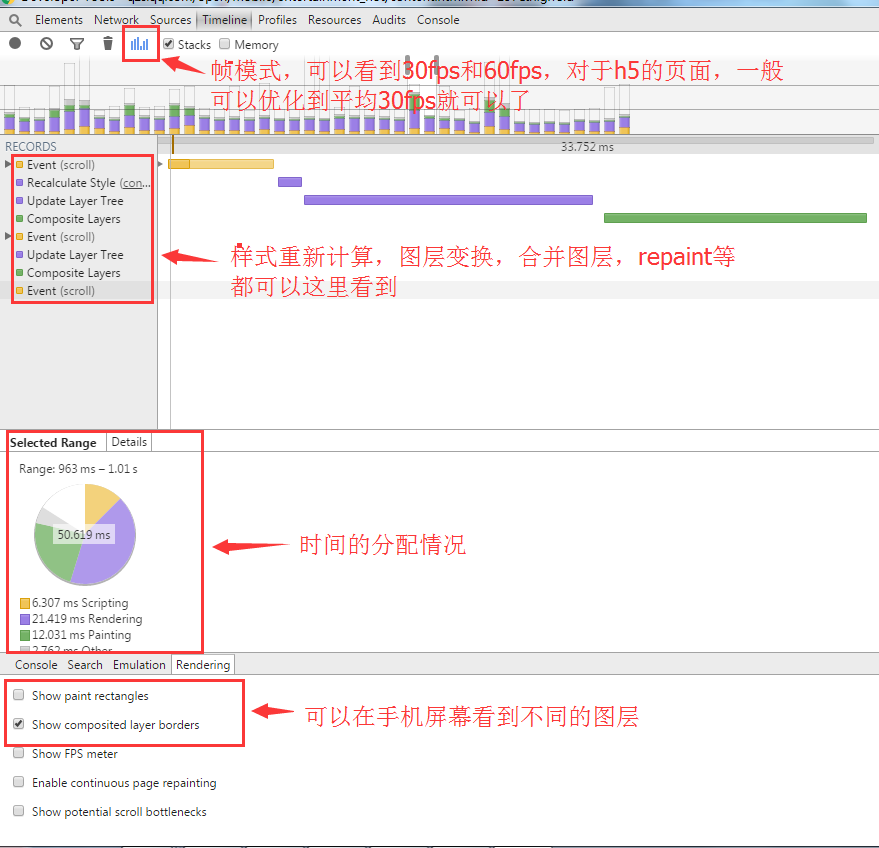
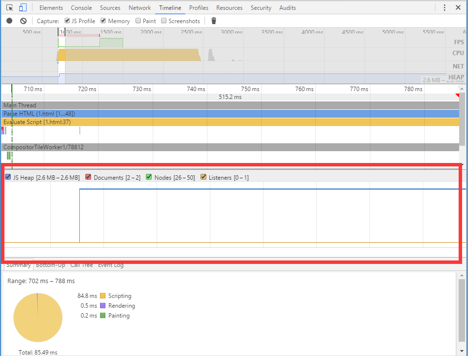

# 性能调试工具

## Timeline

### 基本认识

Timeline工具栏提供了在于装载你的web应用的过程中，时间花费情况的概览。包括

* 处理DOM事件

* 页面布局渲染

* 向屏幕绘制元素

Timeline可以通过三方面的数据来监测网页

* 事件

* 框架

* 实时内存

### 使用

#### 1. 颜色的属性

* 蓝色：加载
* 黄色：脚本
* 紫色：渲染
* 绿色：绘制

#### 2. 帧模式

帧模式能让我们深入了解页面的渲染性能，`帧`表示浏览器要呈现的内容显示到单个帧所必须做的工作，如运行JavaScript、处理事件、更新DOM和更改的样式、布局和绘制。

目前大多数的显示器的刷新频率是`60Hz`，那么我们页面的绘制频率能达到60帧每秒是最好的。因为软件帧和硬件的刷新频率一致的话，页面能给人非常流畅的感觉，否则就会感觉很卡，这样我们大概有16.6ms（1000/60）来完成每一帧的呈现，这也是所谓的`16.6ms`优化。

#### 3.内存模式

内存视图会通过一个图表显示页面随着时间的推移所使用的内存，你可以查看每个时间段的内存使用量，并找出性能问题。

